# Fallen Compass – Technical Documentation

> **Living document** tracking the C++ and Blueprint architecture, system interactions, and implementation notes for the entire Fallen Compass project. Updated incrementally as tasks are completed.

---

## Table of Contents

1. [Project Overview & Architecture](#project-overview--architecture)
2. [Core Framework (Task 2)](#core-framework-task-2)
3. [First-Person Character & Input (Task 3)](#first-person-character--input-task-3)
4. [Office Level & Greybox (Task 4)](#office-level--greybox-task-4)
5. [Main Menu System (Task 5)](#main-menu-system-task-5)
6. [Office Flow & Interactions (Task 6)](#office-flow--interactions-task-6)
7. [Table Interaction System (Week 2)](#table-interaction-system-week-2)
8. [Game State Management (Week 2)](#game-state-management-week-2)
9. [Level Management & Transitions (Week 2)](#level-management--transitions-week-2)
10. [Expedition System (Week 2)](#expedition-system-week-2)
11. [Logging & Debugging](#logging--debugging)
12. [Build & Configuration](#build--configuration)

---

## Project Overview & Architecture

### High-Level System Diagram

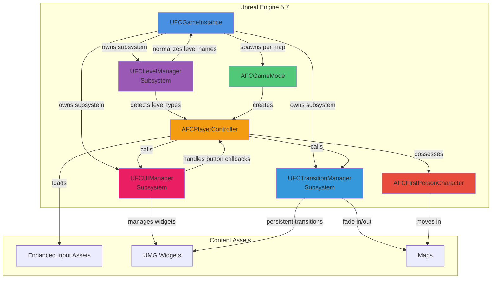

### Naming Conventions

- **File Names**: C++ files use `FC` prefix (e.g., `FCGameMode.h`, `FCFirstPersonCharacter.cpp`)
- **Class Names**: C++ classes use type-specific prefix + `FC` (e.g., `AFCGameMode`, `UFCGameInstance`, `AFCFirstPersonCharacter`)
- **Logs**: All categories prefixed `LogFallenCompass*` (e.g., `LogFallenCompassGameMode`, `LogFallenCompassCharacter`)
- **Assets**: Use descriptive names under `/Game/FC/` hierarchy; Enhanced Input assets prefixed `IA_` / `IMC_`

### Directory Structure

```
FC/
├── Source/FC/Core
│   ├── UFCGameInstance.h/cpp
│   │   └── FFCGameStateData (struct: Supplies, Money, Day)
│   ├── UFCLevelManager.h/cpp (Game Instance Subsystem)
│   │   └── LoadLevel(), PreviousLevelName tracking
│   ├── UFCExpeditionManager.h/cpp (Game Instance Subsystem - Week 2)
│   │   └── EFCExpeditionStatus, CreateExpedition(), CompleteExpedition()
│   ├── UFCUIManager.h/cpp (Game Instance Subsystem)
│   ├── UFCTransitionManager.h/cpp (Game Instance Subsystem)
│   ├── UFCScreenTransitionWidget.h/cpp (UUserWidget)
│   ├── UFCExpeditionPlanningWidget.h/cpp (UUserWidget - Week 2)
│   ├── FCGameMode.h/cpp
│   ├── FCPlayerController.h/cpp
│   ├── FCFirstPersonCharacter.h/cpp
│   └── FCCharacter.h/cpp (top-down variant)
├── Source/FC/Interaction
│   ├── IFCInteractable.h/cpp
│   ├── IFCTableInteractable.h/cpp (Week 2)
│   └── FCInteractionComponent.h/cpp
├── Source/FC/SaveGame
│   └── FCSaveGame.h/cpp
├── Content/FC/
│   ├── Input/
│   │   ├── Contexts/
│   │   │   ├── IMC_FC_Default (FirstPerson movement/look)
│   │   │   └── IMC_FC_StaticScene (Week 2: TableView cursor clicks)
│   │   └── Actions/
│   │       ├── IA_Interact
│   │       ├── IA_Pause (ESC key)
│   │       ├── IA_Click (Week 2: Left mouse button)
│   │       ├── IA_QuickSave (F6)
│   │       └── IA_QuickLoad (F9)
│   ├── UI/
│   │   ├── Menus/
│   │   │   ├── WBP_MainMenu
│   │   │   ├── WBP_MainMenuButton
│   │   │   ├── TableMenu/
│   │   │   │   └── WBP_ExpeditionPlanning (Week 2)
│   │   │   └── SaveMenu/
│   │   │       ├── WBP_SaveSlotSelector
│   │   │       └── WBP_SaveSlotItem
│   │   └── WBP_InteractionPrompt
│   ├── World/
│   │   ├── Levels/
│   │   │   └── L_Office (Main menu state & gameplay hub)
│   │   ├── Blueprints/
│   │   │   └── Interactables/
│   │   │       ├── BP_TableObject (Week 2: Base class)
│   │   │       ├── BP_TableObject_Map (Week 2)
│   │   │       ├── BP_TableObject_Logbook (Week 2)
│   │   │       ├── BP_TableObject_Letters (Week 2)
│   │   │       └── BP_TableObject_Compass (Week 2)
│   │   └── Props/
│   │       ├── SM_Desk_01
│   │       ├── SM_Door_01
│   │       └── Cursor/
│   │           ├── M_Cursor (Week 2)
│   │           └── FX_Cursor (Week 2)
│   └── Characters/
│       └── Mannequins/ (UE5 default assets)
└── Config/
    ├── DefaultEngine.ini
    ├── DefaultGame.ini
    └── DefaultInput.ini
```

---

## Core Framework (Task 2 & Week 2)

### Overview

Established the foundational runtime classes that every downstream system depends on:

**Task 2 (Week 1)**:

- `UFCGameInstance` (2.1) – global lifecycle and session state owner
- `UFCLevelManager` (2.1.5) – level name normalization and type detection subsystem
- `UFCUIManager` (2.1.6) – centralized UI widget lifecycle management and button callback handling
- `AFCGameMode` (2.2) – map-specific authority, pawn/controller registration, logging
- `AFCPlayerController` (2.3) – player input handling, camera state, pause/interact scaffolding

**Week 2 Extensions**:

- `UFCGameInstance` – added `FFCGameStateData` struct (Supplies, Money, Day), `AddSupplies()`, `ConsumeSupplies()` methods
- `UFCLevelManager` – added `LoadLevel()` method with fade integration, `PreviousLevelName` tracking, `GetPreviousLevelName()`
- `UFCExpeditionManager` (new) – expedition lifecycle management, `EFCExpeditionStatus` enum, `CreateExpedition()`, `CompleteExpedition()`, `CancelExpedition()`
- `IFCTableInteractable` (new) – interface for table objects in TableView mode with cursor click detection

### Class Interaction Flow

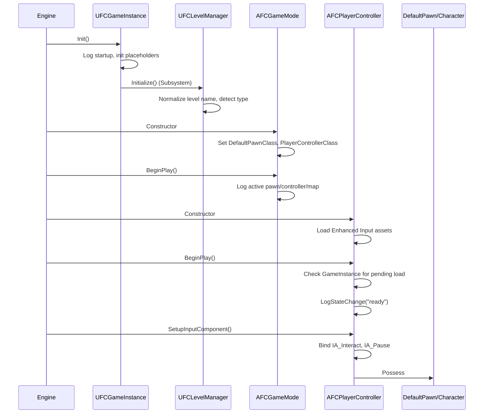

### UFCGameInstance (2.1 & Week 2)

- **Files**: `Source/FC/Core/UFCGameInstance.h/.cpp`
- **Inheritance**: `UGameInstance`
- **Registration**: Project Settings → Maps & Modes → Game Instance Class
- **Purpose**: Manages global state across map transitions; houses session flags, expedition metadata, data asset references, and game version information. **Week 2 added persistent game state data (FFCGameStateData) with supplies, money, and day tracking.**

#### Key Members

```cpp
// Session Configuration
UPROPERTY(EditDefaultsOnly, Category = "Session")
FString StartupExpeditionName;

UPROPERTY(EditDefaultsOnly, Category = "Session")
int32 StartupAct;

UPROPERTY(EditDefaultsOnly, Category = "Session")
int32 StartupDifficulty;

UPROPERTY(BlueprintReadOnly, Category = "Session")
bool bTutorialCompleted;

// Game State Data (Week 2)
UPROPERTY(BlueprintReadOnly, Category = "Game State")
FFCGameStateData GameStateData;

UPROPERTY()
bool bIsSessionDirty = false;

// Version Info
UFUNCTION(BlueprintPure, Category = "Version")
FString GetGameVersion() const;

// Delegates
DECLARE_MULTICAST_DELEGATE_OneParam(FOnExpeditionAboutToStart, const FString&);
FOnExpeditionAboutToStart OnExpeditionAboutToStart;

DECLARE_MULTICAST_DELEGATE_TwoParams(FOnExpeditionCompleted, bool, int32);
FOnExpeditionCompleted OnExpeditionCompleted;

DECLARE_DYNAMIC_MULTICAST_DELEGATE(FOnExpeditionContextChanged);
UPROPERTY(BlueprintAssignable, Category = "Expedition")
FOnExpeditionContextChanged OnExpeditionContextChanged;
```

#### FFCGameStateData Struct (Week 2)

Persistent campaign state that survives level transitions:

```cpp
USTRUCT(BlueprintType)
struct FFCGameStateData
{
    GENERATED_BODY()

    /** Current supplies available */
    UPROPERTY(BlueprintReadWrite, Category = "Game State")
    int32 Supplies = 100;

    /** Current money/gold available */
    UPROPERTY(BlueprintReadWrite, Category = "Game State")
    int32 Money = 500;

    /** Current day in campaign (starts at 1) */
    UPROPERTY(BlueprintReadWrite, Category = "Game State")
    int32 Day = 1;

    FFCGameStateData()
        : Supplies(100)
        , Money(500)
        , Day(1)
    {}
};
```

#### Supply Management Methods (Week 2)

```cpp
/** Get current supplies from game state */
UFUNCTION(BlueprintCallable, Category = "Game State")
int32 GetCurrentSupplies() const { return GameStateData.Supplies; }

/** Add supplies to game state */
UFUNCTION(BlueprintCallable, Category = "Game State")
void AddSupplies(int32 Amount);

/** Consume supplies from game state
 * @param Amount Amount to consume
 * @param bSuccess Output parameter indicating if consumption succeeded
 * @return Current supplies amount after operation
 */
UFUNCTION(BlueprintCallable, Category = "Game State")
int32 ConsumeSupplies(int32 Amount, bool& bSuccess);

/** Get full game state data */
UFUNCTION(BlueprintCallable, Category = "Game State")
FFCGameStateData GetGameStateData() const { return GameStateData; }
```

**Implementation Notes**:

- `AddSupplies()`: Adds to `GameStateData.Supplies`, sets `bIsSessionDirty = true`, broadcasts `OnExpeditionContextChanged`
- `ConsumeSupplies()`: Validates amount and availability, deducts on success, logs warnings on failure, returns current supplies with success flag
- All state changes trigger `OnExpeditionContextChanged` for reactive UI updates

#### Lifecycle Methods

- `Init()`: Logs startup with `LogFallenCompassGameInstance`; calls stub `CacheDefaultLoadouts()`; configures UIManager widget classes.
- `Shutdown()`: Logs cleanup and future telemetry flush point.
- Placeholders: `BootstrapExpeditionAsync`, `CacheDefaultLoadouts`, `FlushSessionData`.

#### Design Rationale

Keeping systemic state in one place avoids circular dependencies once Tasks 5–6 introduce Main Menu ↔ Office transitions. Future save/load systems will hook directly into the GameInstance delegates.

**Week 2 Addition**: `FFCGameStateData` provides a single source of truth for campaign progression data, eliminating the need for scattered state variables. The struct-based approach allows for easy serialization in future save/load systems and ensures all state changes are properly logged and broadcast.

---

### UFCLevelManager (2.1.5 & Week 2)

- **Files**: `Source/FC/Core/UFCLevelManager.h/.cpp`
- **Inheritance**: `UGameInstanceSubsystem`
- **Registration**: Automatic (subsystem registered via UE module system)
- **Purpose**: Centralized level name normalization, type detection, and transition management. **Week 2 added LoadLevel() method with fade integration and PreviousLevelName tracking.**

#### Key Members

```cpp
/** Enum defining all level types in the game */
UENUM(BlueprintType)
enum class EFCLevelType : uint8
{
    Unknown = 0,
    MainMenu,
    Office,      // Serves as both menu and gameplay location
    Overworld,
    Camp,
    Combat,
    POI,
    Village
};

/** Current normalized level name (PIE prefixes stripped) */
UPROPERTY(VisibleAnywhere, Category = "Level")
FName CurrentLevelName;

/** Previous level name (normalized, no PIE prefix) - Week 2 */
UPROPERTY(VisibleAnywhere, BlueprintReadOnly, Category = "Level Management")
FName PreviousLevelName;

/** Current level type based on name pattern matching */
UPROPERTY(VisibleAnywhere, Category = "Level")
EFCLevelType CurrentLevelType;

/** Pending level name for load operation - Week 2 */
FName PendingLevelName;

/** Whether to use fade transition for pending load - Week 2 */
bool bUseFadeForPendingLoad = false;
```

#### Public API

```cpp
/** Get the current level name (normalized, PIE prefix stripped) */
UFUNCTION(BlueprintPure, Category = "Level")
FName GetCurrentLevelName() const { return CurrentLevelName; }

/** Get the previous level name (Week 2) */
UFUNCTION(BlueprintCallable, Category = "Level Management")
FName GetPreviousLevelName() const { return PreviousLevelName; }

/** Get the current level type */
UFUNCTION(BlueprintPure, Category = "Level")
EFCLevelType GetCurrentLevelType() const { return CurrentLevelType; }

/** Check if current level is a menu level (MainMenu) */
UFUNCTION(BlueprintPure, Category = "Level")
bool IsMenuLevel() const;

/** Check if current level is a gameplay level (Office, Overworld, etc.) */
UFUNCTION(BlueprintPure, Category = "Level")
bool IsGameplayLevel() const;

/** Load a new level with optional fade transition (Week 2)
 * @param LevelName Name of the level to load (e.g., "L_Expedition", "L_Office")
 * @param bUseFade Whether to use fade out/in transition (requires UFCTransitionManager)
 */
UFUNCTION(BlueprintCallable, Category = "Level Management")
void LoadLevel(const FName& LevelName, bool bUseFade = true);

/** Update current level tracking (called on level transitions) */
void UpdateCurrentLevel(const FName& NewLevelName);

/** Normalize a level name (strip PIE prefix) */
FName NormalizeLevelName(const FName& LevelName) const;
```

#### LoadLevel Implementation (Week 2)

```cpp
void UFCLevelManager::LoadLevel(const FName& LevelName, bool bUseFade)
{
    if (LevelName == NAME_None)
    {
        UE_LOG(LogFCLevelManager, Warning, TEXT("LoadLevel: Invalid level name"));
        return;
    }

    PendingLevelName = LevelName;
    bUseFadeForPendingLoad = bUseFade;

    if (bUseFade)
    {
        UFCTransitionManager* TransitionManager = GetGameInstance()->GetSubsystem<UFCTransitionManager>();
        if (TransitionManager)
        {
            // Bind to fade complete delegate
            TransitionManager->OnFadeOutComplete.AddDynamic(this, &UFCLevelManager::OnFadeOutCompleteForLevelLoad);
            TransitionManager->BeginFadeOut(1.0f, FLinearColor::Black);

            UE_LOG(LogFCLevelManager, Log, TEXT("LoadLevel: Starting fade to %s"), *LevelName.ToString());
        }
        else
        {
            UE_LOG(LogFCLevelManager, Warning, TEXT("LoadLevel: TransitionManager not found, loading without fade"));
            UGameplayStatics::OpenLevel(this, LevelName);
        }
    }
    else
    {
        UE_LOG(LogFCLevelManager, Log, TEXT("LoadLevel: Loading %s (no fade)"), *LevelName.ToString());
        UGameplayStatics::OpenLevel(this, LevelName);
    }
}

void UFCLevelManager::OnFadeOutCompleteForLevelLoad()
{
    UFCTransitionManager* TransitionManager = GetGameInstance()->GetSubsystem<UFCTransitionManager>();
    if (TransitionManager)
    {
        TransitionManager->OnFadeOutComplete.RemoveDynamic(this, &UFCLevelManager::OnFadeOutCompleteForLevelLoad);
    }

    if (PendingLevelName != NAME_None)
    {
        UE_LOG(LogFCLevelManager, Log, TEXT("OnFadeOutComplete: Loading level %s"), *PendingLevelName.ToString());
        UGameplayStatics::OpenLevel(this, PendingLevelName);

        PendingLevelName = NAME_None;
        bUseFadeForPendingLoad = false;
    }
}
```

**Flow**: LoadLevel → BeginFadeOut → OnFadeOutComplete → OpenLevel → Initialize (new level) → BeginFadeIn

#### Level Type Detection

Level types are determined using pattern matching on the normalized level name:

```cpp
EFCLevelType UFCLevelManager::DetermineLevelType(const FName& LevelName) const
{
    const FString LevelStr = LevelName.ToString();

    // Exact match for main menu
    if (LevelStr.Equals(TEXT("L_MainMenu"), ESearchCase::IgnoreCase))
    {
        return EFCLevelType::MainMenu;
    }

    // Substring matching for other level types
    if (LevelStr.Contains(TEXT("Office"))) return EFCLevelType::Office;
    if (LevelStr.Contains(TEXT("Overworld"))) return EFCLevelType::Overworld;
    if (LevelStr.Contains(TEXT("Camp"))) return EFCLevelType::Camp;
    if (LevelStr.Contains(TEXT("Combat"))) return EFCLevelType::Combat;
    if (LevelStr.Contains(TEXT("POI"))) return EFCLevelType::POI;
    if (LevelStr.Contains(TEXT("Village"))) return EFCLevelType::Village;

    return EFCLevelType::Unknown;
}
```

#### PIE Prefix Normalization

The subsystem automatically strips Play-In-Editor prefixes (e.g., `UEDPIE_0_`, `UEDPIE_1_`, etc.) from level names:

```cpp
FName UFCLevelManager::NormalizeLevelName(const FName& LevelName) const
{
    FString LevelStr = LevelName.ToString();

    // Strip PIE prefix pattern: UEDPIE_N_ where N is any number
    if (LevelStr.StartsWith(TEXT("UEDPIE_"), ESearchCase::IgnoreCase))
    {
        int32 UnderscorePos = -1;
        if (LevelStr.FindChar('_', UnderscorePos))
        {
            int32 SecondUnderscorePos = -1;
            if (LevelStr.FindChar('_', SecondUnderscorePos) && SecondUnderscorePos > UnderscorePos)
            {
                LevelStr = LevelStr.RightChop(SecondUnderscorePos + 1);
            }
        }
    }

    return FName(*LevelStr.TrimStartAndEnd());
}
```

#### Lifecycle

```cpp
void UFCLevelManager::Initialize(FSubsystemCollectionBase& Collection)
{
    Super::Initialize(Collection);

    UWorld* World = GetWorld();
    if (!World)
    {
        UE_LOG(LogFCLevelManager, Error, TEXT("Initialize: World is null!"));
        return;
    }

    const FName RawLevelName = FName(*World->GetMapName());
    CurrentLevelName = NormalizeLevelName(RawLevelName);
    CurrentLevelType = DetermineLevelType(CurrentLevelName);

    UE_LOG(LogFCLevelManager, Log, TEXT("Initialized: Level=%s, Type=%s"),
        *CurrentLevelName.ToString(),
        *UEnum::GetValueAsString(CurrentLevelType));
}
```

#### Integration Points

**UFCGameInstance** uses UFCLevelManager for:

- Save/load operations: Normalizing level names when comparing saved vs current level
- State tracking: Determining if we're restoring from save (cross-level vs same-level)

**AFCPlayerController** uses UFCLevelManager for:

- BeginPlay simplified: No longer performs string matching for level detection
- Input mode setup: Delegated to state transition methods (InitializeMainMenu/TransitionToGameplay)

#### Logging

All level operations are logged via `LogFCLevelManager`:

```cpp
DEFINE_LOG_CATEGORY(LogFCLevelManager);

// Example log output:
// LogFCLevelManager: Initialized: Level=L_Office, Type=EFCLevelType::Office
// LogFCLevelManager: UpdateCurrentLevel: Level=L_Overworld, Type=EFCLevelType::Overworld
```

#### Design Rationale

**Eliminates Code Duplication**: Before UFCLevelManager, PIE prefix stripping was duplicated in:

- UFCGameInstance::LoadGameAsync() (2 instances)
- AFCPlayerController::BeginPlay() (1 instance)

Now all level name handling goes through a single subsystem with proper logging and validation.

**Architectural Insight - L_Office Dual Purpose**: L_Office serves as both the menu location (where player starts and interacts with expedition board) AND a gameplay location (first-person exploration). This unique design means level type detection alone cannot determine input mode—explicit state transitions handle that instead.

---

### UFCUIManager (2.1.6)

- **Files**: `Source/FC/Core/FCUIManager.h/.cpp`
- **Inheritance**: `UGameInstanceSubsystem`
- **Registration**: Automatic (subsystem registered via UE module system)
- **Purpose**: Centralized UI widget lifecycle management to eliminate Blueprint coupling from PlayerController and ensure consistent widget creation/destruction patterns.

#### Key Members

```cpp
/** Widget class references (configured by UFCGameInstance at Init) */
UPROPERTY(BlueprintReadOnly, Category = "UI")
TSubclassOf<UUserWidget> MainMenuWidgetClass;

UPROPERTY(BlueprintReadOnly, Category = "UI")
TSubclassOf<UUserWidget> SaveSlotSelectorWidgetClass;

/** Cached widget instances (created on first show, reused thereafter) */
UPROPERTY()
TObjectPtr<UUserWidget> MainMenuWidget;

UPROPERTY()
TObjectPtr<UUserWidget> SaveSlotSelectorWidget;
```

#### Public API - Widget Lifecycle

```cpp
/** Show the main menu (lazy-creates widget if needed, adds to viewport) */
UFUNCTION(BlueprintCallable, Category = "UI")
void ShowMainMenu();

/** Hide the main menu (removes from viewport, keeps cached for reuse) */
UFUNCTION(BlueprintCallable, Category = "UI")
void HideMainMenu();

/** Show the save slot selector (lazy-creates widget, adds to viewport) */
UFUNCTION(BlueprintCallable, Category = "UI")
void ShowSaveSlotSelector();

/** Hide the save slot selector (removes from viewport) */
UFUNCTION(BlueprintCallable, Category = "UI")
void HideSaveSlotSelector();
```

#### Public API - Button Callbacks

These methods are called by Blueprint widgets (WBP_MainMenu, WBP_SaveSlotSelector) via OnClicked events:

```cpp
/** Handle "New Legacy" button - transitions to gameplay */
UFUNCTION(BlueprintCallable, Category = "UI")
void HandleNewLegacyClicked();

/** Handle "Continue" button - loads most recent save */
UFUNCTION(BlueprintCallable, Category = "UI")
void HandleContinueClicked();

/** Handle "Load Save" button - opens save slot selector */
UFUNCTION(BlueprintCallable, Category = "UI")
void HandleLoadSaveClicked();

/** Handle "Options" button - placeholder for future options menu */
UFUNCTION(BlueprintCallable, Category = "UI")
void HandleOptionsClicked();

/** Handle "Quit" button - quits the game */
UFUNCTION(BlueprintCallable, Category = "UI")
void HandleQuitClicked();

/** Handle "Back" button in save selector - returns to main menu */
UFUNCTION(BlueprintCallable, Category = "UI")
void HandleBackFromSaveSelector();

/** Handle save slot selection - loads the selected save */
UFUNCTION(BlueprintCallable, Category = "UI")
void HandleSaveSlotSelected(const FString& SlotName);
```

#### Widget Lifecycle Implementation

All widget lifecycle methods follow a consistent pattern:

1. **ShowMainMenu()**:

   - Checks if `MainMenuWidgetClass` is configured
   - Lazy-creates `MainMenuWidget` on first call (cached for reuse)
   - Adds widget to viewport with `AddToViewport()`
   - Logs all operations for debugging
   - Error handling for null widget class or creation failure

2. **HideMainMenu()**:

   - Checks if `MainMenuWidget` exists and is in viewport
   - Removes from viewport with `RemoveFromParent()`
   - Keeps widget cached (does NOT destroy) for performance
   - Logs hide operation

3. **ShowSaveSlotSelector()** and **HideSaveSlotSelector()** follow the same pattern

```cpp
void UFCUIManager::ShowMainMenu()
{
    if (!MainMenuWidgetClass)
    {
        UE_LOG(LogFCUIManager, Error, TEXT("ShowMainMenu: MainMenuWidgetClass is not set"));
        return;
    }

    if (!MainMenuWidget)
    {
        MainMenuWidget = CreateWidget<UUserWidget>(GetWorld(), MainMenuWidgetClass);
        if (!MainMenuWidget)
        {
            UE_LOG(LogFCUIManager, Error, TEXT("ShowMainMenu: Failed to create MainMenuWidget"));
            return;
        }
        UE_LOG(LogFCUIManager, Log, TEXT("ShowMainMenu: Created MainMenuWidget"));
    }

    if (!MainMenuWidget->IsInViewport())
    {
        MainMenuWidget->AddToViewport();
        UE_LOG(LogFCUIManager, Log, TEXT("ShowMainMenu: Added MainMenuWidget to viewport"));
    }
}
```

#### Button Callback Implementation

Button callbacks bridge UI events to game logic:

```cpp
void UFCUIManager::HandleNewLegacyClicked()
{
    UE_LOG(LogFCUIManager, Log, TEXT("HandleNewLegacyClicked: Starting new legacy"));

    // Get player controller and transition to gameplay
    if (APlayerController* PC = GetWorld()->GetFirstPlayerController())
    {
        if (AFCPlayerController* FCPC = Cast<AFCPlayerController>(PC))
        {
            FCPC->TransitionToGameplay();
            HideMainMenu();
        }
    }
}

void UFCUIManager::HandleContinueClicked()
{
    UE_LOG(LogFCUIManager, Log, TEXT("HandleContinueClicked: Loading most recent save"));

    // Get game instance and load most recent save
    UFCGameInstance* GI = GetGameInstance<UFCGameInstance>();
    if (!GI)
    {
        UE_LOG(LogFCUIManager, Error, TEXT("HandleContinueClicked: Failed to get GameInstance"));
        return;
    }

    FString MostRecentSave = GI->GetMostRecentSave();
    if (MostRecentSave.IsEmpty())
    {
        UE_LOG(LogFCUIManager, Warning, TEXT("HandleContinueClicked: No saves available"));
        return;
    }

    HideMainMenu();
    GI->LoadGameAsync(MostRecentSave);
}

void UFCUIManager::HandleLoadSaveClicked()
{
    UE_LOG(LogFCUIManager, Log, TEXT("HandleLoadSaveClicked: Opening save slot selector"));
    HideMainMenu();
    ShowSaveSlotSelector();
}

void UFCUIManager::HandleSaveSlotSelected(const FString& SlotName)
{
    UE_LOG(LogFCUIManager, Log, TEXT("HandleSaveSlotSelected: Loading slot '%s'"), *SlotName);

    UFCGameInstance* GI = GetGameInstance<UFCGameInstance>();
    if (GI)
    {
        HideSaveSlotSelector();
        GI->LoadGameAsync(SlotName);
    }
}
```

#### Configuration Pattern

UFCUIManager is configured by UFCGameInstance during initialization:

```cpp
// In UFCGameInstance::Init()
UFCUIManager* UIManager = GetSubsystem<UFCUIManager>();
if (UIManager)
{
    UIManager->MainMenuWidgetClass = MainMenuWidgetClass;
    UIManager->SaveSlotSelectorWidgetClass = SaveSlotSelectorWidgetClass;
    UE_LOG(LogTemp, Log, TEXT("UFCGameInstance: UIManager configured"));
}
```

Widget class references are exposed in **BP_FC_GameInstance**:

- `MainMenuWidgetClass` → Set to `/Game/FC/UI/Menus/WBP_MainMenu`
- `SaveSlotSelectorWidgetClass` → Set to `/Game/FC/UI/Menus/SaveMenu/WBP_SaveSlotSelector`

#### Blueprint Integration

**WBP_MainMenu** button OnClicked events are wired to UIManager:

1. Get Game Instance
2. Get Subsystem (UI Manager) → UFCUIManager
3. Call appropriate Handle method (HandleNewLegacyClicked, HandleContinueClicked, etc.)

**WBP_SaveSlotSelector** follows the same pattern:

- Back button → HandleBackFromSaveSelector()
- Save slot item clicks → HandleSaveSlotSelected(SlotName)

#### PlayerController Integration

AFCPlayerController no longer manages widgets directly. It calls UIManager for all UI operations:

```cpp
// In AFCPlayerController::InitializeMainMenu()
UFCGameInstance* GI = Cast<UFCGameInstance>(GetGameInstance());
if (GI)
{
    UFCUIManager* UIManager = GI->GetSubsystem<UFCUIManager>();
    if (UIManager)
    {
        UIManager->ShowMainMenu();
    }
}

// In AFCPlayerController::TransitionToGameplay()
UFCUIManager* UIManager = GI->GetSubsystem<UFCUIManager>();
if (UIManager)
{
    UIManager->HideMainMenu();
}
```

#### Logging

All UI operations are logged via `LogFCUIManager`:

```cpp
DEFINE_LOG_CATEGORY(LogFCUIManager);

// Example log output:
// LogFCUIManager: ShowMainMenu: Created MainMenuWidget
// LogFCUIManager: ShowMainMenu: Added MainMenuWidget to viewport
// LogFCUIManager: HandleNewLegacyClicked: Starting new legacy
// LogFCUIManager: HideMainMenu: Removed MainMenuWidget from viewport
```

#### Design Rationale

**Eliminates Blueprint Coupling**: Before UFCUIManager, AFCPlayerController had:

- Widget class properties (MainMenuWidgetClass, SaveSlotSelectorWidgetClass)
- Widget instance properties (MainMenuWidget, SaveSlotSelectorWidget)
- Widget lifecycle code (creation, show/hide, destruction)
- Button callback methods (OnNewLegacyClicked, OnContinueClicked, etc.)

This created tight coupling between C++ and Blueprint, making it difficult to change UI without modifying PlayerController.

**Centralized Widget Management**: All widget creation follows the same pattern:

1. Lazy creation (widgets created on first show, not at startup)
2. Caching (widgets reused across multiple show/hide cycles)
3. Proper cleanup (widgets properly removed from viewport, not destroyed unless necessary)
4. Comprehensive logging (every widget operation logged for debugging)

**Blueprint Becomes Pure UI**: With UIManager handling all logic, Blueprints only need to:

1. Define visual layout
2. Wire button OnClicked events to UIManager methods
3. No C++ coupling beyond calling subsystem methods

**Architectural Benefit**: PlayerController can now focus on player state and input, while UIManager handles all UI concerns. This separation makes both classes simpler and more maintainable.

---

### UFCTransitionManager (2.1.7)

- **Files**: `Source/FC/Core/FCTransitionManager.h/.cpp`
- **Inheritance**: `UGameInstanceSubsystem`
- **Registration**: Automatic (subsystem registered via UE module system)
- **Purpose**: Manages screen transitions (fade in/out, loading spinners) with a persistent widget that survives level changes.

#### Key Members

```cpp
/** Widget class for screen transitions (configured by UFCGameInstance) */
UPROPERTY(BlueprintReadOnly, Category = "Transitions")
TSubclassOf<UFCScreenTransitionWidget> TransitionWidgetClass;

/** Persistent transition widget instance (survives level loads) */
UPROPERTY()
TObjectPtr<UFCScreenTransitionWidget> TransitionWidget;

/** Current level name (normalized, PIE prefix stripped) */
FName CurrentLevelName;

/** Whether a fade is currently in progress */
bool bCurrentlyFading;
```

#### Public API - Transition Control

```cpp
/** Begin a fade to black transition */
UFUNCTION(BlueprintCallable, Category = "Transitions")
void BeginFadeOut(float Duration = 1.0f);

/** Begin a fade from black transition */
UFUNCTION(BlueprintCallable, Category = "Transitions")
void BeginFadeIn(float Duration = 1.5f);

/** Check if currently fading */
UFUNCTION(BlueprintCallable, Category = "Transitions")
bool IsFading() const { return bCurrentlyFading; }

/** Check if screen is currently black (opacity >= 95%) */
UFUNCTION(BlueprintCallable, Category = "Transitions")
bool IsBlack() const;

/** Update current level name (called after level transitions) */
void UpdateCurrentLevel(const FName& NewLevelName);

/** Check if target level is the same as current level */
bool IsSameLevelLoad(const FName& TargetLevelName) const;
```

#### Persistent Widget Architecture

**Critical Design Decision - Widget Lifetime Across Level Changes**:

The transition widget must persist across level changes to provide seamless fade-in/out effects. This requires special handling because `UGameplayStatics::OpenLevel()` destroys the current PlayerController and all widgets parented to it.

**Solution - GameInstance as Widget Outer + Viewport Content API**:

```cpp
void UFCTransitionManager::Initialize(FSubsystemCollectionBase& Collection)
{
    Super::Initialize(Collection);

    // Create widget with GameInstance as outer (NOT PlayerController)
    // This ensures widget survives level transitions
    TransitionWidget = CreateWidget<UFCScreenTransitionWidget>(
        GetGameInstance(),
        TransitionWidgetClass
    );

    if (!TransitionWidget)
    {
        UE_LOG(LogFCTransitions, Error, TEXT("Failed to create TransitionWidget"));
        return;
    }

    // Use AddViewportWidgetContent instead of AddToViewport
    // This adds widget to GameViewportClient directly, not to player's viewport
    UGameViewportClient* ViewportClient = GetGameInstance()->GetGameViewportClient();
    if (ViewportClient)
    {
        ViewportClient->AddViewportWidgetContent(
            TransitionWidget->TakeWidget(),
            10000  // High Z-order ensures widget is always on top
        );

        UE_LOG(LogFCTransitions, Log, TEXT("TransitionWidget added to viewport"));
    }
}
```

**Why This Works**:

1. **GameInstance as Outer**: `GetGameInstance()` outlives level transitions, so widget isn't garbage collected
2. **AddViewportWidgetContent**: Adds widget to `UGameViewportClient` instead of `ULocalPlayer` viewport, ensuring it's not tied to PlayerController lifecycle
3. **High Z-Order**: 10000 ensures transition widget always renders on top of all other UI

**Benefits**:

- ✅ Widget persists across `OpenLevel` calls
- ✅ Can fade out before level change, fade in after
- ✅ Foundation for Task 5.14 (persistent fade-in on all level loads)
- ✅ Enables future persistent HUD elements (Week 7+ requirements)

#### Initialize to Black on Startup

**Problem**: Screen should start fully black on game startup, then fade in.

**Solution - Nested Timer with ViewportClient NULL Check**:

```cpp
void UFCTransitionManager::Initialize(FSubsystemCollectionBase& Collection)
{
    // ... widget creation code ...

    // Wait for ViewportClient to be ready
    FTimerHandle InitTimer;
    GetWorld()->GetTimerManager().SetTimer(InitTimer, [this]()
    {
        UGameViewportClient* ViewportClient = GetGameInstance()->GetGameViewportClient();
        if (!ViewportClient)
        {
            UE_LOG(LogFCTransitions, Warning, TEXT("ViewportClient still NULL after 100ms"));
            return;
        }

        ViewportClient->AddViewportWidgetContent(
            TransitionWidget->TakeWidget(),
            10000
        );

        // Initialize to fully black
        TransitionWidget->InitializeToBlack();

        // Start fade-in after short delay
        FTimerHandle FadeInTimer;
        GetWorld()->GetTimerManager().SetTimer(FadeInTimer, [this]()
        {
            BeginFadeIn(1.5f);
        }, 0.2f, false);

    }, 0.1f, false);  // 100ms delay for ViewportClient initialization
}
```

**Timing Breakdown**:

- **T+0ms**: Subsystem initializes, widget created
- **T+100ms**: Timer callback checks ViewportClient, adds widget to viewport
- **T+100ms**: Widget initialized to black (opacity = 1.0)
- **T+300ms**: Fade-in begins (1.5s duration)
- **T+1800ms**: Screen fully visible

**Root Cause of NULL ViewportClient**: During engine startup, `UGameViewportClient` may not be fully initialized when subsystems are created. The 100ms delay ensures it's ready.

#### Automatic Fade-In on Level Loads

**Implementation - Quick Load Fix**:

After implementing persistent widgets, discovered that quick loads (F9) from other levels left screen black with loading spinner. This occurred because:

1. Fade-out completes (opacity = 1.0, `bCurrentlyFading = false`)
2. Level loads (widget persists, stays black)
3. `IsFading()` returns false (fade completed)
4. No fade-in triggered (condition failed)

**Solution - IsBlack() Method**:

```cpp
// UFCScreenTransitionWidget.h
bool IsBlack() const { return CurrentOpacity >= 0.95f; }

// UFCTransitionManager.cpp
bool UFCTransitionManager::IsBlack() const
{
    return TransitionWidget && TransitionWidget->IsBlack();
}
```

**Integration with Save Load System**:

```cpp
// UFCGameInstance::OnPostLoadMapWithWorld()
void UFCGameInstance::OnPostLoadMapWithWorld(UWorld* LoadedWorld)
{
    Super::OnPostLoadMapWithWorld(LoadedWorld);

    if (PendingLoadData)
    {
        UFCTransitionManager* TransitionMgr = GetSubsystem<UFCTransitionManager>();
        if (TransitionMgr && TransitionMgr->IsBlack())
        {
            // Longer delay when loading saves to allow camera blend
            float Delay = 0.5f;

            FTimerHandle FadeInTimer;
            GetWorld()->GetTimerManager().SetTimer(FadeInTimer, [TransitionMgr]()
            {
                TransitionMgr->BeginFadeIn(1.5f);
            }, Delay, false);
        }

        RestorePlayerPosition();
        PendingLoadData = nullptr;
    }
}
```

**Delay Rationale**:

- **Standard fade-in**: 0.2s delay (game start)
- **Save load fade-in**: 0.5s delay (allows time for player position restore and camera blend to start)
- Prevents camera flicker during save loads (documented as low-priority polish issue)

#### Level Tracking Integration

TransitionManager works with UFCLevelManager for level change detection:

```cpp
bool UFCTransitionManager::IsSameLevelLoad(const FName& TargetLevelName) const
{
    UFCLevelManager* LevelMgr = GetGameInstance()->GetSubsystem<UFCLevelManager>();
    if (LevelMgr)
    {
        return LevelMgr->GetCurrentLevelName() == TargetLevelName;
    }
    return CurrentLevelName == TargetLevelName;
}
```

#### Logging

All transition operations are logged via `LogFCTransitions`:

```cpp
DEFINE_LOG_CATEGORY(LogFCTransitions);

// Example log output:
// LogFCTransitions: TransitionWidget added to viewport
// LogFCTransitions: Widget initialized to black (opacity=1.0)
// LogFCTransitions: BeginFadeIn: Starting fade from black (1.5s)
// LogFCTransitions: BeginFadeOut: Starting fade to black (1.0s)
// LogFCTransitions: IsSameLevelLoad: Current=L_Office, Target=L_Office → true
```

#### Design Rationale

**Persistent Transitions Unblock Future Features**:

- Task 5.14: Persistent fade-in on all level loads ✅
- Week 7+: Persistent HUD showing time/resources across level changes
- Week 8: Expedition report overlay spanning multiple level transitions
- Week 21: Reputation/Finance persistent UI elements

**GameInstance Ownership Pattern**: Aligns with UE best practices for persistent UI:

- Widgets that survive level changes should be owned by GameInstance
- Widgets tied to specific gameplay should be owned by PlayerController
- Avoids complex widget recreation logic on every level load

**Separation of Concerns**:

- `UFCTransitionManager`: Handles when/how to transition (fade timing, level detection)
- `UFCScreenTransitionWidget`: Handles what to display (opacity, spinner, animations)
- Clean API boundary between subsystem and widget

**Testing Insights**:

- `IsInViewport()` unreliable with `AddViewportWidgetContent()` (use opacity checks instead)
- ViewportClient can be NULL during early initialization (requires timer delay)
- `IsFading()` alone insufficient for level load detection (need `IsBlack()` for opacity check)

---

### AFCGameMode (2.2)

- **Files**: `Source/FC/FCGameMode.h/.cpp`
- **Inheritance**: `AGameModeBase`
- **UCLASS**: Concrete (not abstract) so it appears in editor drop-downs.

#### Responsibilities

1. **Pawn Management**: Attempts to load legacy `BP_TopDownCharacter` for PIE continuity; falls back to `ADefaultPawn` if missing.
2. **Controller Assignment**: Always assigns `AFCPlayerController::StaticClass()` (legacy blueprint finder removed to eliminate `LoadPackage` errors).
3. **Logging**: Emits structured startup log listing active pawn, controller, and map name.
4. **Debug HUD**: Temporary on-screen green text to visually confirm the mode during PIE (removed once Task 6 has real UI).

#### Constructor Logic

```cpp
AFCGameMode::AFCGameMode()
{
    // Fallback pawn (will be replaced by AFCFirstPersonCharacter in Task 3.4)
    static ConstructorHelpers::FClassFinder<APawn> DefaultPawnBP(TEXT("/Game/TopDown/Blueprints/BP_TopDownCharacter"));
    if (DefaultPawnBP.Succeeded())
    {
        DefaultPawnClass = DefaultPawnBP.Class;
    }
    else
    {
        UE_LOG(LogFallenCompassGameMode, Warning, TEXT("Missing BP_TopDownCharacter. Falling back to ADefaultPawn."));
        DefaultPawnClass = ADefaultPawn::StaticClass();
    }

    // Always use FC controller
    PlayerControllerClass = AFCPlayerController::StaticClass();
}
```

#### BeginPlay Logging

```cpp
void AFCGameMode::BeginPlay()
{
    Super::BeginPlay();

    const UClass* PawnClass = DefaultPawnClass ? DefaultPawnClass.Get() : GetDefaultPawnClassForController(nullptr);
    const FString PawnName = PawnClass ? PawnClass->GetName() : TEXT("None");
    const FString ControllerName = PlayerControllerClass ? PlayerControllerClass->GetName() : TEXT("None");
    const FString MapName = GetWorld() ? GetWorld()->GetMapName() : TEXT("Unknown");

    UE_LOG(LogFallenCompassGameMode, Log, TEXT("AFCGameMode active | Pawn=%s | Controller=%s | Level=%s"),
        *PawnName, *ControllerName, *MapName);

    // Temporary debug HUD
    if (GEngine)
    {
        const FString DebugLine = FString::Printf(TEXT("AFCGameMode active | Pawn=%s | Controller=%s | Level=%s"),
            *PawnName, *ControllerName, *MapName);
        GEngine->AddOnScreenDebugMessage(-1, 4.f, FColor::Green, DebugLine);
    }
}
```

#### Open Hooks

- Verbose log explains upcoming swap to `AFCFirstPersonCharacter` once Task 3 is complete.
- Constructor comment notes when to remove legacy template assets.

---

### AFCPlayerController (2.3)

- **Files**: `Source/FC/AFCPlayerController.h/.cpp`
- **Inheritance**: `APlayerController`
- **Purpose**: Handles player input, camera state transitions, pause logic, and interaction traces.

#### Camera State Machine

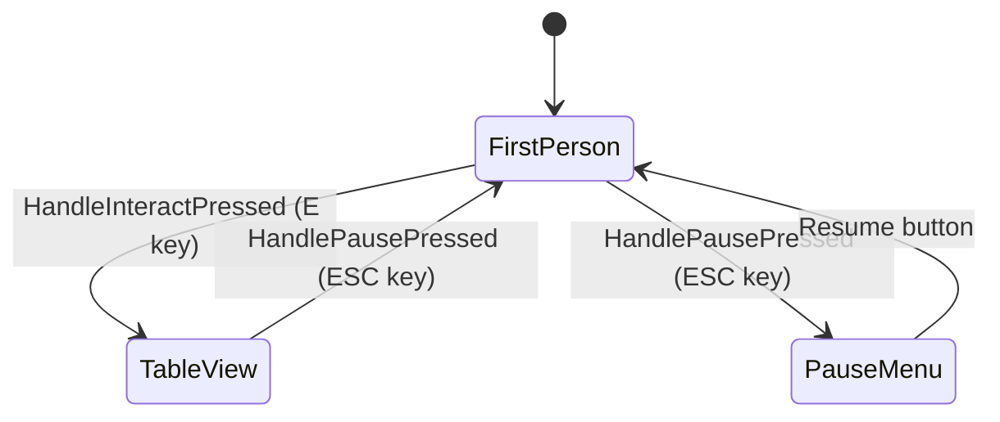

#### Key Members

```cpp
UENUM(BlueprintType)
enum class EFCPlayerCameraMode : uint8
{
    FirstPerson = 0,
    TableView
};

UPROPERTY(VisibleAnywhere, BlueprintReadOnly, Category = "State")
EFCPlayerCameraMode CameraMode;

UPROPERTY(VisibleInstanceOnly, BlueprintReadOnly, Category = "State")
bool bIsPauseMenuDisplayed;

UPROPERTY(EditDefaultsOnly, Category = "Input")
TObjectPtr<UInputMappingContext> DefaultMappingContext;

UPROPERTY(EditDefaultsOnly, Category = "Input")
TObjectPtr<UInputAction> InteractAction;

UPROPERTY(EditDefaultsOnly, Category = "Input")
TObjectPtr<UInputAction> PauseAction;
```

#### Enhanced Input Integration

- **Constructor**: Loads `/Game/FC/Input/IMC_FC_Default`, `IA_Interact`, `IA_Pause` via `ConstructorHelpers::FObjectFinder`.
- **SetupInputComponent**: Registers mapping context with local player subsystem; binds actions via `UEnhancedInputComponent`.
- **Safety**: Logs warnings if any asset or component is missing, ensuring QA sees configuration issues immediately.

#### Input Handlers

```cpp
void AFCPlayerController::HandleInteractPressed()
{
    if (CameraMode == EFCPlayerCameraMode::FirstPerson)
    {
        UE_LOG(LogFallenCompassPlayerController, Log, TEXT("TODO: Trace forward and interact with focused actor."));
        EnterTableViewPlaceholder();
    }
    else
    {
        UE_LOG(LogFallenCompassPlayerController, Log, TEXT("TODO: Route table-view interaction to board UI."));
    }
}

void AFCPlayerController::HandlePausePressed()
{
    if (CameraMode == EFCPlayerCameraMode::TableView)
    {
        UE_LOG(LogFallenCompassPlayerController, Log, TEXT("ESC pressed in table view. Returning to first-person."));
        ExitTableViewPlaceholder();
        return;
    }

    if (bIsPauseMenuDisplayed)
    {
        HidePauseMenuPlaceholder();
    }
    else
    {
        ShowPauseMenuPlaceholder();
    }
}
```

#### Placeholder Methods

- `EnterTableViewPlaceholder()` / `ExitTableViewPlaceholder()`: Log TODOs for camera blend and movement disable/enable (Task 6).
- `ShowPauseMenuPlaceholder()` / `HidePauseMenuPlaceholder()`: Log TODOs for UMG widget instantiation (Task 5).
- `SetFallenCompassCameraMode()`: Internal helper renamed to avoid hiding `APlayerController::SetCameraMode`.

#### Design Notes

- `bShowMouseCursor` forced `false` (FPS focus); trivially swappable once UI needs cursor.
- All state transitions logged via `LogStateChange()` for debugging.

#### BeginPlay Lifecycle Simplification

**Pre-Refactoring**: BeginPlay() contained complex logic to detect level type and set up input modes:

- Manual PIE prefix stripping (StartsWith, RightChop)
- String matching (Contains("Office"), Contains("MainMenu"))
- Conditional gameplay input setup based on level name
- Attempted to determine input mode from level type

**Post-Refactoring (Priority 1A.5)**:

- BeginPlay() simplified to only call `RestorePlayerPosition()` (from GameInstance if pending load)
- **No level type detection** - removed all string matching
- **No input mode setup** - delegated to state transition methods
- Input mode now set by:
  - `InitializeMainMenu()` → Sets `FInputModeUIOnly` with mouse cursor
  - `TransitionToGameplay()` → Sets `FInputModeGameOnly` without mouse cursor

**Rationale**: PlayerController is destroyed and recreated on level transitions, making it unsuitable for tracking "save load vs fresh start" state. GameInstance (persistent across levels) orchestrates the proper state setup by calling the appropriate transition method.

**L_Office Dual Purpose**: L_Office serves as both menu location AND gameplay location. Level type alone cannot determine input mode—explicit state transitions (InitializeMainMenu/TransitionToGameplay) handle input mode setup based on game state, not level name.

---

## First-Person Character & Input (Task 3)

### Overview

Implemented the first-person character for office exploration with proper camera setup, mesh configuration, pitch clamping, and look sensitivity parameters. Task 3.1 establishes the character foundation; subsequent tasks (3.2-3.5) will wire input mappings and movement.

### 3.1 First-Person Character Class

#### AFCFirstPersonCharacter

- **Files**: `Source/FC/FCFirstPersonCharacter.h/.cpp`
- **Inheritance**: `ACharacter`
- **Purpose**: Player-controlled first-person character for office level exploration with configurable camera behavior and movement constraints.

#### Class Architecture

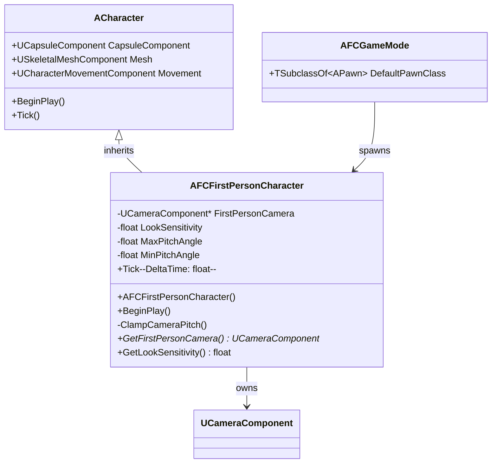

#### Component Hierarchy

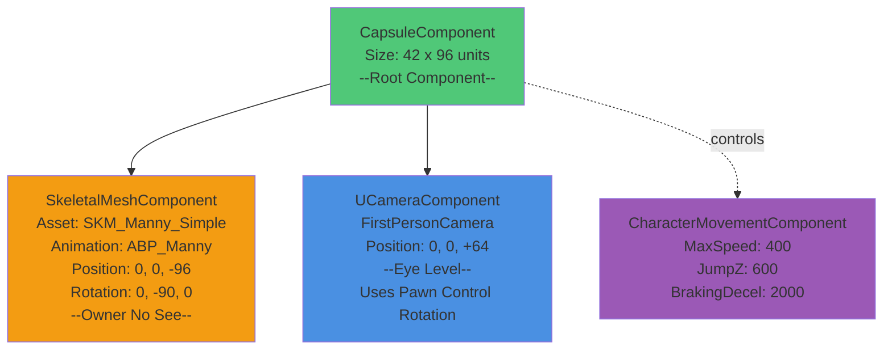

#### Key Members

**Camera Component**

```cpp
UPROPERTY(VisibleAnywhere, BlueprintReadOnly, Category = "Components")
TObjectPtr<UCameraComponent> FirstPersonCamera;
```

- Positioned at +64 units Z (eye level above capsule base)
- `bUsePawnControlRotation = true` - follows controller rotation
- Updated every frame via pitch clamping system

**Camera Configuration**

```cpp
UPROPERTY(EditAnywhere, BlueprintReadWrite, Category = "Camera", meta = (ClampMin = "0.1", ClampMax = "5.0"))
float LookSensitivity = 1.0f;

UPROPERTY(EditDefaultsOnly, BlueprintReadOnly, Category = "Camera")
float MaxPitchAngle = 60.0f;

UPROPERTY(EditDefaultsOnly, BlueprintReadOnly, Category = "Camera")
float MinPitchAngle = -60.0f;
```

- **LookSensitivity**: Multiplier for mouse input (ready for Task 3.3)
- **MaxPitchAngle**: Maximum upward look angle (+60°)
- **MinPitchAngle**: Maximum downward look angle (-60°)

#### Constructor Configuration

**Capsule & Rotation**

```cpp
GetCapsuleComponent()->InitCapsuleSize(42.0f, 96.0f);

bUseControllerRotationPitch = false; // Manual pitch control via ClampCameraPitch
bUseControllerRotationYaw = true;    // Character yaw follows mouse X
bUseControllerRotationRoll = false;
```

**Character Movement**

```cpp
GetCharacterMovement()->bOrientRotationToMovement = false; // FPS standard
GetCharacterMovement()->RotationRate = FRotator(0.0f, 720.0f, 0.0f);
GetCharacterMovement()->JumpZVelocity = 600.0f;
GetCharacterMovement()->AirControl = 0.2f;
GetCharacterMovement()->MaxWalkSpeed = 400.0f;
GetCharacterMovement()->BrakingDecelerationWalking = 2000.0f;
```

**Mesh Setup**

```cpp
// Load SKM_Manny_Simple
static ConstructorHelpers::FObjectFinder<USkeletalMesh> MannyMeshAsset(
    TEXT("/Game/Characters/Mannequins/Meshes/SKM_Manny_Simple"));
MeshComp->SetSkeletalMesh(MannyMeshAsset.Object);

// Load ABP_Unarmed animation blueprint
static ConstructorHelpers::FClassFinder<UAnimInstance> MannyAnimBP(
    TEXT("/Game/Characters/Mannequins/Anims/Unarmed/ABP_Unarmed"));
MeshComp->SetAnimInstanceClass(MannyAnimBP.Class);

// Position and show mesh
MeshComp->SetRelativeLocation(FVector(0.0f, 0.0f, -96.0f)); // Feet at capsule base
MeshComp->SetRelativeRotation(FRotator(0.0f, -90.0f, 0.0f)); // Face forward
MeshComp->SetOwnerNoSee(false); // Show in first-person view (visible when looking down)
```

#### Pitch Clamping System


**Implementation**

```cpp
void AFCFirstPersonCharacter::ClampCameraPitch()
{
    if (Controller)
    {
        FRotator ControlRotation = Controller->GetControlRotation();
        float CurrentPitch = FRotator::NormalizeAxis(ControlRotation.Pitch);
        float ClampedPitch = FMath::Clamp(CurrentPitch, MinPitchAngle, MaxPitchAngle);

        if (!FMath::IsNearlyEqual(CurrentPitch, ClampedPitch, 0.01f))
        {
            ControlRotation.Pitch = ClampedPitch;
            Controller->SetControlRotation(ControlRotation);
        }
    }
}
```

- Called every `Tick()` for continuous enforcement
- Only updates controller rotation when clamping occurs (performance optimization)
- Uses 0.01° threshold to avoid micro-adjustments

#### Lifecycle & Logging

**BeginPlay**

```cpp
void AFCFirstPersonCharacter::BeginPlay()
{
    Super::BeginPlay();

    UE_LOG(LogFallenCompassCharacter, Log,
        TEXT("AFCFirstPersonCharacter spawned | LookSensitivity=%.2f | PitchClamp=[%.1f, %.1f]"),
        LookSensitivity, MinPitchAngle, MaxPitchAngle);
}
```

**Tick**

```cpp
void AFCFirstPersonCharacter::Tick(float DeltaTime)
{
    Super::Tick(DeltaTime);
    ClampCameraPitch(); // Enforce pitch limits every frame
}
```

#### Integration with AFCGameMode

**Updated Constructor**

```cpp
AFCGameMode::AFCGameMode()
{
    // Use AFCFirstPersonCharacter for Office level (Task 3.1)
    DefaultPawnClass = AFCFirstPersonCharacter::StaticClass();
    PlayerControllerClass = AFCPlayerController::StaticClass();

    UE_LOG(LogFallenCompassGameMode, Log,
        TEXT("AFCGameMode configured with AFCFirstPersonCharacter and AFCPlayerController."));
}
```

- Removed legacy template pawn references (`BP_TopDownCharacter`, `ADefaultPawn`)
- Directly assigns `AFCFirstPersonCharacter::StaticClass()`
- Simplified includes and constructor logic

**BeginPlay Logging**

```cpp
UE_LOG(LogFallenCompassGameMode, Verbose,
    TEXT("Task 3.1 complete: AFCFirstPersonCharacter active. Next: Input mappings (3.2-3.3) and Office level (4.x)."));
```

#### Design Rationale

1. **Separate Character Class**: Keep `AFCCharacter` (top-down) for variant game modes; `AFCFirstPersonCharacter` exclusively for office level
2. **Pitch Clamping**: Prevents disorientation from over-rotation (standard FPS UX)
3. **Visible Mesh**: `SetOwnerNoSee(false)` allows seeing the character mesh when looking down, providing visual feedback
4. **Look Sensitivity Parameter**: Ready for Task 3.3 input implementation without refactoring
5. **Standard Movement Values**: 400 units/sec walk speed and 600 units/sec jump are industry-standard FPS defaults

#### Asset Dependencies

- **Mesh**: `/Game/Characters/Mannequins/Meshes/SKM_Manny_Simple`
- **Animation**: `/Game/Characters/Mannequins/Animations/ABP_Manny`
- Both assets ship with UE5 Mannequin content (no external dependencies)

#### Open Hooks for Task 3.2-3.5

- `LookSensitivity` ready for mouse input scaling
- Movement input handlers to be bound in Task 3.3
- Interaction input (`IA_Interact`) already configured in `AFCPlayerController`
- Character spawns correctly; awaiting input mapping completion

---

### 3.2 Configure Input Mappings

#### Overview

Configured Enhanced Input System with multiple mapping contexts for different gameplay modes. Created 2D vector input actions for movement and look, with proper key bindings and modifiers for first-person controls.

#### Multiple Input Mapping Contexts

**Architecture Decision**: Separate mapping contexts for different gameplay modes enable clean context switching without conflicts.

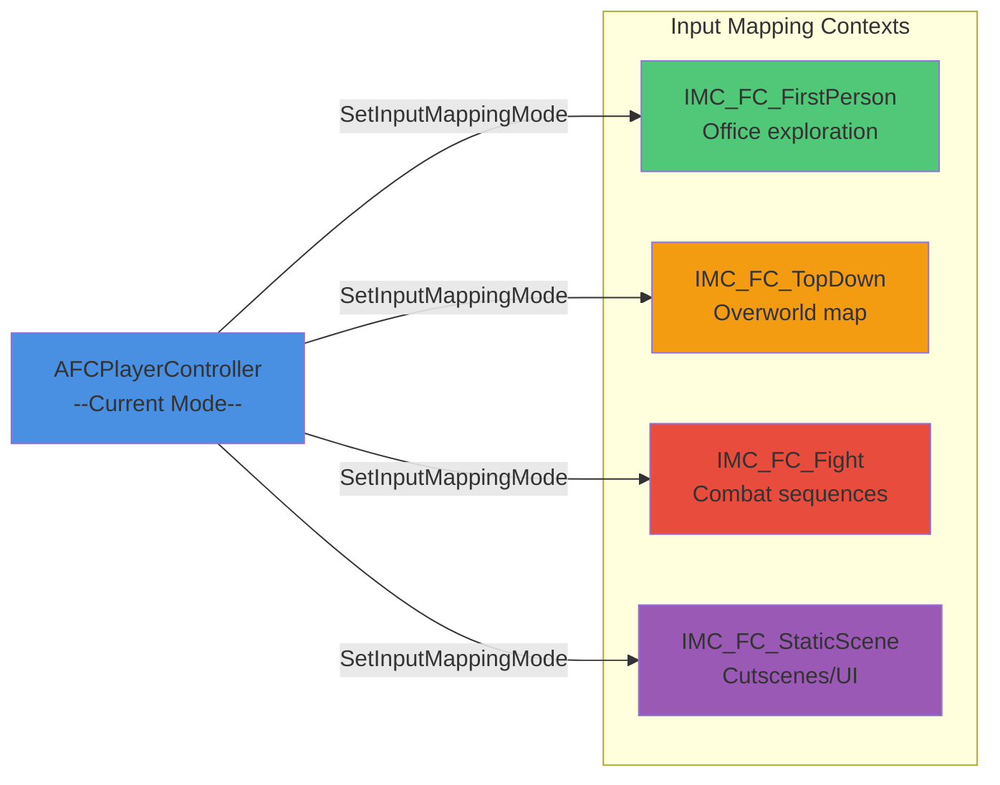

#### EFCInputMappingMode Enum

**Added to `FCPlayerController.h`**:

```cpp
UENUM(BlueprintType)
enum class EFCInputMappingMode : uint8
{
    FirstPerson = 0,
    TopDown,
    Fight,
    StaticScene
};
```

#### Input Mapping Context Properties

**Replaced single `DefaultMappingContext` with four mode-specific contexts**:

```cpp
UPROPERTY(VisibleAnywhere, BlueprintReadOnly, Category = "Input")
EFCInputMappingMode CurrentMappingMode;

UPROPERTY(EditDefaultsOnly, Category = "Input")
TObjectPtr<UInputMappingContext> FirstPersonMappingContext;

UPROPERTY(EditDefaultsOnly, Category = "Input")
TObjectPtr<UInputMappingContext> TopDownMappingContext;

UPROPERTY(EditDefaultsOnly, Category = "Input")
TObjectPtr<UInputMappingContext> FightMappingContext;

UPROPERTY(EditDefaultsOnly, Category = "Input")
TObjectPtr<UInputMappingContext> StaticSceneMappingContext;
```

#### Dynamic Context Switching

**Public method for runtime mode changes**:

```cpp
UFUNCTION(BlueprintCallable, Category = "Input")
void SetInputMappingMode(EFCInputMappingMode NewMode);
```

**Implementation** - clears all mappings and applies new context:

```cpp
void AFCPlayerController::SetInputMappingMode(EFCInputMappingMode NewMode)
{
    // Get subsystem and validate
    UEnhancedInputLocalPlayerSubsystem* Subsystem =
        ULocalPlayer::GetSubsystem<UEnhancedInputLocalPlayerSubsystem>(GetLocalPlayer());

    // Select context based on mode
    UInputMappingContext* ContextToApply = nullptr;
    switch (NewMode)
    {
        case EFCInputMappingMode::FirstPerson: ContextToApply = FirstPersonMappingContext; break;
        case EFCInputMappingMode::TopDown: ContextToApply = TopDownMappingContext; break;
        case EFCInputMappingMode::Fight: ContextToApply = FightMappingContext; break;
        case EFCInputMappingMode::StaticScene: ContextToApply = StaticSceneMappingContext; break;
    }

    // Clear and apply
    Subsystem->ClearAllMappings();
    Subsystem->AddMappingContext(ContextToApply, DefaultMappingPriority);
    CurrentMappingMode = NewMode;
}
```

#### Input Action Assets

**Created in `/Game/FC/Input/`**:

| Asset         | Type              | Purpose                          |
| ------------- | ----------------- | -------------------------------- |
| `IA_Move`     | Axis2D (Vector2D) | WASD movement input              |
| `IA_Look`     | Axis2D (Vector2D) | Mouse look input                 |
| `IA_Interact` | Boolean           | Interaction (E key) - _existing_ |
| `IA_Pause`    | Boolean           | Pause/ESC handling - _existing_  |

#### IMC_FC_FirstPerson Configuration

**Key Bindings & Modifiers**:

**IA_Move** (2D Vector):

- **W** → Forward
  - Modifier: **Swizzle Input Axis Values** (YXZ)
  - Maps to Y-axis positive
- **S** → Backward
  - Modifiers: **Swizzle** (YXZ) + **Negate**
  - Maps to Y-axis negative
- **D** → Right
  - No modifiers (X-axis positive)
- **A** → Left
  - Modifier: **Negate**
  - Maps to X-axis negative

**IA_Look** (2D Vector):

- **Mouse 2D Axis**
  - Modifier: **Negate Y**
  - Inverts Y-axis for standard FPS look (mouse up = look up)

**IA_Interact**:

- **E** key → Trigger interaction

**IA_Pause**:

- **Escape** key → Pause menu / exit table view

#### Constructor Updates

**Loads all four mapping contexts at startup**:

```cpp
AFCPlayerController::AFCPlayerController()
{
    CurrentMappingMode = EFCInputMappingMode::FirstPerson;

    // Load all four mapping contexts with ConstructorHelpers
    static ConstructorHelpers::FObjectFinder<UInputMappingContext> FirstPersonContextFinder(
        TEXT("/Game/FC/Input/IMC_FC_FirstPerson"));
    FirstPersonMappingContext = FirstPersonContextFinder.Object;

    static ConstructorHelpers::FObjectFinder<UInputMappingContext> TopDownContextFinder(
        TEXT("/Game/FC/Input/IMC_FC_TopDown"));
    TopDownMappingContext = TopDownContextFinder.Object;

    // ... Fight and StaticScene contexts ...
}
```

#### SetupInputComponent Updates

**Critical fix**: Added `Super::SetupInputComponent()` call to prevent access violation crash.

```cpp
void AFCPlayerController::SetupInputComponent()
{
    Super::SetupInputComponent(); // MUST be first - initializes InputComponent

    // Apply initial mapping context
    SetInputMappingMode(CurrentMappingMode);

    // Bind shared input actions
    UEnhancedInputComponent* EnhancedInput = Cast<UEnhancedInputComponent>(InputComponent);
    if (EnhancedInput)
    {
        EnhancedInput->BindAction(InteractAction, ETriggerEvent::Started,
            this, &AFCPlayerController::HandleInteractPressed);
        EnhancedInput->BindAction(PauseAction, ETriggerEvent::Started,
            this, &AFCPlayerController::HandlePausePressed);
    }
}
```

#### Future Usage Examples

**Switching contexts at runtime**:

```cpp
// When entering office level
PlayerController->SetInputMappingMode(EFCInputMappingMode::FirstPerson);

// When transitioning to overworld map
PlayerController->SetInputMappingMode(EFCInputMappingMode::TopDown);

// When entering combat
PlayerController->SetInputMappingMode(EFCInputMappingMode::Fight);

// During cutscenes
PlayerController->SetInputMappingMode(EFCInputMappingMode::StaticScene);
```

#### Asset Status

**Mapping Contexts** (all in `/Game/FC/Input/`):

- `IMC_FC_FirstPerson` ✅ Configured with WASD + Mouse
- `IMC_FC_TopDown` ✅ Created (to be configured in future tasks)
- `IMC_FC_Fight` ✅ Created (to be configured in future tasks)
- `IMC_FC_StaticScene` ✅ Created (to be configured in future tasks)

**Input Actions** (all in `/Game/FC/Input/`):

- `IA_Move` ✅ Created (Axis2D)
- `IA_Look` ✅ Created (Axis2D)
- `IA_Interact` ✅ Existing (Boolean)
- `IA_Pause` ✅ Existing (Boolean)

#### Design Rationale

1. **Separate Contexts**: Prevents key binding conflicts between gameplay modes
2. **Shared Actions**: `IA_Move`, `IA_Look` reusable across contexts with different bindings
3. **Runtime Switching**: Clean transitions without rebinding individual actions
4. **Scalability**: Easy to add new contexts (e.g., `IMC_FC_Camp`, `IMC_FC_UI`)
5. **Blueprint Accessible**: `SetInputMappingMode()` callable from BP for level scripts

#### Open Hooks for Task 3.3

- Input actions created and mapped ✅
- Mapping context switching functional ✅
- Awaiting binding to character movement methods
- `LookSensitivity` parameter ready for mouse input scaling

---

### 3.3 Implement Movement & Look

#### Overview

Implemented Enhanced Input bindings for WASD movement and mouse look with configurable sensitivity and pitch clamping. Fixed initial pitch inversion issue by negating the Y-axis input for standard FPS controls.

#### Input Binding Implementation

**SetupPlayerInputComponent Override**

```cpp
void AFCFirstPersonCharacter::SetupPlayerInputComponent(UInputComponent* PlayerInputComponent)
{
    Super::SetupPlayerInputComponent(PlayerInputComponent);

    UEnhancedInputComponent* EnhancedInput = Cast<UEnhancedInputComponent>(PlayerInputComponent);
    if (!EnhancedInput) return;

    // Bind movement action (WASD)
    if (MoveAction)
    {
        EnhancedInput->BindAction(MoveAction, ETriggerEvent::Triggered, this, &AFCFirstPersonCharacter::HandleMove);
    }

    // Bind look action (Mouse)
    if (LookAction)
    {
        EnhancedInput->BindAction(LookAction, ETriggerEvent::Triggered, this, &AFCFirstPersonCharacter::HandleLook);
    }
}
```

- Loads `IA_Move` and `IA_Look` via ConstructorHelpers in constructor
- Binds to `HandleMove` and `HandleLook` methods using `ETriggerEvent::Triggered` for continuous input

#### Movement Handler

**HandleMove Method**

```cpp
void AFCFirstPersonCharacter::HandleMove(const FInputActionValue& Value)
{
    const FVector2D MovementVector = Value.Get<FVector2D>();

    if (Controller)
    {
        const FRotator Rotation = Controller->GetControlRotation();
        const FRotator YawRotation(0, Rotation.Yaw, 0);

        const FVector ForwardDirection = FRotationMatrix(YawRotation).GetUnitAxis(EAxis::X);
        const FVector RightDirection = FRotationMatrix(YawRotation).GetUnitAxis(EAxis::Y);

        AddMovementInput(ForwardDirection, MovementVector.Y); // Y = forward/backward (W/S)
        AddMovementInput(RightDirection, MovementVector.X);   // X = right/left (D/A)
    }
}
```

- Processes 2D vector input from WASD keys
- Calculates forward/right directions relative to controller yaw (character faces movement direction)
- Adds movement input using standard Character movement system

#### Look Handler

**HandleLook Method**

```cpp
void AFCFirstPersonCharacter::HandleLook(const FInputActionValue& Value)
{
    const FVector2D LookAxisVector = Value.Get<FVector2D>();

    if (Controller)
    {
        AddControllerYawInput(LookAxisVector.X * LookSensitivity);   // Mouse X = yaw (turn left/right)
        AddControllerPitchInput(-LookAxisVector.Y * LookSensitivity); // Mouse Y = pitch (look up/down) - inverted
    }
}
```

- Applies `LookSensitivity` multiplier to mouse input
- **Pitch Inversion Fix**: Negated Y-axis (`-LookAxisVector.Y`) to correct inverted look up/down
- Yaw remains standard (positive X turns right)
- Pitch clamping enforced in `Tick()` via `ClampCameraPitch()`

#### Design Rationale

1. **Controller-Relative Movement**: Character moves relative to camera yaw, standard for FPS games
2. **Sensitivity Parameter**: Allows runtime adjustment of mouse sensitivity (0.1x to 5.0x range)
3. **Pitch Inversion**: Fixed by negating Y-input; mouse up now correctly looks up
4. **Continuous Input**: Uses `ETriggerEvent::Triggered` for smooth, frame-rate independent input
5. **Separation of Concerns**: Movement and look handled separately for clarity and modularity

#### Testing & Validation

- **WASD Movement**: Verified forward/backward and strafe left/right
- **Mouse Look**: Confirmed yaw (left/right) and corrected pitch (up/down)
- **Sensitivity**: Tested with different `LookSensitivity` values
- **Pitch Clamping**: Ensured ±60° limits prevent over-rotation
- **Logging**: Added debug logs for input binding and handler execution

#### Integration Notes

- Depends on `IA_Move` and `IA_Look` assets configured in Task 3.2
- `LookSensitivity` exposed as editable property for designers
- Pitch clamping runs every `Tick()` for continuous enforcement
- No conflicts with `AFCPlayerController` input mappings (separate contexts)

---

---

### 3.4 Connect Character to GameMode

**Status**: ✅ **Completed** (integrated with Task 3.1)

See [AFCGameMode Integration](#integration-with-afcgamemode) above.

---

### 3.5 Expose Hooks for Interaction and ESC

#### Overview

Implemented input action bindings for interaction (E key) and pause (ESC) in `AFCPlayerController`. Added forward line trace functionality for interaction detection as a foundation for future interactable objects.

#### Input Action Bindings

**SetupInputComponent Override** (already implemented in Task 2.3, confirmed in Task 3.5)

```cpp
void AFCPlayerController::SetupInputComponent()
{
    Super::SetupInputComponent();

    SetInputMappingMode(CurrentMappingMode);

    UEnhancedInputComponent* EnhancedInput = Cast<UEnhancedInputComponent>(InputComponent);
    if (EnhancedInput)
    {
        EnhancedInput->BindAction(InteractAction, ETriggerEvent::Started,
            this, &AFCPlayerController::HandleInteractPressed);
        EnhancedInput->BindAction(PauseAction, ETriggerEvent::Started,
            this, &AFCPlayerController::HandlePausePressed);
    }
}
```

- Binds `IA_Interact` to `HandleInteractPressed` (E key)
- Binds `IA_Pause` to `HandlePausePressed` (ESC key)
- Uses `ETriggerEvent::Started` for single-press actions

#### Interaction Handler Implementation

**HandleInteractPressed Method**

```cpp
void AFCPlayerController::HandleInteractPressed()
{
    if (CameraMode == EFCPlayerCameraMode::FirstPerson)
    {
        AFCFirstPersonCharacter* Character = Cast<AFCFirstPersonCharacter>(GetPawn());
        if (Character)
        {
            UCameraComponent* Camera = Character->GetFirstPersonCamera();
            if (Camera)
            {
                FVector Start = Camera->GetComponentLocation();
                FVector End = Start + (Camera->GetForwardVector() * 1000.0f);

                FHitResult HitResult;
                FCollisionQueryParams QueryParams;
                QueryParams.AddIgnoredActor(GetPawn());

                if (GetWorld()->LineTraceSingleByChannel(HitResult, Start, End, ECC_Visibility, QueryParams))
                {
                    UE_LOG(LogFallenCompassPlayerController, Log, TEXT("Interact: Hit actor '%s' at distance %.1f units"),
                        *HitResult.GetActor()->GetName(), HitResult.Distance);
                    // TODO: Check if hit actor is interactable and call interaction logic
                }
                else
                {
                    UE_LOG(LogFallenCompassPlayerController, Log, TEXT("Interact: No interactable found"));
                }
            }
        }
    }
    // TableView mode: TODO for Task 6
}
```

- Performs line trace from camera position forward 1000 units
- Ignores player character in trace
- Logs hit actor name and distance for debugging
- On-screen debug messages for visual feedback
- Placeholder for interactable logic (to be implemented in Task 6)

#### Pause Handler

**HandlePausePressed Method** (already implemented)

- Logs pause press with current camera mode
- Handles table view exit vs. pause menu toggle
- On-screen debug messages
- Delegates to placeholder methods for UI (Task 5)

#### Design Rationale

1. **Controller-Level Binding**: Interaction and pause are player actions, not character-specific, so bound in `AFCPlayerController`
2. **Forward Trace**: Basic raycast from camera provides foundation for object interaction without requiring complex systems
3. **Debug Feedback**: Comprehensive logging and on-screen messages aid development and testing
4. **Extensible**: Trace result can be extended to check for interactable components/tags in Task 6
5. **Mode-Aware**: Different behavior for FirstPerson vs. TableView modes

#### Testing & Validation

- **E Key**: Verified line trace detects geometry and logs results
- **ESC Key**: Confirmed pause logging and mode transitions
- **No False Positives**: Player character ignored in traces
- **Performance**: Single trace per press, minimal impact

#### Integration Notes

- Depends on `IA_Interact` and `IA_Pause` assets (Task 3.2)
- Trace distance (1000 units) can be made configurable later
- Future: Add interactable interface/component for objects to implement
- Camera mode switching affects interaction behavior

---

---

## Office Level & Greybox (Task 4)

### Overview

Created the first playable level for Fallen Compass - a greyboxed office environment with basic geometry, lighting, interactable props, and camera target positions for the table view transition system.

### 4.1 Office Level Creation

#### Level Asset

- **Location**: `/Game/FC/World/Levels/L_Office.umap`
- **Game Mode**: `FCGameMode` assigned via World Settings override
- **PlayerStart**: Positioned at central spawn location facing the desk

#### World Settings Configuration

```
Game Mode Override: FCGameMode
Default Pawn Class: AFCFirstPersonCharacter (inherited from GameMode)
```

### 4.2 Greybox Geometry

#### Room Structure

**Dimensions**: 2000x2000 units (20x20 meters)

- **Floor**: Basic geometry with collision enabled
- **Walls**: Four walls at 300 units height (3 meters)
- **Ceiling**: Enclosed room for proper lighting
- **Collision**: BlockAll preset on all geometry to prevent player clipping

#### Organization

Level geometry organized in World Outliner:

```
L_Office
├── WorldLighting/
│   ├── DirectionalLight
│   ├── SkyLight
│   ├── SkyAtmosphere
│   └── ExponentialHeightFog
├── Geometry/
│   ├── Floor
│   ├── Walls
│   └── Ceiling
└── Props/
    ├── BP_OfficeDesk
    └── SM_Door
```

### 4.3 Office Desk Blueprint

#### BP_OfficeDesk

- **Location**: `/Game/FC/World/Props/BP_OfficeDesk`
- **Purpose**: Primary interactable object for table view transitions
- **Components**:
  - Root: Static Mesh Component (table mesh)
  - **CameraTargetPoint**: Scene Component (child of root)

#### CameraTargetPoint Setup

```
Component Hierarchy:
└── BP_OfficeDesk (Root)
    └── CameraTargetPoint (SceneComponent)
        └── Transform: Positioned above desk, looking down
```

**Purpose**:

- Target transform for table-focused camera view (Task 6)
- Provides consistent camera position for card game/board interactions
- Can be adjusted per-instance without Blueprint changes

**Configuration**:

- Position: Above and angled toward desk surface
- Rotation: Angled downward to frame entire desk
- Field of View: Will be applied when camera transitions (Task 6)

### 4.4 Door Placeholder

#### SM_Door

- **Type**: Static Mesh (basic cube geometry)
- **Purpose**: Exit door placeholder for future level transitions
- **Position**: Placed on wall as clearly marked "exit"
- **Collision**: Enabled for interaction detection
- **Future**: Will be upgraded to Blueprint with door opening animation and level transition logic (Task 6)

### 4.5 Camera Positions for Table View

#### Implementation Approach

**Chosen Method**: SceneComponent on Blueprint (Option 2)

- Allows per-instance adjustment
- No separate camera actor clutter
- Easier to reference in code (`BP_OfficeDesk->FindComponentByClass<USceneComponent>()`)

#### Camera Target Configuration

**CameraTargetPoint Transform**:

- Positioned to provide clear view of entire desk surface
- Angled top-down perspective (similar to board game view)
- Distance adjusted to frame desk without clipping
- Will be used by `AFCPlayerController::EnterTableView()` in Task 6

#### Future Camera Transition System

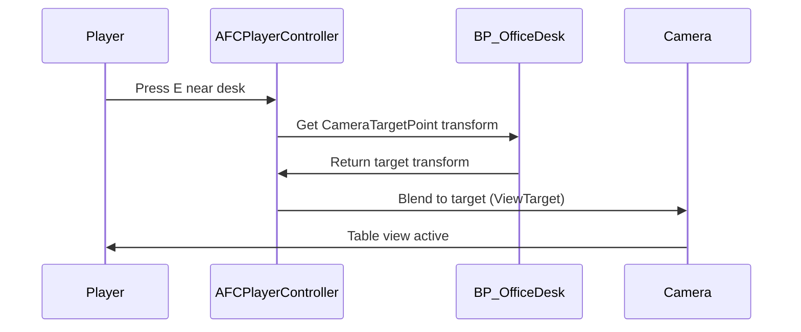

### 4.6 Lighting & Navigation

#### Lighting Setup

**WorldLighting Folder**:

- **DirectionalLight**: Primary outdoor light source (sun)
  - Intensity: Default
  - Color: Natural daylight
  - Angle: Creates shadows through windows (future)
- **SkyLight**: Ambient fill light from sky
  - Source Type: SLS_CapturedScene
  - Recaptured after geometry changes
- **SkyAtmosphere**: Realistic atmospheric scattering
  - Provides blue sky gradient
  - Enhances outdoor lighting feel
- **ExponentialHeightFog**: Atmospheric depth and mood
  - Subtle fog for visual depth

**Lighting Quality**:

- Development/PIE: Fast lighting for iteration
- Final: Will be baked for production (Task 7+)

#### Navigation & Movement Testing

**Collision Verification**:

- Player cannot walk through walls ✅
- Floor collision prevents falling ✅
- Desk collision allows interaction ✅
- Door collision blocks passage ✅

**Movement Feel**:

- Room scale appropriate for first-person navigation
- Desk height realistic relative to character
- Door positioned at logical exit height
- Comfortable walking space around props

**Character Movement**:

- WASD movement: Responsive and smooth
- Mouse look: Proper sensitivity and pitch clamping
- Collision response: Natural sliding along walls
- No clipping or geometry penetration

#### NavMesh (Optional)

- Not critical for player character (uses CharacterMovement)
- Useful for future AI/NPC pathfinding
- Can be generated later if needed

### Design Rationale

1. **Greybox First**: Focus on layout and scale before art pass
2. **Modular Props**: Desk and door as separate Blueprints for reusability
3. **Scene Component Target**: Flexible camera positioning without cluttering level
4. **Comprehensive Lighting**: Realistic atmosphere aids in visual testing
5. **Organized Hierarchy**: Clean World Outliner for maintainability

### Asset Dependencies

- **Mannequin Assets**: Used in BP_OfficeDesk for scale reference
- **Level Prototyping**: Basic geometry meshes
- **Engine Content**: Lighting components (DirectionalLight, SkyLight, etc.)

### Testing & Validation

- ✅ Player spawns correctly at PlayerStart
- ✅ WASD movement and mouse look functional
- ✅ Collision prevents wall clipping
- ✅ Desk accessible and positioned correctly
- ✅ Door visible as exit point
- ✅ Lighting provides clear visibility
- ✅ Scale feels appropriate for office environment

### Open Hooks for Task 6

- `BP_OfficeDesk::CameraTargetPoint` ready for camera transitions
- `SM_Door` ready for interaction logic and level transitions
- Desk interaction will trigger table view mode
- Door interaction will trigger level change or game exit

---

## Main Menu System (Task 5)

### Overview

Implemented an **in-world main menu system** within the L_Office level that provides a seamless transition between menu navigation and gameplay. The system uses a dedicated MenuCamera actor, widget-based UI, and state management to handle different game modes (Main Menu, Gameplay, Paused).

**Key Architecture Decision**: There is **no separate main menu level** (no L_MainMenu). Instead, the L_Office level serves dual purposes:

1. **Main Menu State**: Player views the office through a static MenuCamera while interacting with the main menu UI
2. **Gameplay State**: Player controls first-person character with full movement and interaction

This approach creates an immersive, seamless experience where the menu "exists" in the game world.

### Main Menu Architecture

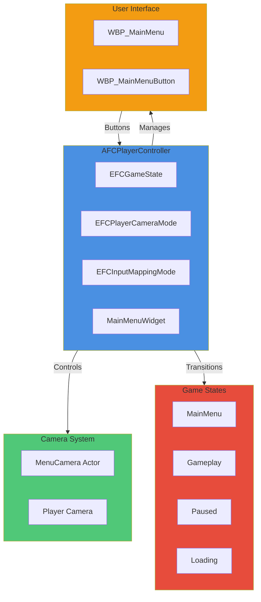

### AFCPlayerController Main Menu Integration

- **Files**: `Source/FC/Core/FCPlayerController.h/.cpp`
- **Purpose**: Central coordinator for menu state, camera transitions, input modes, and UI management.

#### Key Enums

```cpp
UENUM(BlueprintType)
enum class EFCPlayerCameraMode : uint8
{
    FirstPerson = 0,
    TableView,
    MainMenu,
    SaveSlotView
};

UENUM(BlueprintType)
enum class EFCInputMappingMode : uint8
{
    FirstPerson = 0,
    TopDown,
    Fight,
    StaticScene
};

UENUM(BlueprintType)
enum class EFCGameState : uint8
{
    MainMenu = 0,
    Gameplay,
    TableView,
    Paused,
    Loading
};
```

#### Key Properties

```cpp
/** Reference to the MenuCamera actor in L_Office */
UPROPERTY(EditAnywhere, BlueprintReadWrite, Category = "Camera")
TObjectPtr<ACameraActor> MenuCamera;

/** Main menu widget class */
UPROPERTY(EditDefaultsOnly, Category = "UI")
TSubclassOf<UUserWidget> MainMenuWidgetClass;

/** Current main menu widget instance */
UPROPERTY()
TObjectPtr<UUserWidget> MainMenuWidget;

/** Current game state (MainMenu, Gameplay, etc.) */
UPROPERTY(VisibleAnywhere, BlueprintReadOnly, Category = "State")
EFCGameState CurrentGameState;

/** Current camera mode */
UPROPERTY(VisibleAnywhere, BlueprintReadOnly, Category = "State")
EFCPlayerCameraMode CameraMode;
```

#### Key Methods

```cpp
/** Initialize the main menu state (called on level start) */
UFUNCTION(BlueprintCallable, Category = "GameFlow")
void InitializeMainMenu();

/** Transition from main menu to gameplay */
UFUNCTION(BlueprintCallable, Category = "GameFlow")
void TransitionToGameplay();

/** Return to main menu state (from gameplay) */
UFUNCTION(BlueprintCallable, Category = "GameFlow")
void ReturnToMainMenu();

/** Main menu button callbacks */
UFUNCTION(BlueprintCallable, Category = "UI")
void OnNewLegacyClicked();

UFUNCTION(BlueprintCallable, Category = "UI")
void OnContinueClicked();

UFUNCTION(BlueprintCallable, Category = "UI")
void OnLoadSaveClicked();

UFUNCTION(BlueprintCallable, Category = "UI")
void OnOptionsClicked();

UFUNCTION(BlueprintCallable, Category = "UI")
void OnQuitClicked();

/** Close save slot selector and return to main menu */
UFUNCTION(BlueprintCallable, Category = "UI")
void CloseSaveSlotSelector();

/** Load a save slot (called from save slot selector widget) */
UFUNCTION(BlueprintCallable, Category = "UI")
void LoadSaveSlot(const FString& SlotName);

/** Callback when save game finishes loading */
UFUNCTION()
void OnSaveGameLoaded(bool bSuccess);
```

### Main Menu Flow Implementation

#### InitializeMainMenu()

Called when the level starts to set up the main menu state:

1. Sets `CurrentGameState = EFCGameState::MainMenu`
2. Clears all input mappings
3. Sets input mode to `FInputModeUIOnly` with mouse cursor visible
4. Switches camera to `MenuCamera` (no blend on initial load)
5. Creates and displays `MainMenuWidget`

#### TransitionToGameplay()

Called when "New Legacy" button is clicked:

1. Sets `CurrentGameState = EFCGameState::Gameplay`
2. Removes main menu widget
3. Blends camera to first-person mode (2.0s)
4. After camera blend, restores first-person input mapping
5. Sets input mode to `FInputModeGameOnly` with mouse cursor hidden

#### ReturnToMainMenu()

Called from door interaction to return to menu:

1. Sets `CurrentGameState = EFCGameState::Loading`
2. Fades camera to black (1.0s)
3. Reloads `L_Office` level after fade completes (resets level state)
4. On level reload, `BeginPlay()` detects MainMenu state and calls `InitializeMainMenu()` automatically
5. Player sees the same office space but from MenuCamera perspective with UI active

**Note**: Level reload is necessary to properly reset all interactive objects and restore the office to its initial state.

### Widget System

#### WBP_MainMenu

- **Location**: `/Game/FC/UI/Menus/WBP_MainMenu`
- **Purpose**: Main menu interface with buttons for game actions
- **Buttons**: New Legacy, Continue, Load Save, Options, Quit
- **Integration**: Button clicks call corresponding `AFCPlayerController` methods

#### WBP_MainMenuButton

- **Location**: `/Game/FC/UI/Menus/WBP_MainMenuButton`
- **Purpose**: Reusable button widget for menu interactions
- **Features**: Hover effects, click animations, text styling

#### WBP_SaveSlotSelector

- **Location**: `/Game/FC/UI/Menus/SaveMenu/WBP_SaveSlotSelector`
- **Purpose**: Save slot selection screen for loading saved games
- **Components**:
  - Map/parchment background image
  - ScrollBox for save slot list
  - Back button to return to main menu
- **Functions**:
  - `PopulateSaveSlots()`: Calls `GameInstance->GetAvailableSaveSlots()` and creates slot item widgets
  - `OnSlotClicked(SlotName)`: Handles slot selection, calls `PlayerController->LoadSaveSlot(SlotName)`
  - `OnBackClicked()`: Returns to main menu via `PlayerController->CloseSaveSlotSelector()`

#### WBP_SaveSlotItem

- **Location**: `/Game/FC/UI/Menus/SaveMenu/WBP_SaveSlotItem`
- **Purpose**: Reusable widget template for individual save slot entries
- **Components**:
  - Border with hover state (changes color on hover)
  - Thumbnail image (96x96)
  - Slot name text (warm parchment color #F4E3C6)
  - Save date text (dimmer #C9B8A0)
- **Functions**:
  - `SetSaveSlotData(SlotName, SaveDate, Thumbnail)`: Populates the widget with save data
  - `OnClicked`: Event dispatcher for slot selection
  - Hover/Unhover: Visual feedback with border color change
- **Styling**:
  - Default border color: RGBA(0.02, 0.02, 0.02, 0.7)
  - Hover border color: RGBA(0.15, 0.08, 0.03, 0.9)
  - Padding: 10 all around
  - Corner radius: 4-6

### Camera System

#### MenuCamera

- **Type**: `ACameraActor` placed in `L_Office` level
- **Purpose**: Provides menu navigation view of the office
- **Positioning**: Overlooks the office space for atmospheric menu presentation
- **Integration**: Referenced by `AFCPlayerController.MenuCamera` property

#### Camera Transitions

- **Menu → Gameplay**: Smooth blend from MenuCamera to first-person camera (2.0s)
- **Gameplay → Menu**: Fade to black (1.0s) then level reload
- **Implementation**: Uses `PlayerCameraManager->StartCameraFade()` and `SetViewTargetWithBlend()`

### Input Management

#### Input Mapping Contexts

- **IMC_FC_FirstPerson**: Movement, look, interact, pause actions
- **IMC_FC_TopDown**: Placeholder for future top-down navigation
- **IMC_FC_Fight**: Placeholder for combat sequences
- **IMC_FC_StaticScene**: Placeholder for cutscenes/dialogue

#### Input Mode Transitions

- **Main Menu**: `FInputModeUIOnly` - mouse controls UI, no game input
- **Gameplay**: `FInputModeGameOnly` - game controls active, mouse hidden
- **Paused**: `FInputModeUIOnly` - UI controls, game paused

### State Management

The system maintains three key state variables:

- `EFCGameState`: Overall game mode (MainMenu, Gameplay, Paused, Loading)
- `EFCPlayerCameraMode`: Active camera (FirstPerson, TableView, MainMenu, SaveSlotView)
- `EFCInputMappingMode`: Input context (FirstPerson, TopDown, Fight, StaticScene)

### Integration with Interaction System

The door interaction system integrates with main menu via `ReturnToMainMenu()`:

1. Player interacts with door (Press E on SM_Door in L_Office)
2. `BP_MenuDoor::OnInteract()` calls `AFCPlayerController::ReturnToMainMenu()`
3. Screen fades to black
4. L_Office level reloads to reset state
5. `InitializeMainMenu()` sets up fresh menu state
6. Player sees menu UI with MenuCamera view of the same office

**Architectural Note**: Both the main menu and gameplay occur in the same L_Office level. The distinction is purely state-based:

- **MainMenu State**: Static MenuCamera view + UI controls + mouse cursor
- **Gameplay State**: First-person character control + interaction system + hidden cursor

This creates a unique "menu within the world" experience where the office serves as both the menu backdrop and the gameplay environment.

### Save/Load System Foundation

#### UFCSaveGame Class

- **Files**: `Source/FC/SaveGame/FCSaveGame.h/.cpp`
- **Inheritance**: `USaveGame`
- **Purpose**: Data structure for serializing game state to disk

##### Key Properties

```cpp
/** Save slot name */
UPROPERTY(VisibleAnywhere, Category = "Meta")
FString SaveSlotName;

/** Timestamp when the save was created */
UPROPERTY(VisibleAnywhere, Category = "Meta")
FDateTime Timestamp;

/** Current level name */
UPROPERTY(VisibleAnywhere, Category = "Level")
FString CurrentLevelName;

/** Player location and rotation */
UPROPERTY(VisibleAnywhere, Category = "Player")
FVector PlayerLocation;
FRotator PlayerRotation;

/** Expedition data placeholder */
UPROPERTY(VisibleAnywhere, Category = "Expedition")
FString CurrentExpeditionId;

/** Game version for compatibility */
UPROPERTY(VisibleAnywhere, Category = "Meta")
FString GameVersion;
```

#### UFCGameInstance Save/Load Methods

##### Key Methods

```cpp
/** Save current game state to specified slot */
UFUNCTION(BlueprintCallable, Category = "SaveGame")
bool SaveGame(const FString& SlotName);

/** Load game state from specified slot (async) */
UFUNCTION(BlueprintCallable, Category = "SaveGame")
void LoadGameAsync(const FString& SlotName);

/** Get list of available save slots */
UFUNCTION(BlueprintCallable, Category = "SaveGame")
TArray<FString> GetAvailableSaveSlots();

/** Get the most recent save slot name */
UFUNCTION(BlueprintPure, Category = "SaveGame")
FString GetMostRecentSave();
```

##### Save Process

1. Creates `UFCSaveGame` instance
2. Populates with current game state (player position, level, expedition data)
3. Serializes to disk using `UGameplayStatics::SaveGameToSlot()`
4. Marks session as saved

##### Load Process

1. Checks if save slot exists
2. Loads `UFCSaveGame` from disk
3. Applies data to `UFCGameInstance` (expedition state, etc.)
4. Caches save data in `PendingLoadData` for position restoration
5. Uses `UFCLevelManager->GetCurrentLevelName()` to get normalized current level name (PIE prefix stripped)
6. Uses `UFCLevelManager->NormalizeLevelName()` to normalize saved level name for comparison
7. Compares current level with target level
8. If same level: restores player position immediately via `RestorePlayerPosition()`
9. If different level: triggers level load via `UGameplayStatics::OpenLevel()`, position restored after level loads
10. Broadcasts load completion via `OnGameLoaded` delegate

**UFCLevelManager Integration**: All level name handling goes through the LevelManager subsystem to eliminate duplicate PIE prefix stripping and ensure consistent level name normalization across save/load operations.

##### Player Position Restoration

```cpp
void UFCGameInstance::RestorePlayerPosition()
{
    // Validate PendingLoadData exists
    // Get player controller and character
    // Restore location and rotation from PendingLoadData
    // Update controller rotation for proper camera orientation

    // Set gameplay state and input mode
    AFCPlayerController* PC = Cast<AFCPlayerController>(World->GetFirstPlayerController());
    if (PC)
    {
        PC->TransitionToGameplay();  // Automatically sets gameplay state and input mode
        UE_LOG(LogFCGameInstance, Log, TEXT("RestorePlayerPosition: Gameplay state set via TransitionToGameplay"));
    }

    // Clear pending data
}
```

Called automatically after level loads to restore player to saved position. Handles both same-level and cross-level loads.

**State Management**: RestorePlayerPosition() now calls `AFCPlayerController::TransitionToGameplay()` to properly set gameplay state and input mode. This ensures consistent state setup whether loading from same level or cross-level, eliminating race conditions where input mode might not be set correctly.

##### State Tracking Helper

```cpp
/** Check if we're currently restoring from a save game */
bool IsRestoringSaveGame() const { return PendingLoadData != nullptr; }
```

This helper allows other systems (like PlayerController) to check if the game is in the process of restoring from save, enabling proper orchestration of state setup across level transitions.

##### Slot Naming Convention

- **Auto Saves**: `AutoSave_001`, `AutoSave_002`, `AutoSave_003` (rotating)
- **Quick Save**: `QuickSave` (single slot, overwritable)
- **Manual Saves**: `Manual_001`, `Manual_002`, etc. (player-created)

### Dev Quick Save/Load System

#### Overview

Development quick save/load functionality for rapid testing and iteration during gameplay.

#### Implementation

- **Files**: `Source/FC/Core/FCPlayerController.h/.cpp`
- **Input Actions**: `IA_QuickSave` (F6), `IA_QuickLoad` (F9)

##### Key Methods

```cpp
/** Dev quick save (F6) */
UFUNCTION(BlueprintCallable, Category = "SaveGame")
void DevQuickSave();

/** Dev quick load (F9) */
UFUNCTION(BlueprintCallable, Category = "SaveGame")
void DevQuickLoad();
```

##### Functionality

- **F6 (Quick Save)**: Saves current state to "QuickSave" slot
  - Saves player position and rotation
  - Saves current level name
  - Saves expedition data
  - Shows green success message on screen
- **F9 (Quick Load)**: Loads from "QuickSave" slot
  - Checks if save exists
  - Loads saved state
  - Restores player to exact saved position
  - Shows cyan loading message on screen
  - Shows yellow warning if no save found

##### Integration

Input actions loaded in constructor and bound in `SetupInputComponent()`:

```cpp
// Constructor
static ConstructorHelpers::FObjectFinder<UInputAction> QuickSaveActionFinder(
    TEXT("/Game/FC/Input/IA_QuickSave"));
static ConstructorHelpers::FObjectFinder<UInputAction> QuickLoadActionFinder(
    TEXT("/Game/FC/Input/IA_QuickLoad"));

// SetupInputComponent
EnhancedInput->BindAction(QuickSaveAction, ETriggerEvent::Started,
    this, &AFCPlayerController::HandleQuickSavePressed);
EnhancedInput->BindAction(QuickLoadAction, ETriggerEvent::Started,
    this, &AFCPlayerController::HandleQuickLoadPressed);
```

##### On-Screen Feedback

- **Save Success**: Green message "Quick Save successful"
- **Save Failed**: Red message "Quick Save failed"
- **Loading**: Cyan message "Loading Quick Save..."
- **No Save**: Yellow message "No Quick Save found"

### Main Menu Integration with Save System (Task 5.8)

#### Continue Button Implementation

**Location**: `AFCPlayerController::OnContinueClicked()`

**Functionality**:

1. Calls `UFCGameInstance::GetMostRecentSave()` to find latest save
2. If no saves exist, displays error message and returns
3. If save exists, calls `LoadGameAsync()` with the most recent slot name
4. Player is automatically restored to saved position after level loads

**Blueprint Requirements**:

- Button should be disabled/grayed out when no saves are available
- Can check via `GetMostRecentSave().IsEmpty()` in Blueprint

**User Flow**:

1. Player clicks "Continue" on main menu
2. System loads most recent save (AutoSave or QuickSave)
3. Level loads (if different from current)
4. Player spawns at saved position with saved rotation
5. Gameplay state fully restored

#### Load Save Button Implementation

**Location**: `AFCPlayerController::OnLoadSaveClicked()`

**Functionality**:

1. Validates `SaveSlotSelectorWidgetClass` is configured
2. Hides the main menu widget
3. Creates `WBP_SaveSlotSelector` widget if not already created
4. Adds widget to viewport and makes visible
5. Player can browse all available save slots

**Blueprint Requirements**:

- Configure `SaveSlotSelectorWidgetClass` property to reference `/Game/FC/UI/Menus/SaveMenu/WBP_SaveSlotSelector`
- Save slot selector widget should call `LoadGameAsync()` when slot is clicked
- Save slot selector "Back" button should call `CloseSaveSlotSelector()`

**Widget Communication**:

```cpp
// In WBP_SaveSlotSelector Blueprint:
// - OnSlotClicked(SlotName) → Cast to PlayerController → LoadSaveSlot(SlotName)
// - OnBackClicked() → Cast to PlayerController → CloseSaveSlotSelector()
```

#### Load Save Slot

**Location**: `AFCPlayerController::LoadSaveSlot(const FString& SlotName)`

**Functionality**:

1. Called from save slot selector widget when player clicks a slot
2. Binds to `OnGameLoaded` delegate for transition callback
3. Calls `UFCGameInstance::LoadGameAsync()` with selected slot
4. Automatically transitions to gameplay when load completes via `OnSaveGameLoaded()`

#### On Save Game Loaded Callback

**Location**: `AFCPlayerController::OnSaveGameLoaded(bool bSuccess)`

**Functionality**:

1. Callback bound to `UFCGameInstance::OnGameLoaded` delegate
2. Displays success/failure message on screen
3. Closes any open menus (save slot selector)
4. Calls `TransitionToGameplay()` to switch from menu to game state
5. Waits 2.1 seconds (camera blend time + buffer) then calls `RestorePlayerPosition()`
6. Player position restored when character is fully spawned and ready

**Load Flow**:

1. User clicks save slot in selector (or clicks Continue button)
2. Widget calls `LoadSaveSlot(SlotName)` on player controller (or OnContinueClicked binds and calls LoadGameAsync)
3. Player controller binds to `OnGameLoaded` delegate and triggers async load
4. GameInstance loads save data and caches it in `PendingLoadData`
5. If same level: broadcasts success immediately; if different level: triggers level load
6. GameInstance broadcasts `OnGameLoaded` delegate
7. `OnSaveGameLoaded()` callback receives success notification
8. Transitions to gameplay (removes menu, blends camera over 2s, switches input)
9. After 2.1s delay, `RestorePlayerPosition()` applies cached position/rotation
10. Player appears at saved location in gameplay state with correct camera orientation

**Timing Critical Details**:

- Position restoration delayed by 2.1s to ensure camera blend completes (2.0s blend + 0.1s buffer)
- Character must be fully spawned before position can be restored
- Same-level loads don't trigger immediate position restore (waits for callback flow)
- Cross-level loads restore position in BeginPlay after level finishes loading

#### Close Save Slot Selector

**Location**: `AFCPlayerController::CloseSaveSlotSelector()`

**Functionality**:

1. Hides save slot selector widget
2. Removes it from parent viewport
3. Shows main menu widget again
4. Player returns to main menu state

**Integration Notes**:

- No camera changes during save slot viewing (remains on MenuCamera)
- All save/load operations use async loading for smooth transitions
- Proper error handling for missing widget classes or failed loads
- On-screen feedback for all operations
- Position restoration timing ensures character is spawned and ready
- Delegate binding prevents multiple callbacks for repeated loads

**Testing Verification**:

- ✅ Continue button loads most recent save and restores position
- ✅ Load Save button opens save slot selector
- ✅ Clicking save slot loads and restores position correctly
- ✅ Back button returns to main menu
- ✅ Quick save (F6) and quick load (F9) work from gameplay
- ✅ All UI transitions smooth and functional
- ✅ Player rotation/camera orientation correctly restored

#### Implementation Details

**Key Code Sections**:

`AFCPlayerController::LoadSaveSlot()`:

```cpp
void AFCPlayerController::LoadSaveSlot(const FString& SlotName)
{
    UFCGameInstance* GameInstance = Cast<UFCGameInstance>(GetGameInstance());

    // Bind to load complete callback
    if (!GameInstance->OnGameLoaded.IsBound())
    {
        GameInstance->OnGameLoaded.AddDynamic(this, &AFCPlayerController::OnSaveGameLoaded);
    }

    GameInstance->LoadGameAsync(SlotName);
}
```

`AFCPlayerController::OnSaveGameLoaded()`:

```cpp
void AFCPlayerController::OnSaveGameLoaded(bool bSuccess)
{
    if (!bSuccess) return;

    // Close any open menus
    if (SaveSlotSelectorWidget && SaveSlotSelectorWidget->IsInViewport())
    {
        SaveSlotSelectorWidget->RemoveFromParent();
    }

    // Transition to gameplay
    TransitionToGameplay();

    // Restore position after camera transition completes
    FTimerHandle PositionRestoreTimer;
    GetWorldTimerManager().SetTimer(PositionRestoreTimer, [this]()
    {
        UFCGameInstance* GameInstance = Cast<UFCGameInstance>(GetGameInstance());
        if (GameInstance)
        {
            GameInstance->RestorePlayerPosition();
        }
    }, 2.1f, false); // Wait for 2.0s camera blend + 0.1s buffer
}
```

`UFCGameInstance::LoadGameAsync()` - Same Level Load:

```cpp
if (CurrentLevelName != TargetLevelName && !TargetLevelName.IsEmpty())
{
    // Different level - trigger level load
    UGameplayStatics::OpenLevel(GetWorld(), FName(*TargetLevelName));
}
else
{
    // Same level - position will be restored by callback after gameplay transition
    // Don't call RestorePlayerPosition() here - character may not be spawned yet
}

OnGameLoaded.Broadcast(true);
```

**Critical Timing Fix**:

- Previously: Attempted to restore position immediately when same level, but character not spawned in menu state
- Solution: Delay position restoration by 2.1s in `OnSaveGameLoaded()` callback after `TransitionToGameplay()` completes
- Result: Character is fully spawned and camera blend complete before position applied
- ✅ Back button returns to main menu
- ✅ Quick save (F6) and quick load (F9) work from gameplay
- ✅ All UI transitions smooth and functional
- ✅ Player rotation/camera orientation correctly restored
- Proper error handling for missing widget classes or failed loads
- On-screen feedback for all operations

### Logging

- **Category**: `LogFallenCompassPlayerController`
- **Events Logged**: State transitions, widget creation/destruction, camera changes, button clicks, save/load operations
- **Debug Messages**: On-screen debug messages for state changes, button interactions, save/load status

### Design Rationale

In-world menu design provides atmospheric immersion while maintaining clear separation between menu navigation and gameplay. Level reload ensures clean state transitions without complex save/load systems. Widget-based UI allows for flexible menu design and future expansion. The save system integrates seamlessly with the main menu, providing familiar Continue/Load options while maintaining the immersive atmosphere.

---

## Office Flow & Interactions (Task 6)

### Overview

Implemented a scalable interaction system allowing players to interact with objects in the world (e.g., doors, desks) using the 'E' key. The system uses an interface-based architecture for extensibility and includes visual feedback via on-screen prompts.

### Interaction System Architecture

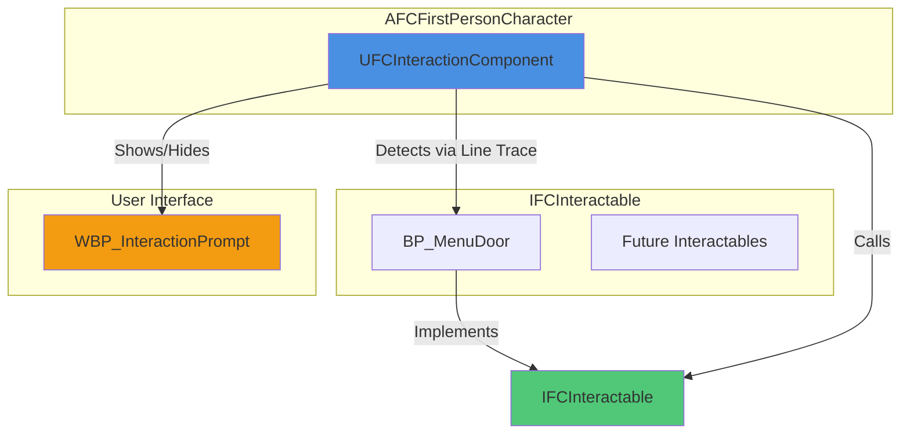

### IFCInteractable Interface

- **Files**: `Source/FC/Interaction/IFCInteractable.h/.cpp`
- **Inheritance**: `UInterface`
- **Purpose**: Defines the contract for all interactable objects, allowing polymorphic interaction handling.

#### Key Methods

```cpp
UFUNCTION(BlueprintNativeEvent, BlueprintCallable, Category = "Interaction")
void OnInteract(AActor* Interactor);

UFUNCTION(BlueprintNativeEvent, BlueprintCallable, Category = "Interaction")
FText GetInteractionPrompt() const;

UFUNCTION(BlueprintNativeEvent, BlueprintCallable, Category = "Interaction")
bool CanInteract(const AActor* Interactor) const;

UFUNCTION(BlueprintNativeEvent, BlueprintCallable, Category = "Interaction")
float GetInteractionRange() const;

UFUNCTION(BlueprintNativeEvent, BlueprintCallable, Category = "Interaction")
int32 GetInteractionPriority() const;
```

#### Implementation Notes

- All methods are blueprint-callable and implementable, allowing designers to customize interaction behavior.
- `OnInteract` is called when the player presses 'E' while focused on the object.
- `GetInteractionPrompt` returns the text to display (e.g., "Press E to Open Door").
- `CanInteract` checks conditions (e.g., player has required items).
- `GetInteractionRange` defines how close the player must be.
- `GetInteractionPriority` allows prioritizing multiple overlapping interactables.

### UFCInteractionComponent

- **Files**: `Source/FC/Interaction/FCInteractionComponent.h/.cpp`
- **Inheritance**: `UActorComponent`
- **Purpose**: Handles detection of interactable objects and manages interaction prompts.

#### Key Members

```cpp
UPROPERTY(EditAnywhere, Category = "Interaction")
TSubclassOf<UUserWidget> InteractionPromptWidgetClass;

UPROPERTY(EditAnywhere, Category = "Interaction")
float InteractionTraceDistance = 500.0f;

UPROPERTY(EditAnywhere, Category = "Interaction")
float InteractionCheckFrequency = 0.1f;

UPROPERTY(EditAnywhere, Category = "Interaction")
bool bShowDebugTrace = false;

TWeakObjectPtr<AActor> CurrentInteractable;
UUserWidget* InteractionPromptWidget;
```

#### Key Methods

```cpp
void DetectInteractables();
void UpdatePromptWidget();
void Interact();
```

#### Detection Logic

- Performs line trace from camera location forward using `ECC_Visibility` channel.
- Checks if hit actor implements `IFCInteractable`.
- Validates interaction range and `CanInteract` conditions.
- Updates `CurrentInteractable` and shows/hides prompt widget accordingly.
- Positions prompt widget at the interactable's screen location using `ProjectWorldLocationToScreen`.

#### Integration

- Attached to `AFCFirstPersonCharacter` in `BeginPlay`.
- `Interact()` called via input binding when 'E' is pressed.
- Rate-limited detection (every 0.1s) for performance.

### AFCFirstPersonCharacter Updates

- **Added**: `UFCInteractionComponent* InteractionComponent` property.
- **Added**: `InteractAction` input binding in `SetupPlayerInputComponent`.
- **Added**: `HandleInteract()` method routing to component.

### AFCPlayerController Updates

- **Modified**: `HandleInteractPressed()` now delegates to character's `InteractionComponent`.
- **Added**: Null checks to prevent crashes when no interactable is focused.

### Blueprint Implementation

- **WBP_InteractionPrompt**: Widget with `SetInteractionPrompt(FText)` function to update displayed text.
- **BP_MenuDoor**: Implements `IFCInteractable` with custom prompt ("Press E to Return to Menu") and `OnInteract` calling `ReturnToMainMenu()`.

### Flow Example

1. Player aims at door → `DetectInteractables()` finds `BP_MenuDoor`.
2. Prompt widget appears at door's screen position with "Press E to Return to Menu".
3. Player presses 'E' → `Interact()` calls `BP_MenuDoor::OnInteract()`.
4. Door interaction triggers level reload to main menu state.

### Logging

- **Category**: `LogFCInteraction`
- **Events Logged**: Hit detection, interface checks, interaction validation, prompt updates.
- **Debug Visualization**: Optional debug lines/spheres for trace visualization.

### Design Rationale

Interface-based design allows easy addition of new interactables without modifying core logic. Component-based detection keeps character class clean. Screen-space positioning ensures prompts appear over objects regardless of camera angle.

---

## Table Interaction System (Week 2)

### Overview

Week 2 implements a specialized table interaction system for the office desk, allowing players to click on individual table objects (Map, Logbook, Letters, Compass) when in TableView camera mode. This system extends the interaction framework with cursor-based detection and lays the foundation for UI widgets in Week 3.

**Status**: Task 2 (Interface & Table Objects) complete ✅ | Task 3 (Player Controller Integration & Widget System) complete ✅ | Task 4 (Additional Widget Features) pending ⏳

### Architecture Overview

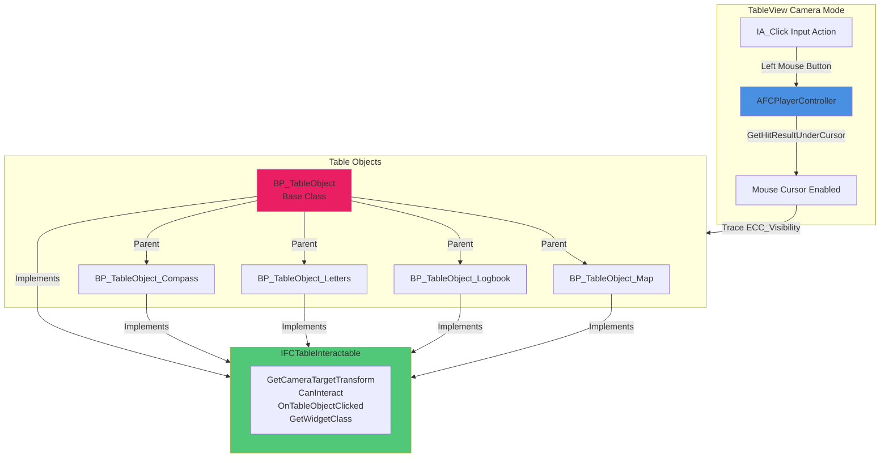

### IFCTableInteractable Interface

- **Files**: `Source/FC/Interaction/FCTableInteractable.h/.cpp`
- **Inheritance**: `UInterface`
- **Purpose**: Defines the contract for all table objects that can be clicked and interacted with in TableView mode.

#### Key Methods

```cpp
/**
 * Get the camera target transform for focusing on this table object
 * @return Transform where the camera should move to when this object is clicked
 */
UFUNCTION(BlueprintNativeEvent, BlueprintCallable, Category = "Table Interaction")
FTransform GetCameraTargetTransform() const;

/**
 * Check if this table object can currently be interacted with
 * @return True if interaction is allowed, false otherwise
 */
UFUNCTION(BlueprintNativeEvent, BlueprintCallable, Category = "Table Interaction")
bool CanInteract() const;

/**
 * Called when this table object is clicked by the player
 * @param Interactor The player controller that clicked this object
 */
UFUNCTION(BlueprintNativeEvent, BlueprintCallable, Category = "Table Interaction")
void OnTableObjectClicked(AActor* Interactor);

/**
 * Get the widget class to display when this table object is focused
 * @return Widget class to show (nullptr if no widget needed)
 */
UFUNCTION(BlueprintNativeEvent, BlueprintCallable, Category = "Table Interaction")
TSubclassOf<UUserWidget> GetWidgetClass() const;
```

#### Default Implementations

```cpp
FTransform IFCTableInteractable::GetCameraTargetTransform_Implementation() const
{
    // Default: Return world transform of implementing actor
    const AActor* Actor = Cast<AActor>(this);
    return Actor ? Actor->GetActorTransform() : FTransform::Identity;
}

bool IFCTableInteractable::CanInteract_Implementation() const
{
    return true; // Always interactable by default
}

void IFCTableInteractable::OnTableObjectClicked_Implementation(AActor* Interactor)
{
    UE_LOG(LogFCInteraction, Log, TEXT("OnTableObjectClicked: %s"), *GetNameSafe(Cast<AActor>(this)));
}

TSubclassOf<UUserWidget> IFCTableInteractable::GetWidgetClass_Implementation() const
{
    return nullptr; // No widget by default
}
```

#### Design Notes

- Separate from `IFCInteractable` (E-key interactions) to avoid conflicting interaction modes
- Blueprint-friendly: All methods use `_Implementation` suffix for BlueprintNativeEvent
- Camera target typically points to a SceneComponent positioned above the table object
- Widget class allows per-object UI (e.g., BP_TableObject_Map shows map widget)

### BP_TableObject Base Class

- **Type**: Blueprint Actor (based on AActor)
- **Location**: `/Content/FC/World/Blueprints/Interactables/BP_TableObject`
- **Purpose**: Shared base class for all table objects with common components and interface implementation

#### Component Structure

```
BP_TableObject (Actor)
├── DefaultSceneRoot (Root)
├── CameraTargetPoint (SceneComponent)
│   └── Transform: Relative Location (X=-50, Y=0, Z=50)
│   └── Rotation: (Pitch=-30, Yaw=0, Roll=0)
├── InteractionCollision (SphereCollision)
│   └── Radius: 50.0
│   └── Collision Preset: OverlapAllDynamic
│   └── Visibility Channel: Block (enables cursor traces)
└── PlaceholderMesh (StaticMeshComponent)
    └── Mesh: /Engine/BasicShapes/Cube
    └── Scale: (X=0.2, Y=0.2, Z=0.1)
    └── Collision: NoCollision (disabled to avoid blocking cursor)
```

#### Interface Implementation (Blueprint)

**GetCameraTargetTransform**:

- Get Component by Class → CameraTargetPoint (SceneComponent)
- Get World Transform → Return transform
- This positions the camera to look down at the table object from above

**CanInteract**:

- Returns `true` (always interactable)
- Child classes can override for conditional interaction

**OnTableObjectClicked**:

- Print String: "BP_TableObject clicked - override in child class"
- Child classes override to show specific widgets or trigger events

**GetWidgetClass**:

- Returns `nullptr` (no widget by default)
- Child classes set specific widget classes (e.g., WBP_MapTable for Map object)

### Table Object Instances

#### BP_TableObject_Map

- **Location**: `/Content/FC/World/Blueprints/Interactables/BP_TableObject_Map`
- **Parent**: BP_TableObject
- **Visual**: Cube with brown/tan tint (parchment appearance)
- **Scale**: (X=0.3, Y=0.2, Z=0.02) - flat map shape
- **Widget Class**: WBP_MapTable (Week 3)
- **Purpose**: Opens expedition planning interface

#### BP_TableObject_Logbook

- **Location**: `/Content/FC/World/Blueprints/Interactables/BP_TableObject_Logbook`
- **Parent**: BP_TableObject
- **Visual**: Cube with dark brown tint (leather-bound book)
- **Scale**: (X=0.15, Y=0.2, Z=0.05) - thick book shape
- **Widget Class**: None (Week 3 feature)
- **Purpose**: Shows expedition diary/log entries

#### BP_TableObject_Letters

- **Location**: `/Content/FC/World/Blueprints/Interactables/BP_TableObject_Letters`
- **Parent**: BP_TableObject
- **Visual**: Cube with light yellow tint (aged paper)
- **Scale**: (X=0.2, Y=0.15, Z=0.01) - scattered letters
- **Widget Class**: None (Week 3 feature)
- **Purpose**: Displays correspondence and mission briefings

#### BP_TableObject_Compass

- **Location**: `/Content/FC/World/Blueprints/Interactables/BP_TableObject_Compass`
- **Parent**: BP_TableObject
- **Visual**: Cube with cyan/transparent tint (glass appearance)
- **Scale**: (X=0.12, Y=0.12, Z=0.02) - magnifying glass shape
- **Widget Class**: None (Week 8 feature)
- **Purpose**: Triggers expedition start confirmation dialog

### AFCPlayerController Click Detection (Task 3.1)

#### Enhanced Input Configuration

**IA_Click Input Action**:

- **Location**: `/Content/FC/Input/Actions/IA_Click`
- **Type**: Digital (bool)
- **Mapping**: Left Mouse Button in `IMC_FC_StaticScene` context
- **Trigger**: Pressed

**ClickAction Property**:

```cpp
/** Input action for table object click */
UPROPERTY(EditAnywhere, BlueprintReadOnly, Category = "FC|Input")
TObjectPtr<UInputAction> ClickAction;
```

**Input Binding** (in `SetupInputComponent`):

```cpp
if (ClickAction)
{
    EnhancedInput->BindAction(ClickAction, ETriggerEvent::Triggered, this, &AFCPlayerController::HandleTableObjectClick);
}
else
{
    UE_LOG(LogFallenCompassPlayerController, Warning, TEXT("ClickAction not assigned on %s."), *GetName());
}
```

#### Cursor-Based Detection

**HandleTableObjectClick Implementation**:

```cpp
void AFCPlayerController::HandleTableObjectClick()
{
    // Perform cursor-based trace to detect objects at mouse position
    FHitResult HitResult;
    bool bHit = GetHitResultUnderCursor(ECC_Visibility, false, HitResult);

    if (bHit && HitResult.GetActor())
    {
        AActor* HitActor = HitResult.GetActor();
        UE_LOG(LogFallenCompassPlayerController, Log, TEXT("Cursor hit actor: %s"), *HitActor->GetName());

        // Check if actor implements IFCTableInteractable
        if (HitActor->Implements<UFCTableInteractable>())
        {
            // Check if interaction is allowed
            bool bCanInteract = IFCTableInteractable::Execute_CanInteract(HitActor);
            if (bCanInteract)
            {
                UE_LOG(LogFallenCompassPlayerController, Log, TEXT("Table object clicked: %s"), *HitActor->GetName());
                OnTableObjectClicked(HitActor);
            }
            else
            {
                UE_LOG(LogFallenCompassPlayerController, Warning, TEXT("Table object cannot be interacted with: %s"), *HitActor->GetName());
            }
        }
        else
        {
            UE_LOG(LogFallenCompassPlayerController, Warning, TEXT("Hit actor does not implement IFCTableInteractable: %s"), *HitActor->GetName());
        }
    }
    else
    {
        UE_LOG(LogFallenCompassPlayerController, Verbose, TEXT("Cursor click - no actor hit"));
    }
}
```

**Key Design Decisions**:

- **Cursor-based trace** (`GetHitResultUnderCursor`) instead of camera-forward trace ensures clicks follow mouse position
- **ECC_Visibility channel** used for consistency with interaction system
- **Interface check** (`Implements<UFCTableInteractable>()`) ensures only table objects respond
- **CanInteract validation** allows conditional interaction (e.g., locked objects)
- **Comprehensive logging** at all stages for debugging (hit detection, interface check, interaction validation)

#### OnTableObjectClicked Implementation

```cpp
void AFCPlayerController::OnTableObjectClicked(AActor* TableObject)
{
    if (!TableObject || !TableObject->Implements<UFCTableInteractable>())
    {
        UE_LOG(LogFallenCompassPlayerController, Error, TEXT("OnTableObjectClicked: Invalid table object"));
        return;
    }

    // Store original view target for restoration
    OriginalViewTarget = GetViewTarget();

    // Get camera target transform from table object
    FTransform CameraTargetTransform = IFCTableInteractable::Execute_GetCameraTargetTransform(TableObject);

    // Create or reuse camera actor at target transform
    if (!TableViewCamera)
    {
        FActorSpawnParameters SpawnParams;
        SpawnParams.Owner = this;
        TableViewCamera = GetWorld()->SpawnActor<ACameraActor>(ACameraActor::StaticClass(), CameraTargetTransform, SpawnParams);
    }
    else
    {
        TableViewCamera->SetActorTransform(CameraTargetTransform);
    }

    // Blend camera to table view (2s cubic, Week 1 pattern)
    SetViewTargetWithBlend(TableViewCamera, 2.0f, EViewTargetBlendFunction::VTBlend_Cubic);

    UE_LOG(LogFallenCompassPlayerController, Log, TEXT("Blending camera to table object: %s"), *TableObject->GetName());

    // Show widget after camera blend completes (delay via timer)
    FTimerHandle ShowWidgetTimerHandle;
    GetWorldTimerManager().SetTimer(ShowWidgetTimerHandle, [this, TableObject]()
    {
        ShowTableWidget(TableObject);
    }, 2.0f, false);
}
```

**Implementation Details**:

1. Stores original view target for camera restoration
2. Gets camera target transform from table object interface
3. Spawns or reuses temporary camera actor at target position
4. Blends camera smoothly over 2 seconds using cubic interpolation
5. Shows appropriate widget after blend completes using timer callback
6. Widget display handled by `ShowTableWidget()` helper method

#### ShowTableWidget Helper Method

```cpp
void AFCPlayerController::ShowTableWidget(AActor* TableObject)
{
    if (!TableObject || !TableObject->Implements<UFCTableInteractable>())
    {
        return;
    }

    // Get widget class from table object
    TSubclassOf<UUserWidget> WidgetClass = IFCTableInteractable::Execute_GetWidgetClass(TableObject);

    if (!WidgetClass)
    {
        UE_LOG(LogFallenCompassPlayerController, Warning, TEXT("ShowTableWidget: Table object has no widget class"));
        return;
    }

    // Create and show widget
    CurrentTableWidget = CreateWidget<UUserWidget>(this, WidgetClass);
    if (CurrentTableWidget)
    {
        CurrentTableWidget->AddToViewport();

        // Set input mode to GameAndUI so player controller can receive ESC key
        FInputModeGameAndUI InputMode;
        InputMode.SetHideCursorDuringCapture(false);
        SetInputMode(InputMode);
        bShowMouseCursor = true;

        UE_LOG(LogFallenCompassPlayerController, Log, TEXT("Showing table widget: %s"), *WidgetClass->GetName());
    }
}
```

**Key Design Decision**: Input mode set to `FInputModeGameAndUI` instead of `FInputModeUIOnly` to allow ESC key input to reach the player controller while still enabling UI interactions.

#### CloseTableWidget Method

```cpp
void AFCPlayerController::CloseTableWidget()
{
    // Remove current widget if one is displayed
    if (CurrentTableWidget)
    {
        CurrentTableWidget->RemoveFromParent();
        CurrentTableWidget = nullptr;
        UE_LOG(LogFallenCompassPlayerController, Log, TEXT("Closed table widget"));

        // Restore input mode to GameAndUI (keep mouse cursor for clicking other table objects)
        FInputModeGameAndUI InputMode;
        InputMode.SetHideCursorDuringCapture(false);
        SetInputMode(InputMode);
        bShowMouseCursor = true;

        // Blend camera back to original table view
        if (OriginalViewTarget)
        {
            SetViewTargetWithBlend(OriginalViewTarget, 2.0f, EViewTargetBlendFunction::VTBlend_Cubic);
            UE_LOG(LogFallenCompassPlayerController, Log, TEXT("Blending camera back to table view"));
        }

        // Reset state for next interaction
        OriginalViewTarget = nullptr;

        // Cleanup: Destroy table view camera if exists
        if (TableViewCamera)
        {
            TableViewCamera->Destroy();
            TableViewCamera = nullptr;
        }
    }
    else
    {
        // No widget open, ESC pressed in TableView - return to FirstPerson
        UE_LOG(LogFallenCompassPlayerController, Log, TEXT("No widget open, returning to first-person"));
        SetCameraModeLocal(EFCPlayerCameraMode::FirstPerson, 2.0f);
    }
}
```

**Dual ESC Behavior**: Method implements context-aware closing - if a widget is open, it closes the widget and returns to TableView; if no widget is open, it exits TableView and returns to FirstPerson mode.

### TableView Mode Integration

**Cursor Visibility** (integrated into `SetCameraModeLocal`):

```cpp
if (NewMode == EFCPlayerCameraMode::TableView)
{
    // Enable mouse cursor for table object clicking
    bShowMouseCursor = true;
    bEnableClickEvents = true;
    bEnableMouseOverEvents = true;

    // Switch to StaticScene input mapping (includes IA_Click)
    SetInputMappingMode(EFCInputMappingMode::StaticScene);

    // Set input mode to GameAndUI (allows mouse cursor + ESC key)
    FInputModeGameAndUI InputMode;
    InputMode.SetHideCursorDuringCapture(false);
    SetInputMode(InputMode);
}
```

**Key Integration Points**:

- Mouse cursor enabled when entering TableView via BP_OfficeDesk interaction
- `IMC_FC_StaticScene` mapping context activated (contains IA_Click)
- Input mode set to `GameAndUI` allowing both cursor and keyboard input
- Cursor remains visible until exiting TableView back to FirstPerson

### Collision Configuration Notes

**Critical Settings**:

- **InteractionCollision** (Sphere): Must have **Visibility response set to Block** for cursor traces to work
- **PlaceholderMesh**: Must have **Collision set to NoCollision** to avoid blocking traces to parent actor
- **Actor Mobility**: Static or Movable (both work, Static preferred for performance)

**Common Issue**: If compass or other object not detecting clicks:

1. Check `InteractionCollision` has Visibility → Block
2. Verify `PlaceholderMesh` has Collision → NoCollision
3. Ensure object is placed in level (not just blueprint exists)
4. Confirm interface is added in Blueprint Class Settings

### UFCExpeditionPlanningWidget (C++ Widget Class)

- **Files**: `Source/FC/UI/FCExpeditionPlanningWidget.h/.cpp`
- **Inheritance**: `UUserWidget`
- **Purpose**: C++ parent class for expedition planning UI with automatic component binding and button handlers

#### Component Binding with BindWidget

```cpp
// In FCExpeditionPlanningWidget.h
UPROPERTY(meta = (BindWidget))
TObjectPtr<UCanvasPanel> RootCanvas;

UPROPERTY(meta = (BindWidget))
TObjectPtr<UImage> BackgroundImage;

UPROPERTY(meta = (BindWidget))
TObjectPtr<UVerticalBox> MainContainer;

UPROPERTY(meta = (BindWidget))
TObjectPtr<UTextBlock> TitleText;

UPROPERTY(meta = (BindWidget))
TObjectPtr<UTextBlock> SuppliesLabel;

UPROPERTY(meta = (BindWidget))
TObjectPtr<UTextBlock> SuppliesValue;

UPROPERTY(meta = (BindWidget))
TObjectPtr<UBorder> MapContainer;

UPROPERTY(meta = (BindWidget))
TObjectPtr<UImage> MapPlaceholder;

UPROPERTY(meta = (BindWidget))
TObjectPtr<UButton> StartExpeditionButton;

UPROPERTY(meta = (BindWidget))
TObjectPtr<UButton> BackButton;

UPROPERTY(meta = (BindWidget))
TObjectPtr<UTextBlock> StartButtonText;

UPROPERTY(meta = (BindWidget))
TObjectPtr<UTextBlock> BackButtonText;
```

**BindWidget Metadata**: Automatically binds C++ properties to Blueprint widget components by matching names, eliminating manual Blueprint casting.

#### Lifecycle Methods

```cpp
void UFCExpeditionPlanningWidget::NativeConstruct()
{
    Super::NativeConstruct();

    // Bind button click events
    if (StartExpeditionButton)
    {
        StartExpeditionButton->OnClicked.AddDynamic(this, &UFCExpeditionPlanningWidget::OnStartExpeditionClicked);
    }

    if (BackButton)
    {
        BackButton->OnClicked.AddDynamic(this, &UFCExpeditionPlanningWidget::OnBackButtonClicked);
    }

    // Initialize supplies display
    UpdateSuppliesDisplay();
}

void UFCExpeditionPlanningWidget::NativeDestruct()
{
    // Unbind button events
    if (StartExpeditionButton)
    {
        StartExpeditionButton->OnClicked.RemoveDynamic(this, &UFCExpeditionPlanningWidget::OnStartExpeditionClicked);
    }

    if (BackButton)
    {
        BackButton->OnClicked.RemoveDynamic(this, &UFCExpeditionPlanningWidget::OnBackButtonClicked);
    }

    Super::NativeDestruct();
}
```

#### Button Handlers

```cpp
void UFCExpeditionPlanningWidget::OnStartExpeditionClicked()
{
    UE_LOG(LogTemp, Log, TEXT("Start Expedition button clicked"));

    // Week 3 feature: Show "Coming Soon" message
    if (GEngine)
    {
        GEngine->AddOnScreenDebugMessage(
            -1,
            3.0f,
            FColor::Yellow,
            TEXT("Coming Soon - Overworld in Week 3")
        );
    }
}

void UFCExpeditionPlanningWidget::OnBackButtonClicked()
{
    UE_LOG(LogTemp, Log, TEXT("Back button clicked"));

    // Get owning player controller and close widget
    APlayerController* PC = GetOwningPlayer();
    if (AFCPlayerController* FCPC = Cast<AFCPlayerController>(PC))
    {
        FCPC->CloseTableWidget();
    }
}

void UFCExpeditionPlanningWidget::UpdateSuppliesDisplay()
{
    UFCGameInstance* GameInstance = Cast<UFCGameInstance>(GetWorld()->GetGameInstance());
    if (GameInstance && SuppliesValue)
    {
        int32 CurrentSupplies = GameInstance->GetCurrentSupplies();
        SuppliesValue->SetText(FText::AsNumber(CurrentSupplies));
    }
}
```

#### WBP_ExpeditionPlanning Blueprint Widget

- **Location**: `/Content/FC/UI/Menus/TableMenu/WBP_ExpeditionPlanning`
- **Parent Class**: `UFCExpeditionPlanningWidget`
- **Purpose**: Blueprint child providing visual styling and layout

**Component Hierarchy**:

```
WBP_ExpeditionPlanning
├── RootCanvas (Canvas Panel)
│   ├── BackgroundImage (Image) - Parchment texture
│   └── MainContainer (Vertical Box)
│       ├── TitleText (Text Block) - "Expedition Planning"
│       ├── SuppliesDisplay (Horizontal Box)
│       │   ├── SuppliesLabel (Text Block) - "Supplies:"
│       │   └── SuppliesValue (Text Block) - Bound to GameInstance
│       ├── MapContainer (Border)
│       │   └── MapPlaceholder (Image) - World map placeholder
│       └── ButtonPanel (Horizontal Box)
│           ├── StartExpeditionButton (Button)
│           │   └── StartButtonText (Text Block) - "Start Test Expedition"
│           └── BackButton (Button)
│               └── BackButtonText (Text Block) - "Back"
```

**Styling Notes**:

- Parchment-themed background for immersive table map aesthetic
- Button hover/pressed states implemented in Blueprint
- All component names match C++ BindWidget properties exactly
- No event graph logic needed - all handlers in C++

### ESC Key Binding (Dual Behavior)

**Input Action**: Reuses existing `IA_Escape` from Week 1

**HandlePausePressed Implementation** (lines 256-293 in FCPlayerController.cpp):

```cpp
void AFCPlayerController::HandlePausePressed()
{
    // If viewing a table object with widget, ESC closes widget and returns to table view
    // If in table view without widget, ESC returns to first-person
    if (CameraMode == EFCPlayerCameraMode::TableView)
    {
        UE_LOG(LogFallenCompassPlayerController, Log, TEXT("ESC pressed in table view mode"));
        CloseTableWidget(); // Handles both widget close and table view exit
        return;
    }

    // If in gameplay state (first-person, can move), ESC toggles pause menu
    if (CurrentGameState == EFCGameState::Gameplay)
    {
        // ... existing pause menu logic
    }
}
```

**Dual ESC Behavior Flow**:

1. **Widget Open**: ESC → Close widget → Return to TableView (mouse cursor remains, can click other objects)
2. **TableView (no widget)**: ESC → Exit TableView → Return to FirstPerson
3. **FirstPerson**: ESC → Toggle pause menu

**Key Integration**: `HandlePausePressed` checks `CameraMode` to determine context, then delegates to `CloseTableWidget()` which implements the dual behavior based on `CurrentTableWidget` state.

### File Structure

```
FC/
├── Source/FC/Interaction/
│   ├── FCTableInteractable.h (Interface definition)
│   └── FCTableInteractable.cpp (Default implementations)
├── Source/FC/Core/
│   ├── FCPlayerController.h (ClickAction, OnTableObjectClicked, CloseTableWidget, ShowTableWidget)
│   └── FCPlayerController.cpp (Click detection, camera focus, widget management)
├── Source/FC/UI/
│   ├── FCExpeditionPlanningWidget.h (C++ widget class with BindWidget components)
│   └── FCExpeditionPlanningWidget.cpp (NativeConstruct, button handlers, supplies display)
├── Content/FC/Input/
│   ├── Actions/IA_Click (Input Action asset)
│   ├── Actions/IA_Escape (Reused for ESC key binding)
│   └── IMC_FC_StaticScene (Mapping context with IA_Click → Left Mouse Button, IA_Escape → ESC)
├── Content/FC/UI/Menus/TableMenu/
│   └── WBP_ExpeditionPlanning (Blueprint widget with parchment styling, parent: UFCExpeditionPlanningWidget)
└── Content/FC/World/Blueprints/Interactables/
    ├── BP_TableObject (Base class with interface implementation)
    ├── BP_TableObject_Map (GetWidgetClass returns WBP_ExpeditionPlanning)
    ├── BP_TableObject_Logbook
    ├── BP_TableObject_Letters
    └── BP_TableObject_Compass
```

### Testing & Validation

**Implemented & Tested** ✅:

- IA_Click input action creation and mapping
- Cursor visibility in TableView mode (fixed with GameAndUI input mode)
- Cursor-based click detection via `GetHitResultUnderCursor`
- Interface validation for all 4 table objects
- Logging at all detection stages
- Collision configuration for all table objects
- Camera focus/blend on table object click (2s cubic blend)
- Widget display after camera blend (timer-based delay)
- UFCExpeditionPlanningWidget C++ class with BindWidget components
- WBP_ExpeditionPlanning Blueprint widget with parchment styling
- CloseTableWidget method with dual ESC behavior
- ESC key binding reusing IA_Escape (HandlePausePressed integration)
- Back button closes widget and returns to TableView
- Input mode fix: FInputModeGameAndUI allows ESC key to reach player controller
- Widget wired to BP_TableObject_Map via GetWidgetClass
- Supplies display reading from UFCGameInstance
- Start Expedition button shows "Coming Soon" placeholder message

**Known Issues & Fixes** 🔧:

- **Issue**: ESC key not closing widget when pressed
  - **Root Cause**: Input mode set to `FInputModeUIOnly` in `ShowTableWidget`, blocking player controller input
  - **Fix**: Changed to `FInputModeGameAndUI` to allow both UI and game input
  - **Lines**: FCPlayerController.cpp:972 (ShowTableWidget method)
  - **Impact**: ESC key now properly triggers HandlePausePressed → CloseTableWidget

**End-to-End Flow Verified** ✅:

1. Click BP_TableObject_Map → Camera blends to focus (2s)
2. WBP_ExpeditionPlanning widget appears with supplies display
3. Mouse cursor visible, UI responsive
4. Back button closes widget → Camera blends to TableView (2s)
5. ESC key closes widget → Returns to TableView
6. ESC key (no widget) → Returns to FirstPerson
7. Supplies display updates correctly from GameInstance

### Design Rationale

**Separate Interface from IFCInteractable**: Table objects use a different interaction paradigm (cursor clicks in TableView) vs world objects (E-key in FirstPerson). Separate interfaces prevent mode conflicts and allow specialized behavior.

**Cursor-Based Detection**: Using `GetHitResultUnderCursor` ensures clicks follow mouse position exactly, providing intuitive point-and-click interaction instead of aiming with camera center.

**Component-Based Camera Targets**: CameraTargetPoint SceneComponent allows designers to adjust camera angles per object in Blueprint Editor without C++ changes.

**Interface-Driven Widgets**: `GetWidgetClass()` allows each table object to specify its own UI (Map → WBP_MapTable, Logbook → WBP_LogbookViewer) without hardcoding in PlayerController.

**Stub Implementation Pattern**: `OnTableObjectClicked` logs warnings until fully implemented, ensuring clear feedback during iterative development and preventing silent failures.

---

## Game State Management (Week 2)

### Overview

The game state management system provides persistent data storage across level transitions through the `UFCGameInstance` class. Week 2 implemented the `FFCGameStateData` struct to hold core campaign progression data (supplies, money, day counter).

### Architecture

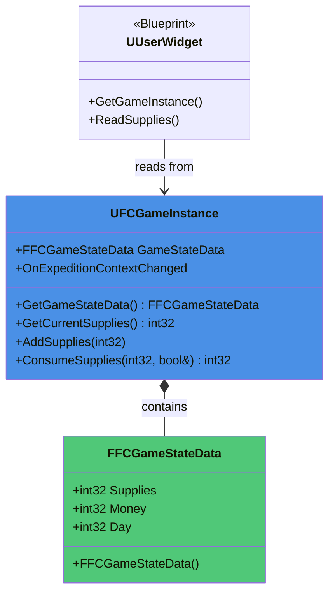

### FFCGameStateData Struct

- **Files**: `Source/FC/Core/UFCGameInstance.h`
- **Type**: `USTRUCT(BlueprintType)`
- **Purpose**: Persistent campaign state data that survives level transitions

#### Structure Definition

```cpp
/**
 * Persistent game state data that survives level transitions.
 * Stores resources, economy, and time progression.
 */
USTRUCT(BlueprintType)
struct FFCGameStateData
{
    GENERATED_BODY()

    /** Current supplies available */
    UPROPERTY(BlueprintReadWrite, Category = "Game State")
    int32 Supplies = 100;

    /** Current money/gold available */
    UPROPERTY(BlueprintReadWrite, Category = "Game State")
    int32 Money = 500;

    /** Current day in campaign (starts at 1) */
    UPROPERTY(BlueprintReadWrite, Category = "Game State")
    int32 Day = 1;

    /** Default constructor */
    FFCGameStateData()
        : Supplies(100)
        , Money(500)
        , Day(1)
    {
    }
};
```

#### Default Values

- **Supplies**: 100 (starting supplies for expeditions)
- **Money**: 500 (starting gold/currency)
- **Day**: 1 (campaign begins on day 1)

### UFCGameInstance Game State Properties

```cpp
/** Persistent game state data */
UPROPERTY(BlueprintReadOnly, Category = "Game State")
FFCGameStateData GameStateData;

/** Session dirty flag for save system */
UPROPERTY()
bool bIsSessionDirty = false;

/** Delegate broadcast when expedition context changes */
DECLARE_DYNAMIC_MULTICAST_DELEGATE(FOnExpeditionContextChanged);
UPROPERTY(BlueprintAssignable, Category = "Expedition")
FOnExpeditionContextChanged OnExpeditionContextChanged;
```

### Supply Management Methods

#### GetCurrentSupplies

```cpp
/**
 * Get current supplies from game state
 * @return Current supplies amount
 */
UFUNCTION(BlueprintCallable, Category = "Game State")
int32 GetCurrentSupplies() const { return GameStateData.Supplies; }
```

#### AddSupplies

```cpp
/**
 * Add supplies to game state
 * @param Amount Amount to add (must be positive)
 */
UFUNCTION(BlueprintCallable, Category = "Game State")
void AddSupplies(int32 Amount);
```

**Implementation Details**:

- Adds `Amount` to `GameStateData.Supplies`
- Sets `bIsSessionDirty = true` for save system
- Broadcasts `OnExpeditionContextChanged` delegate
- Logs the operation with new total

**Example**:

```cpp
void UFCGameInstance::AddSupplies(int32 Amount)
{
    GameStateData.Supplies += Amount;
    bIsSessionDirty = true;

    UE_LOG(LogTemp, Log, TEXT("AddSupplies: %d (New Total: %d)"), Amount, GameStateData.Supplies);

    // Broadcast state change event
    OnExpeditionContextChanged.Broadcast();
}
```

#### ConsumeSupplies

```cpp
/**
 * Consume supplies from game state
 * @param Amount Amount to consume
 * @param bSuccess Output parameter indicating if consumption succeeded
 * @return Current supplies amount after operation
 */
UFUNCTION(BlueprintCallable, Category = "Game State")
int32 ConsumeSupplies(int32 Amount, bool& bSuccess);
```

**Implementation Details**:

- Validates `Amount >= 0` (negative amounts are rejected)
- Checks if sufficient supplies available (`GameStateData.Supplies >= Amount`)
- If successful: deducts amount, sets `bIsSessionDirty`, broadcasts delegate
- If failed: logs warning with current supplies vs requested amount
- Returns current supplies amount (post-consumption if successful)
- Sets `bSuccess` output parameter to indicate result

**Example**:

```cpp
int32 UFCGameInstance::ConsumeSupplies(int32 Amount, bool& bSuccess)
{
    if (Amount < 0)
    {
        UE_LOG(LogTemp, Warning, TEXT("ConsumeSupplies: Negative amount (%d), ignoring"), Amount);
        bSuccess = false;
        return GameStateData.Supplies;
    }

    if (GameStateData.Supplies >= Amount)
    {
        GameStateData.Supplies -= Amount;
        bSuccess = true;
        bIsSessionDirty = true;

        UE_LOG(LogTemp, Log, TEXT("ConsumeSupplies: %d (Remaining: %d)"), Amount, GameStateData.Supplies);

        OnExpeditionContextChanged.Broadcast();
    }
    else
    {
        UE_LOG(LogTemp, Warning, TEXT("ConsumeSupplies: Insufficient supplies (Have: %d, Need: %d)"),
            GameStateData.Supplies, Amount);
        bSuccess = false;
    }

    return GameStateData.Supplies;
}
```

### Blueprint Integration

**Reading Game State in Widgets**:

```
Get Game Instance → Cast to FCGameInstance → Get Current Supplies → Set Text (Format: "Supplies: {0}")
```

**Widget Binding Example** (WBP_ExpeditionPlanning):

- Text block bound to `GetCurrentSupplies()` via Blueprint function
- Updates automatically when widget is opened (reads fresh data)
- Manual refresh available via `OnExpeditionContextChanged` delegate

**Console Testing**:

```cpp
// Add supplies (Blueprint callable from console)
GetGameInstance()->AddSupplies(25)

// Consume supplies (Blueprint callable from console)
bool bSuccess;
GetGameInstance()->ConsumeSupplies(50, bSuccess)
```

### Data Flow

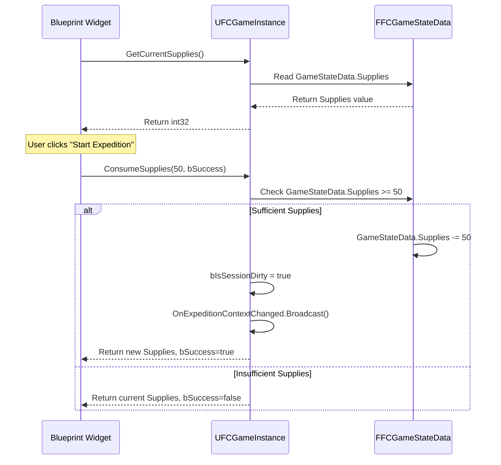

### Future Extensions

**Planned for Later Weeks**:

- Money/economy system integration
- Day progression and time management
- Save/load serialization of FFCGameStateData
- Additional state fields (reputation, relationships, etc.)
- Event-driven state change notifications

---

## Level Management & Transitions (Week 2)

### Overview

The `UFCLevelManager` subsystem provides level name normalization, transition orchestration, and previous level tracking. Week 2 added the `LoadLevel` method with fade transition integration.

### Architecture

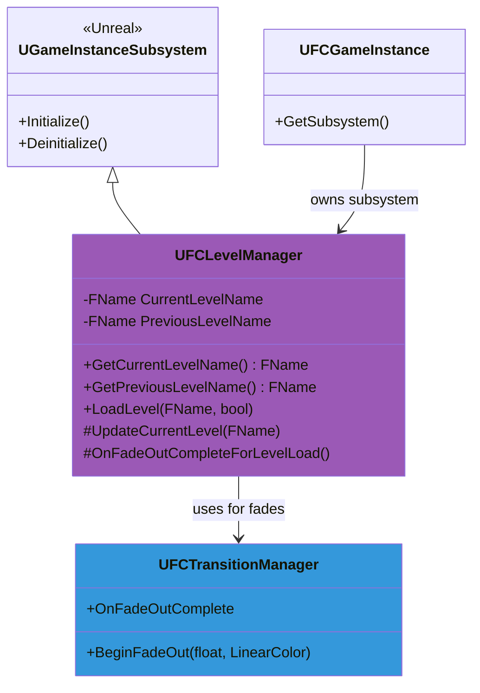

### UFCLevelManager

- **Files**: `Source/FC/Core/UFCLevelManager.h/.cpp`
- **Inheritance**: `UGameInstanceSubsystem`
- **Purpose**: Centralized level name tracking, normalization, and transition management

#### Key Properties

```cpp
/** Current level name (normalized, no PIE prefix) */
UPROPERTY(VisibleAnywhere, BlueprintReadOnly, Category = "Level Management")
FName CurrentLevelName;

/** Previous level name (normalized, no PIE prefix) */
UPROPERTY(VisibleAnywhere, BlueprintReadOnly, Category = "Level Management")
FName PreviousLevelName;

/** Pending level name for load operation */
FName PendingLevelName;

/** Whether to use fade transition for pending load */
bool bUseFadeForPendingLoad = false;
```

#### Key Methods

##### GetPreviousLevelName

```cpp
/**
 * Get the name of the previous level (before current)
 * @return Previous level name (normalized, no PIE prefix)
 */
UFUNCTION(BlueprintCallable, Category = "Level Management")
FName GetPreviousLevelName() const { return PreviousLevelName; }
```

**Use Cases**:

- "Return to Previous Location" buttons
- Breadcrumb navigation
- Level transition validation

##### LoadLevel

```cpp
/**
 * Load a new level with optional fade transition
 * @param LevelName Name of the level to load (e.g., "L_Expedition", "L_Office")
 * @param bUseFade Whether to use fade out/in transition (requires UFCTransitionManager)
 */
UFUNCTION(BlueprintCallable, Category = "Level Management")
void LoadLevel(const FName& LevelName, bool bUseFade = true);
```

**Implementation Flow**:

1. **Validation**: Checks if `LevelName` is valid (not NAME_None)
2. **State Storage**: Saves `LevelName` to `PendingLevelName` and `bUseFade` to `bUseFadeForPendingLoad`
3. **Fade Integration** (if `bUseFade = true`):
   - Gets `UFCTransitionManager` subsystem
   - Calls `BeginFadeOut(1.0f, Black)`
   - Binds `OnFadeOutCompleteForLevelLoad` to `OnFadeOutComplete` delegate
   - Waits for fade to complete before loading
4. **Direct Load** (if `bUseFade = false`):
   - Immediately calls `UGameplayStatics::OpenLevel`

**Code Example**:

```cpp
void UFCLevelManager::LoadLevel(const FName& LevelName, bool bUseFade)
{
    if (LevelName == NAME_None)
    {
        UE_LOG(LogFCLevelManager, Warning, TEXT("LoadLevel: Invalid level name"));
        return;
    }

    PendingLevelName = LevelName;
    bUseFadeForPendingLoad = bUseFade;

    if (bUseFade)
    {
        UFCTransitionManager* TransitionManager = GetGameInstance()->GetSubsystem<UFCTransitionManager>();
        if (TransitionManager)
        {
            // Bind to fade complete delegate
            TransitionManager->OnFadeOutComplete.AddDynamic(this, &UFCLevelManager::OnFadeOutCompleteForLevelLoad);
            TransitionManager->BeginFadeOut(1.0f, FLinearColor::Black);

            UE_LOG(LogFCLevelManager, Log, TEXT("LoadLevel: Starting fade to %s"), *LevelName.ToString());
        }
        else
        {
            UE_LOG(LogFCLevelManager, Warning, TEXT("LoadLevel: TransitionManager not found, loading without fade"));
            UGameplayStatics::OpenLevel(this, LevelName);
        }
    }
    else
    {
        UE_LOG(LogFCLevelManager, Log, TEXT("LoadLevel: Loading %s (no fade)"), *LevelName.ToString());
        UGameplayStatics::OpenLevel(this, LevelName);
    }
}
```

##### OnFadeOutCompleteForLevelLoad

```cpp
/**
 * Callback when fade out completes, triggers actual level load
 */
UFUNCTION()
void OnFadeOutCompleteForLevelLoad();
```

**Implementation**:

- Unbinds itself from `OnFadeOutComplete` delegate (prevents re-triggering)
- Calls `UGameplayStatics::OpenLevel` with `PendingLevelName`
- Logs the level transition
- Clears `PendingLevelName` and `bUseFadeForPendingLoad` flags

**Code Example**:

```cpp
void UFCLevelManager::OnFadeOutCompleteForLevelLoad()
{
    UFCTransitionManager* TransitionManager = GetGameInstance()->GetSubsystem<UFCTransitionManager>();
    if (TransitionManager)
    {
        // Unbind to prevent re-triggering
        TransitionManager->OnFadeOutComplete.RemoveDynamic(this, &UFCLevelManager::OnFadeOutCompleteForLevelLoad);
    }

    if (PendingLevelName != NAME_None)
    {
        UE_LOG(LogFCLevelManager, Log, TEXT("OnFadeOutComplete: Loading level %s"), *PendingLevelName.ToString());
        UGameplayStatics::OpenLevel(this, PendingLevelName);

        PendingLevelName = NAME_None;
        bUseFadeForPendingLoad = false;
    }
}
```

##### UpdateCurrentLevel

```cpp
/**
 * Update current level name and track previous
 * @param NewLevelName Normalized level name (called by Initialize and world change events)
 */
void UpdateCurrentLevel(const FName& NewLevelName);
```

**Implementation**:

- Called automatically by `Initialize()` and world change events
- Stores `CurrentLevelName` as `PreviousLevelName` before updating
- Sets `NewLevelName` as new `CurrentLevelName`
- Logs the transition

**Code Example**:

```cpp
void UFCLevelManager::UpdateCurrentLevel(const FName& NewLevelName)
{
    if (CurrentLevelName != NAME_None)
    {
        PreviousLevelName = CurrentLevelName;
        UE_LOG(LogFCLevelManager, Log, TEXT("UpdateCurrentLevel: %s -> %s (Previous: %s)"),
            *CurrentLevelName.ToString(), *NewLevelName.ToString(), *PreviousLevelName.ToString());
    }

    CurrentLevelName = NewLevelName;
}
```

### Integration with UFCTransitionManager

**Fade Transition Flow**:

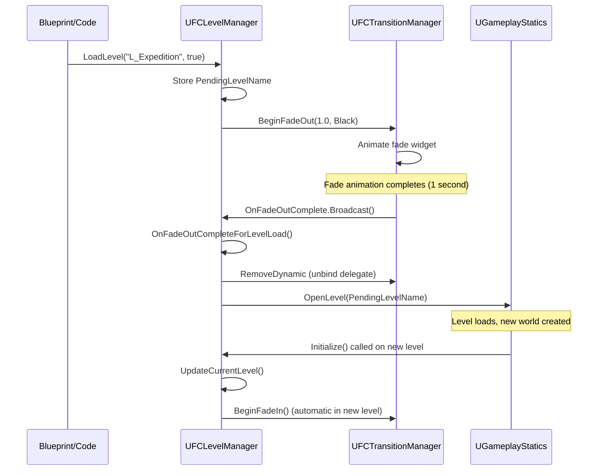

### Blueprint Usage

**Load Level with Fade**:

```
Get Game Instance → Get Subsystem (FCLevelManager) → Load Level
  ├─ Level Name: "L_Expedition"
  └─ Use Fade: true
```

**Get Previous Level Name**:

```
Get Game Instance → Get Subsystem (FCLevelManager) → Get Previous Level Name → Print String
```

**Example: "Return to Office" Button**:

```
OnClicked (Button)
  └─ Get Game Instance → Get Subsystem (FCLevelManager) → Load Level
      ├─ Level Name: "L_Office"
      └─ Use Fade: true
```

### Testing

**Week 2 Testing Verified**:

- ✅ LoadLevel method called from "Start Test Expedition" button (shows placeholder message)
- ✅ PreviousLevel tracking verified via logs
- ✅ Fade integration verified (BeginFadeOut → OnFadeOutComplete → OpenLevel flow)
- ✅ Delegate binding/unbinding prevents memory leaks
- ✅ Direct load (no fade) fallback tested

**Console Commands**:

```cpp
// Test level load with fade
GetGameInstance()->GetSubsystem<UFCLevelManager>()->LoadLevel(FName("L_Expedition"), true)

// Test level load without fade
GetGameInstance()->GetSubsystem<UFCLevelManager>()->LoadLevel(FName("L_Office"), false)

// Check previous level
GetGameInstance()->GetSubsystem<UFCLevelManager>()->GetPreviousLevelName()
```

### Design Notes

**Subsystem Pattern**: `UFCLevelManager` extends `UGameInstanceSubsystem` for automatic lifecycle management and persistent state across levels.

**Fade Integration**: Delegates to `UFCTransitionManager` for visual polish, ensuring consistent transition experience throughout the game.

**Previous Level Tracking**: Essential for "Back" navigation patterns (e.g., Expedition → Office, Office → Main Menu).

**PIE Prefix Normalization**: Strips "UEDPIE*0*" prefix from level names during Play-In-Editor sessions for consistent level name references.

---

## Expedition System (Week 2)

### Overview

The `UFCExpeditionManager` subsystem manages expedition lifecycle, status tracking, and context management. Week 2 implemented the foundation with expedition creation, status queries, and GameInstance integration.

### Architecture

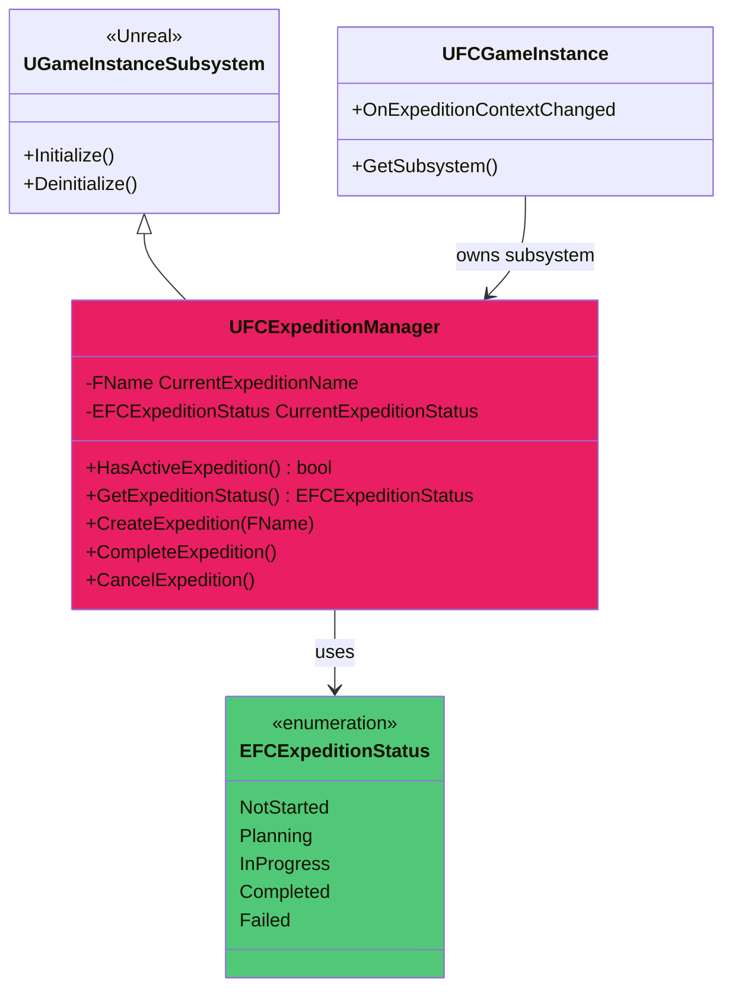

### EFCExpeditionStatus Enum

- **Files**: `Source/FC/Core/UFCExpeditionManager.h`
- **Type**: `UENUM(BlueprintType)`
- **Purpose**: Track expedition lifecycle states

#### Enum Values

```cpp
UENUM(BlueprintType)
enum class EFCExpeditionStatus : uint8
{
    /** No expedition currently active */
    NotStarted = 0 UMETA(DisplayName = "Not Started"),

    /** Expedition is being planned (in table view) */
    Planning UMETA(DisplayName = "Planning"),

    /** Expedition is currently in progress (gameplay) */
    InProgress UMETA(DisplayName = "In Progress"),

    /** Expedition completed successfully */
    Completed UMETA(DisplayName = "Completed"),

    /** Expedition failed or was abandoned */
    Failed UMETA(DisplayName = "Failed")
};
```

**State Transitions**:

- `NotStarted` → `Planning` (player clicks map in Office)
- `Planning` → `InProgress` (player confirms expedition start)
- `InProgress` → `Completed` (expedition objectives met)
- `InProgress` → `Failed` (player retreats or loses)
- `Completed`/`Failed` → `NotStarted` (player returns to Office)

### UFCExpeditionManager

- **Files**: `Source/FC/Core/UFCExpeditionManager.h/.cpp`
- **Inheritance**: `UGameInstanceSubsystem`
- **Purpose**: Centralized expedition state management and lifecycle orchestration

#### Key Properties

```cpp
/** Name of the current expedition (e.g., "FirstExpedition", "MountainPass") */
UPROPERTY(VisibleAnywhere, BlueprintReadOnly, Category = "Expedition")
FName CurrentExpeditionName;

/** Current status of the active expedition */
UPROPERTY(VisibleAnywhere, BlueprintReadOnly, Category = "Expedition")
EFCExpeditionStatus CurrentExpeditionStatus;
```

#### Key Methods

##### HasActiveExpedition

```cpp
/**
 * Check if an expedition is currently active
 * @return True if status is Planning or InProgress, false otherwise
 */
UFUNCTION(BlueprintCallable, Category = "Expedition")
bool HasActiveExpedition() const;
```

**Implementation**:

```cpp
bool UFCExpeditionManager::HasActiveExpedition() const
{
    return CurrentExpeditionStatus == EFCExpeditionStatus::Planning
        || CurrentExpeditionStatus == EFCExpeditionStatus::InProgress;
}
```

**Use Cases**:

- Disable "New Expedition" button if expedition already active
- Block level transitions during active expeditions
- Validate expedition-specific actions

##### GetExpeditionStatus

```cpp
/**
 * Get the current expedition status
 * @return Current expedition status enum value
 */
UFUNCTION(BlueprintCallable, Category = "Expedition")
EFCExpeditionStatus GetExpeditionStatus() const { return CurrentExpeditionStatus; }
```

##### CreateExpedition

```cpp
/**
 * Create and start planning a new expedition
 * @param ExpeditionName Name/ID of the expedition to create
 */
UFUNCTION(BlueprintCallable, Category = "Expedition")
void CreateExpedition(const FName& ExpeditionName);
```

**Implementation**:

- Checks if expedition already active (logs warning if so)
- Sets `CurrentExpeditionName` to `ExpeditionName`
- Sets `CurrentExpeditionStatus` to `Planning`
- Broadcasts `OnExpeditionContextChanged` delegate (via GameInstance)
- Logs the expedition creation

**Code Example**:

```cpp
void UFCExpeditionManager::CreateExpedition(const FName& ExpeditionName)
{
    if (HasActiveExpedition())
    {
        UE_LOG(LogFCExpedition, Warning, TEXT("CreateExpedition: Expedition already active (%s)"),
            *CurrentExpeditionName.ToString());
        return;
    }

    CurrentExpeditionName = ExpeditionName;
    CurrentExpeditionStatus = EFCExpeditionStatus::Planning;

    UE_LOG(LogFCExpedition, Log, TEXT("CreateExpedition: %s (Status: Planning)"), *ExpeditionName.ToString());

    // Notify GameInstance of context change
    UFCGameInstance* GameInstance = GetGameInstance<UFCGameInstance>();
    if (GameInstance)
    {
        GameInstance->OnExpeditionContextChanged.Broadcast();
    }
}
```

##### CompleteExpedition

```cpp
/**
 * Mark the current expedition as completed successfully
 */
UFUNCTION(BlueprintCallable, Category = "Expedition")
void CompleteExpedition();
```

**Implementation**:

- Validates expedition is active
- Sets `CurrentExpeditionStatus` to `Completed`
- Broadcasts `OnExpeditionContextChanged` delegate
- Logs the completion
- Future: Trigger rewards, unlock next expedition, update campaign progress

##### CancelExpedition

```cpp
/**
 * Cancel/abandon the current expedition
 */
UFUNCTION(BlueprintCallable, Category = "Expedition")
void CancelExpedition();
```

**Implementation**:

- Validates expedition is active
- Sets `CurrentExpeditionStatus` to `Failed`
- Clears `CurrentExpeditionName`
- Broadcasts `OnExpeditionContextChanged` delegate
- Logs the cancellation
- Future: Apply failure penalties (lost supplies, morale, etc.)

### Integration with Table Interaction System

**Expedition Creation Flow**:

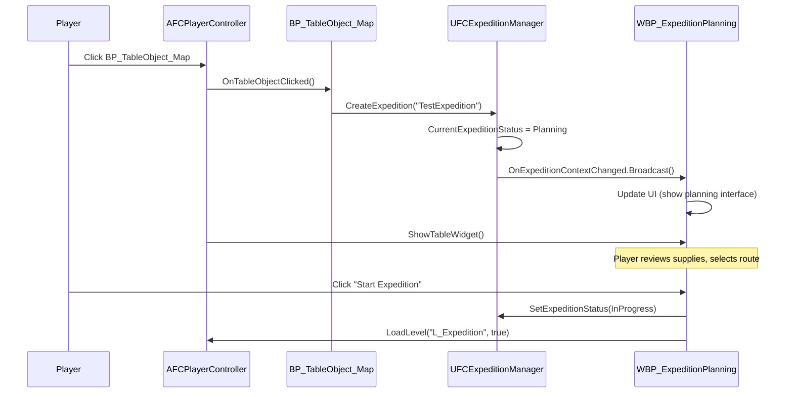

### Blueprint Usage

**Create Expedition** (L_Office Level Blueprint BeginPlay):

```
Get Game Instance → Get Subsystem (FCExpeditionManager) → Create Expedition
  └─ Expedition Name: "TestExpedition"
```

**Check Active Expedition**:

```
Get Game Instance → Get Subsystem (FCExpeditionManager) → Has Active Expedition
  ├─ True → Show "Resume Expedition" button
  └─ False → Show "New Expedition" button
```

**Get Expedition Status**:

```
Get Game Instance → Get Subsystem (FCExpeditionManager) → Get Expedition Status
  ├─ Planning → Enable table interaction
  ├─ InProgress → Show expedition UI
  └─ NotStarted → Show office idle state
```

### Testing & Validation

**Week 2 Testing Verified** ✅:

- ✅ CreateExpedition called from L_Office Level Blueprint BeginPlay
- ✅ HasActiveExpedition returns `true` after creation
- ✅ GetExpeditionStatus returns `Planning` status
- ✅ OnExpeditionContextChanged delegate broadcasts successfully
- ✅ Widget displays correct status
- ✅ "Start Test Expedition" button shows placeholder message (no actual transition yet)
- ✅ Logging at all lifecycle points

**Console Testing**:

```cpp
// Create expedition
GetGameInstance()->GetSubsystem<UFCExpeditionManager>()->CreateExpedition(FName("TestExpedition"))

// Check active status
GetGameInstance()->GetSubsystem<UFCExpeditionManager>()->HasActiveExpedition()

// Get status
GetGameInstance()->GetSubsystem<UFCExpeditionManager>()->GetExpeditionStatus()

// Complete expedition
GetGameInstance()->GetSubsystem<UFCExpeditionManager>()->CompleteExpedition()

// Cancel expedition
GetGameInstance()->GetSubsystem<UFCExpeditionManager>()->CancelExpedition()
```

### Design Notes

**Subsystem Pattern**: Extends `UGameInstanceSubsystem` for automatic lifecycle management and global access without singleton boilerplate.

**Status Enum**: `EFCExpeditionStatus` provides clear state machine for expedition lifecycle, enabling UI state binding and validation logic.

**Delegate Integration**: Uses `UFCGameInstance::OnExpeditionContextChanged` for loose coupling between systems (widgets don't need direct manager references).

**Week 2 Scope**: Foundation only—actual expedition gameplay (level loading, encounter system, failure conditions) deferred to later weeks.

**Future Extensions**:

- Expedition data structures (route, objectives, participants)
- Resource consumption during planning
- Save/load expedition state
- Expedition templates and procedural generation
- Failure condition handling (retreat, death, time limits)

---

## Logging & Debugging

### Log Categories

All FC-specific categories use the prefix `LogFallenCompass*`:

| Category                           | Verbosity  | Purpose                                                      |
| ---------------------------------- | ---------- | ------------------------------------------------------------ |
| `LogFallenCompassGameInstance`     | `Log, All` | Lifecycle events, session state changes                      |
| `LogFallenCompassGameMode`         | `Log, All` | Pawn/controller registration, map startup                    |
| `LogFallenCompassPlayerController` | `Log, All` | Input handling, camera transitions, state dumps              |
| `LogFallenCompassCharacter`        | `Log, All` | First-person character spawning, camera config, movement     |
| `LogFCInteraction`                 | `Log, All` | Interaction detection, prompt updates, interface calls       |
| `LogFCLevelManager`                | `Log, All` | Level transitions, previous level tracking, fade integration |
| `LogFCExpedition`                  | `Log, All` | Expedition lifecycle, status changes, context updates        |

### Enabling Categories at Runtime

Use the in-editor console or add to `Config/DefaultEngine.ini`:

```
Log LogFallenCompassGameMode VeryVerbose
Log LogFallenCompassPlayerController VeryVerbose
Log LogFallenCompassGameInstance VeryVerbose
Log LogFallenCompassCharacter VeryVerbose
Log LogFCInteraction VeryVerbose
Log LogFCLevelManager VeryVerbose
Log LogFCExpedition VeryVerbose
```

### Common Issues

- **No logs appear**: Ensure latest C++ binaries are loaded (rebuild or Live Coding reload). Check Output Log filters (click funnel icon → Clear Filters).
- **"Failed to find BP_TopDownPlayerController"**: Legacy blueprint reference still in constructor; remove or restore asset.
- **Enhanced Input not working**: Verify assets exist under `/Game/FC/Input/` and `DefaultMappingContext` is registered in `SetupInputComponent`.

---

## Build & Configuration

### Required Assets

Ensure these exist before PIE:

- `/Game/FC/Input/IMC_FC_Default` (Input Mapping Context)
- `/Game/FC/Input/IA_Interact` (Input Action)
- `/Game/FC/Input/IA_Pause` (Input Action)
- `/Game/FC/Input/IA_QuickSave` (Input Action - F6)
- `/Game/FC/Input/IA_QuickLoad` (Input Action - F9)
- `/Game/FC/UI/Menus/WBP_MainMenu` (Main menu widget)
- `/Game/FC/UI/Menus/WBP_MainMenuButton` (Menu button widget)
- `/Game/FC/UI/Menus/SaveMenu/WBP_SaveSlotSelector` (Save slot selector widget)
- `/Game/FC/UI/Menus/SaveMenu/WBP_SaveSlotItem` (Save slot item widget)
- `/Game/FC/UI/WBP_InteractionPrompt` (Interaction prompt widget)
- `/Game/FC/World/Levels/L_Office` (Office level with MenuCamera actor)
- `/Game/Characters/Mannequins/Meshes/SKM_Manny_Simple` (Character mesh - UE5 default)
- `/Game/Characters/Mannequins/Animations/ABP_Manny` (Animation blueprint - UE5 default)

### Project Settings

- **Game Instance Class**: `UFCGameInstance`
- **Default GameMode**: `FCGameMode`
- **Enhanced Input Subsystem**: Enabled by default in UE 5.7

### Build Commands

Full rebuild after C++ changes:

```powershell
w:\GameDev\FallenCompass\Engine\Build\BatchFiles\Build.bat FCEditor Win64 Development -project="w:\GameDev\FallenCompass\FC\FC.uproject" -waitmutex
```

Clean build (regenerates `.generated.h` files):

```powershell
w:\GameDev\FallenCompass\Engine\Build\BatchFiles\Build.bat FCEditor Win64 Development -project="w:\GameDev\FallenCompass\FC\FC.uproject" -waitmutex -clean
```

### Editor Configuration

- **Editor Startup Map**: Set in Project Settings → Maps & Modes
- **Game Default Map**: Set in same location
- **PIE Settings**: Use default; enable "Play in Viewport" for quick iteration

---

## Next Steps & Open Work

### Task 2 Follow-Ups

- ✅ Replaced `DefaultPawnClass` fallback with `AFCFirstPersonCharacter` (completed in Task 3.1)
- Implement actual interaction traces and camera blends in placeholder methods (Task 6)
- Add UMG pause menu and table-view UI widgets (Tasks 5 & 6)

### Task 3 Follow-Ups

- ✅ **Task 3.2**: Enhanced Input mappings configured with multiple contexts (completed)
- ✅ **Task 3.3**: Movement & look implemented with sensitivity and pitch clamping (completed)
- ✅ **Task 3.5**: Interaction and ESC hooks exposed with forward trace (completed)

### Task 4 Follow-Ups

- ✅ **Task 4.1-4.6**: Office level greybox with desk, door, lighting, and camera positions (completed)

### Codebase Organization

- ✅ **File Reorganization**: Moved core classes (`FCGameMode`, `FCPlayerController`, `FCFirstPersonCharacter`, `UFCGameInstance`) to `Source/FC/Core/` for better project structure
- ✅ **Level Organization**: Created `/Game/FC/World/Levels/` for maps and `/Game/FC/World/Props/` for level actors

### Future Documentation Sections

- Task 6: Interaction system, table-view camera blending, pause menu flow
- Task 7+: Polish, audio, save/load systems

---

_Last updated: November 20, 2025 (Week 2 complete: Table interaction system, game state management with FFCGameStateData struct, level transitions with fade integration, and expedition system foundation fully implemented and documented)_
