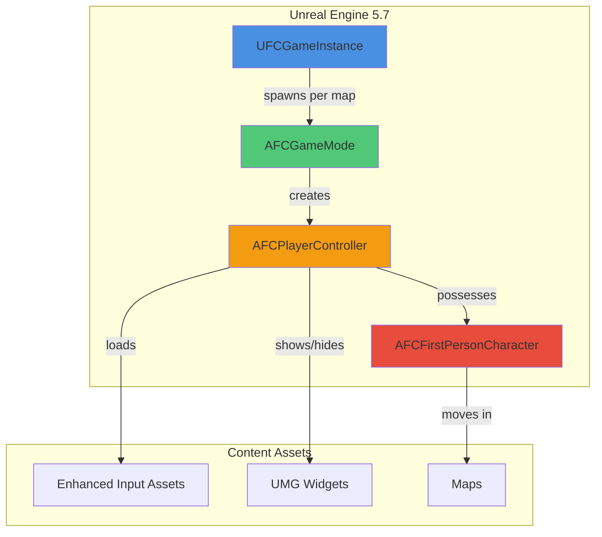
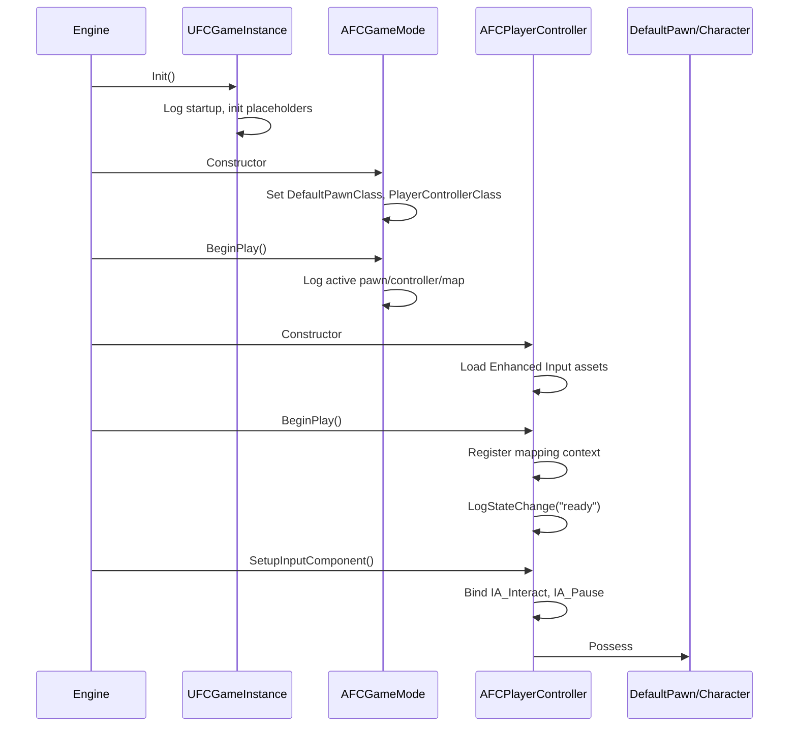
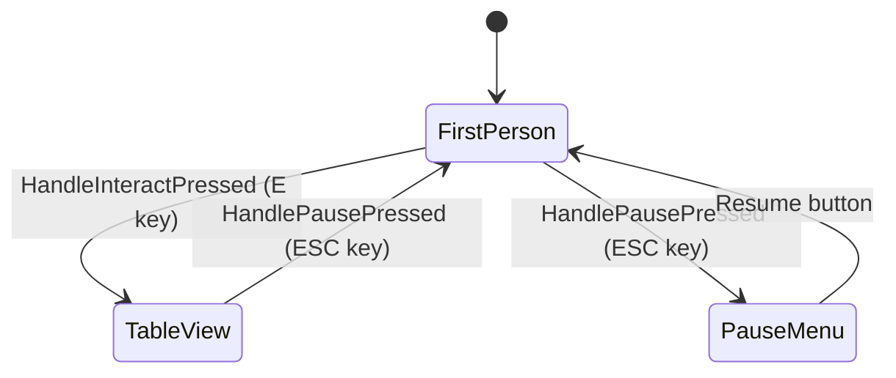
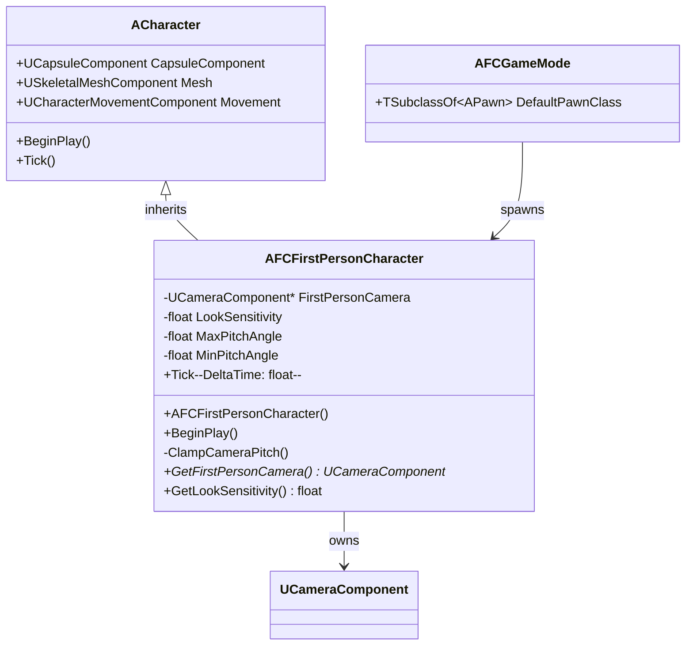
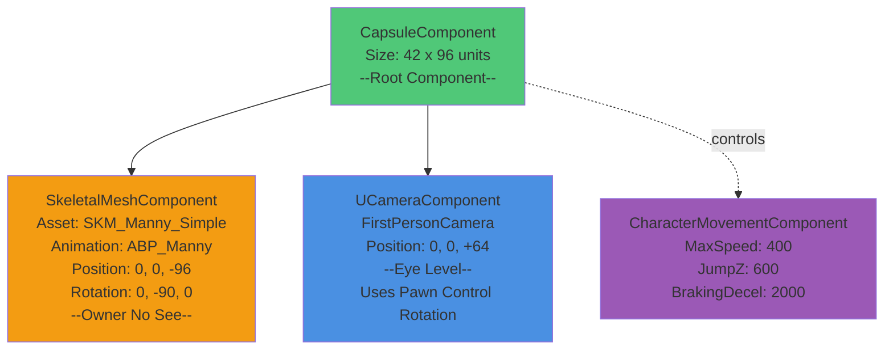
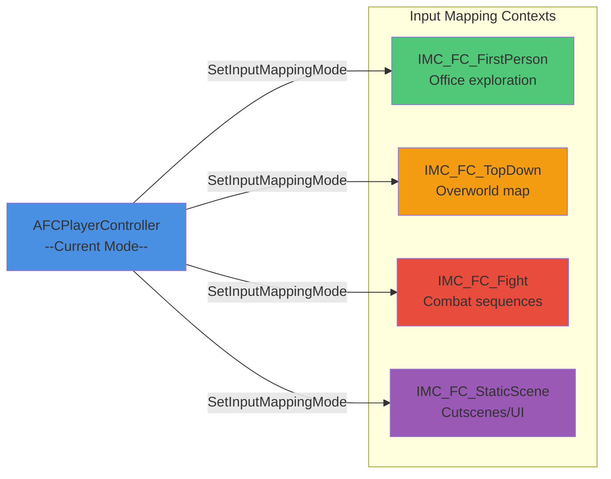
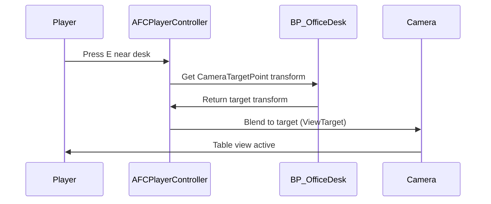
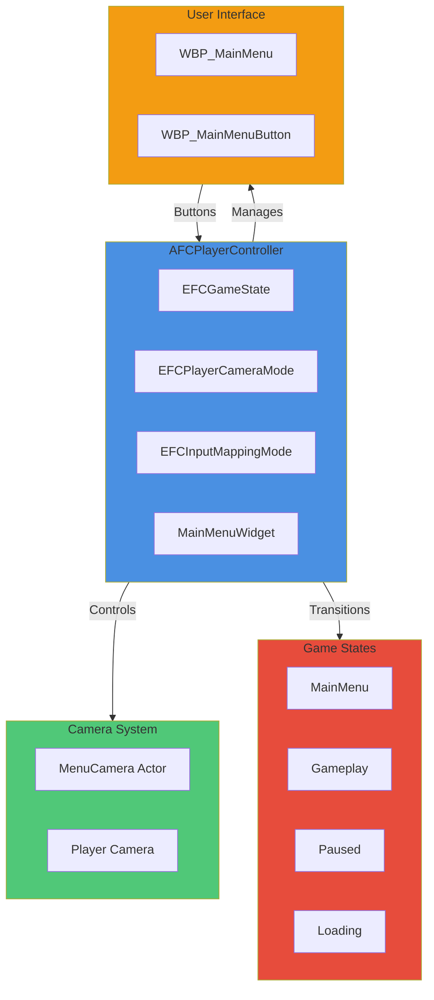
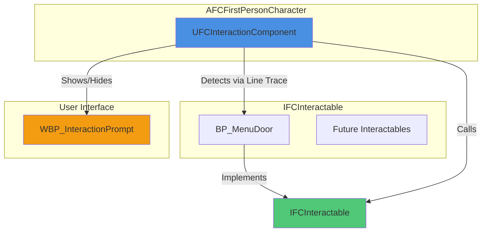

# Fallen Compass – Technical Documentation

> **Living document** tracking the C++ and Blueprint architecture, system interactions, and implementation notes for the entire Fallen Compass project. Updated incrementally as tasks are completed.

---

## Table of Contents

1. [Project Overview & Architecture](#project-overview--architecture)
2. [Core Framework (Task 2)](#core-framework-task-2)
3. [First-Person Character & Input (Task 3)](#first-person-character--input-task-3)
4. [Office Level & Greybox (Task 4)](#office-level--greybox-task-4)
5. [Main Menu System (Task 5)](#main-menu-system-task-5)
6. [Office Flow & Interactions (Task 6)](#office-flow--interactions-task-6)
7. [Logging & Debugging](#logging--debugging)
8. [Build & Configuration](#build--configuration)

---

## Project Overview & Architecture

### High-Level System Diagram



### Naming Conventions

- **File Names**: C++ files use `FC` prefix (e.g., `FCGameMode.h`, `FCFirstPersonCharacter.cpp`)
- **Class Names**: C++ classes use type-specific prefix + `FC` (e.g., `AFCGameMode`, `UFCGameInstance`, `AFCFirstPersonCharacter`)
- **Logs**: All categories prefixed `LogFallenCompass*` (e.g., `LogFallenCompassGameMode`, `LogFallenCompassCharacter`)
- **Assets**: Use descriptive names under `/Game/FC/` hierarchy; Enhanced Input assets prefixed `IA_` / `IMC_`

### Directory Structure

```
FC/
├── Source/FC/Core
│   ├── UFCGameInstance.h/cpp
│   ├── FCGameMode.h/cpp
│   ├── FCPlayerController.h/cpp
│   ├── FCFirstPersonCharacter.h/cpp
│   └── FCCharacter.h/cpp (top-down variant)
├── Source/FC/Interaction
│   ├── IFCInteractable.h/cpp
│   └── FCInteractionComponent.h/cpp
├── Source/FC/SaveGame
│   └── FCSaveGame.h/cpp
├── Content/FC/
│   ├── Input/
│   │   ├── IMC_FC_Default
│   │   ├── IA_Interact
│   │   └── IA_Pause
│   └── (future: UI/, Levels/, Characters/)
└── Config/
    ├── DefaultEngine.ini
    ├── DefaultGame.ini
    └── DefaultInput.ini
```

---

## Core Framework (Task 2)

### Overview

Established the foundational runtime classes that every downstream system depends on:

- `UFCGameInstance` (2.1) – global lifecycle and session state owner
- `AFCGameMode` (2.2) – map-specific authority, pawn/controller registration, logging
- `AFCPlayerController` (2.3) – player input handling, camera state, pause/interact scaffolding

### Class Interaction Flow



### UFCGameInstance (2.1)

- **Files**: `Source/FC/UFCGameInstance.h/.cpp`
- **Inheritance**: `UGameInstance`
- **Registration**: Project Settings → Maps & Modes → Game Instance Class
- **Purpose**: Manages global state across map transitions; houses session flags, expedition metadata, data asset references, and game version information.

#### Key Members

```cpp
UPROPERTY(EditDefaultsOnly, Category = "Session")
FString StartupExpeditionName;

UPROPERTY(EditDefaultsOnly, Category = "Session")
int32 StartupAct;

UPROPERTY(EditDefaultsOnly, Category = "Session")
int32 StartupDifficulty;

UPROPERTY(BlueprintReadOnly, Category = "Session")
bool bTutorialCompleted;

UFUNCTION(BlueprintPure, Category = "Version")
FString GetGameVersion() const;

DECLARE_MULTICAST_DELEGATE_OneParam(FOnExpeditionAboutToStart, const FString&);
FOnExpeditionAboutToStart OnExpeditionAboutToStart;

DECLARE_MULTICAST_DELEGATE_TwoParams(FOnExpeditionCompleted, bool, int32);
FOnExpeditionCompleted OnExpeditionCompleted;
```

#### Lifecycle Methods

- `Init()`: Logs startup with `LogFallenCompassGameInstance`; calls stub `CacheDefaultLoadouts()`.
- `Shutdown()`: Logs cleanup and future telemetry flush point.
- Placeholders: `BootstrapExpeditionAsync`, `CacheDefaultLoadouts`, `FlushSessionData`.

#### Design Rationale

Keeping systemic state in one place avoids circular dependencies once Tasks 5–6 introduce Main Menu ↔ Office transitions. Future save/load systems will hook directly into the GameInstance delegates.

---

### AFCGameMode (2.2)

- **Files**: `Source/FC/FCGameMode.h/.cpp`
- **Inheritance**: `AGameModeBase`
- **UCLASS**: Concrete (not abstract) so it appears in editor drop-downs.

#### Responsibilities

1. **Pawn Management**: Attempts to load legacy `BP_TopDownCharacter` for PIE continuity; falls back to `ADefaultPawn` if missing.
2. **Controller Assignment**: Always assigns `AFCPlayerController::StaticClass()` (legacy blueprint finder removed to eliminate `LoadPackage` errors).
3. **Logging**: Emits structured startup log listing active pawn, controller, and map name.
4. **Debug HUD**: Temporary on-screen green text to visually confirm the mode during PIE (removed once Task 6 has real UI).

#### Constructor Logic

```cpp
AFCGameMode::AFCGameMode()
{
    // Fallback pawn (will be replaced by AFCFirstPersonCharacter in Task 3.4)
    static ConstructorHelpers::FClassFinder<APawn> DefaultPawnBP(TEXT("/Game/TopDown/Blueprints/BP_TopDownCharacter"));
    if (DefaultPawnBP.Succeeded())
    {
        DefaultPawnClass = DefaultPawnBP.Class;
    }
    else
    {
        UE_LOG(LogFallenCompassGameMode, Warning, TEXT("Missing BP_TopDownCharacter. Falling back to ADefaultPawn."));
        DefaultPawnClass = ADefaultPawn::StaticClass();
    }

    // Always use FC controller
    PlayerControllerClass = AFCPlayerController::StaticClass();
}
```

#### BeginPlay Logging

```cpp
void AFCGameMode::BeginPlay()
{
    Super::BeginPlay();

    const UClass* PawnClass = DefaultPawnClass ? DefaultPawnClass.Get() : GetDefaultPawnClassForController(nullptr);
    const FString PawnName = PawnClass ? PawnClass->GetName() : TEXT("None");
    const FString ControllerName = PlayerControllerClass ? PlayerControllerClass->GetName() : TEXT("None");
    const FString MapName = GetWorld() ? GetWorld()->GetMapName() : TEXT("Unknown");

    UE_LOG(LogFallenCompassGameMode, Log, TEXT("AFCGameMode active | Pawn=%s | Controller=%s | Level=%s"),
        *PawnName, *ControllerName, *MapName);

    // Temporary debug HUD
    if (GEngine)
    {
        const FString DebugLine = FString::Printf(TEXT("AFCGameMode active | Pawn=%s | Controller=%s | Level=%s"),
            *PawnName, *ControllerName, *MapName);
        GEngine->AddOnScreenDebugMessage(-1, 4.f, FColor::Green, DebugLine);
    }
}
```

#### Open Hooks

- Verbose log explains upcoming swap to `AFCFirstPersonCharacter` once Task 3 is complete.
- Constructor comment notes when to remove legacy template assets.

---

### AFCPlayerController (2.3)

- **Files**: `Source/FC/AFCPlayerController.h/.cpp`
- **Inheritance**: `APlayerController`
- **Purpose**: Handles player input, camera state transitions, pause logic, and interaction traces.

#### Camera State Machine



#### Key Members

```cpp
UENUM(BlueprintType)
enum class EFCPlayerCameraMode : uint8
{
    FirstPerson = 0,
    TableView
};

UPROPERTY(VisibleAnywhere, BlueprintReadOnly, Category = "State")
EFCPlayerCameraMode CameraMode;

UPROPERTY(VisibleInstanceOnly, BlueprintReadOnly, Category = "State")
bool bIsPauseMenuDisplayed;

UPROPERTY(EditDefaultsOnly, Category = "Input")
TObjectPtr<UInputMappingContext> DefaultMappingContext;

UPROPERTY(EditDefaultsOnly, Category = "Input")
TObjectPtr<UInputAction> InteractAction;

UPROPERTY(EditDefaultsOnly, Category = "Input")
TObjectPtr<UInputAction> PauseAction;
```

#### Enhanced Input Integration

- **Constructor**: Loads `/Game/FC/Input/IMC_FC_Default`, `IA_Interact`, `IA_Pause` via `ConstructorHelpers::FObjectFinder`.
- **SetupInputComponent**: Registers mapping context with local player subsystem; binds actions via `UEnhancedInputComponent`.
- **Safety**: Logs warnings if any asset or component is missing, ensuring QA sees configuration issues immediately.

#### Input Handlers

```cpp
void AFCPlayerController::HandleInteractPressed()
{
    if (CameraMode == EFCPlayerCameraMode::FirstPerson)
    {
        UE_LOG(LogFallenCompassPlayerController, Log, TEXT("TODO: Trace forward and interact with focused actor."));
        EnterTableViewPlaceholder();
    }
    else
    {
        UE_LOG(LogFallenCompassPlayerController, Log, TEXT("TODO: Route table-view interaction to board UI."));
    }
}

void AFCPlayerController::HandlePausePressed()
{
    if (CameraMode == EFCPlayerCameraMode::TableView)
    {
        UE_LOG(LogFallenCompassPlayerController, Log, TEXT("ESC pressed in table view. Returning to first-person."));
        ExitTableViewPlaceholder();
        return;
    }

    if (bIsPauseMenuDisplayed)
    {
        HidePauseMenuPlaceholder();
    }
    else
    {
        ShowPauseMenuPlaceholder();
    }
}
```

#### Placeholder Methods

- `EnterTableViewPlaceholder()` / `ExitTableViewPlaceholder()`: Log TODOs for camera blend and movement disable/enable (Task 6).
- `ShowPauseMenuPlaceholder()` / `HidePauseMenuPlaceholder()`: Log TODOs for UMG widget instantiation (Task 5).
- `SetFallenCompassCameraMode()`: Internal helper renamed to avoid hiding `APlayerController::SetCameraMode`.

#### Design Notes

- `bShowMouseCursor` forced `false` (FPS focus); trivially swappable once UI needs cursor.
- All state transitions logged via `LogStateChange()` for debugging.

---

## First-Person Character & Input (Task 3)

### Overview

Implemented the first-person character for office exploration with proper camera setup, mesh configuration, pitch clamping, and look sensitivity parameters. Task 3.1 establishes the character foundation; subsequent tasks (3.2-3.5) will wire input mappings and movement.

### 3.1 First-Person Character Class

#### AFCFirstPersonCharacter

- **Files**: `Source/FC/FCFirstPersonCharacter.h/.cpp`
- **Inheritance**: `ACharacter`
- **Purpose**: Player-controlled first-person character for office level exploration with configurable camera behavior and movement constraints.

#### Class Architecture



#### Component Hierarchy



#### Key Members

**Camera Component**

```cpp
UPROPERTY(VisibleAnywhere, BlueprintReadOnly, Category = "Components")
TObjectPtr<UCameraComponent> FirstPersonCamera;
```

- Positioned at +64 units Z (eye level above capsule base)
- `bUsePawnControlRotation = true` - follows controller rotation
- Updated every frame via pitch clamping system

**Camera Configuration**

```cpp
UPROPERTY(EditAnywhere, BlueprintReadWrite, Category = "Camera", meta = (ClampMin = "0.1", ClampMax = "5.0"))
float LookSensitivity = 1.0f;

UPROPERTY(EditDefaultsOnly, BlueprintReadOnly, Category = "Camera")
float MaxPitchAngle = 60.0f;

UPROPERTY(EditDefaultsOnly, BlueprintReadOnly, Category = "Camera")
float MinPitchAngle = -60.0f;
```

- **LookSensitivity**: Multiplier for mouse input (ready for Task 3.3)
- **MaxPitchAngle**: Maximum upward look angle (+60°)
- **MinPitchAngle**: Maximum downward look angle (-60°)

#### Constructor Configuration

**Capsule & Rotation**

```cpp
GetCapsuleComponent()->InitCapsuleSize(42.0f, 96.0f);

bUseControllerRotationPitch = false; // Manual pitch control via ClampCameraPitch
bUseControllerRotationYaw = true;    // Character yaw follows mouse X
bUseControllerRotationRoll = false;
```

**Character Movement**

```cpp
GetCharacterMovement()->bOrientRotationToMovement = false; // FPS standard
GetCharacterMovement()->RotationRate = FRotator(0.0f, 720.0f, 0.0f);
GetCharacterMovement()->JumpZVelocity = 600.0f;
GetCharacterMovement()->AirControl = 0.2f;
GetCharacterMovement()->MaxWalkSpeed = 400.0f;
GetCharacterMovement()->BrakingDecelerationWalking = 2000.0f;
```

**Mesh Setup**

```cpp
// Load SKM_Manny_Simple
static ConstructorHelpers::FObjectFinder<USkeletalMesh> MannyMeshAsset(
    TEXT("/Game/Characters/Mannequins/Meshes/SKM_Manny_Simple"));
MeshComp->SetSkeletalMesh(MannyMeshAsset.Object);

// Load ABP_Unarmed animation blueprint
static ConstructorHelpers::FClassFinder<UAnimInstance> MannyAnimBP(
    TEXT("/Game/Characters/Mannequins/Anims/Unarmed/ABP_Unarmed"));
MeshComp->SetAnimInstanceClass(MannyAnimBP.Class);

// Position and show mesh
MeshComp->SetRelativeLocation(FVector(0.0f, 0.0f, -96.0f)); // Feet at capsule base
MeshComp->SetRelativeRotation(FRotator(0.0f, -90.0f, 0.0f)); // Face forward
MeshComp->SetOwnerNoSee(false); // Show in first-person view (visible when looking down)
```

#### Pitch Clamping System


**Implementation**

```cpp
void AFCFirstPersonCharacter::ClampCameraPitch()
{
    if (Controller)
    {
        FRotator ControlRotation = Controller->GetControlRotation();
        float CurrentPitch = FRotator::NormalizeAxis(ControlRotation.Pitch);
        float ClampedPitch = FMath::Clamp(CurrentPitch, MinPitchAngle, MaxPitchAngle);

        if (!FMath::IsNearlyEqual(CurrentPitch, ClampedPitch, 0.01f))
        {
            ControlRotation.Pitch = ClampedPitch;
            Controller->SetControlRotation(ControlRotation);
        }
    }
}
```

- Called every `Tick()` for continuous enforcement
- Only updates controller rotation when clamping occurs (performance optimization)
- Uses 0.01° threshold to avoid micro-adjustments

#### Lifecycle & Logging

**BeginPlay**

```cpp
void AFCFirstPersonCharacter::BeginPlay()
{
    Super::BeginPlay();

    UE_LOG(LogFallenCompassCharacter, Log,
        TEXT("AFCFirstPersonCharacter spawned | LookSensitivity=%.2f | PitchClamp=[%.1f, %.1f]"),
        LookSensitivity, MinPitchAngle, MaxPitchAngle);
}
```

**Tick**

```cpp
void AFCFirstPersonCharacter::Tick(float DeltaTime)
{
    Super::Tick(DeltaTime);
    ClampCameraPitch(); // Enforce pitch limits every frame
}
```

#### Integration with AFCGameMode

**Updated Constructor**

```cpp
AFCGameMode::AFCGameMode()
{
    // Use AFCFirstPersonCharacter for Office level (Task 3.1)
    DefaultPawnClass = AFCFirstPersonCharacter::StaticClass();
    PlayerControllerClass = AFCPlayerController::StaticClass();

    UE_LOG(LogFallenCompassGameMode, Log,
        TEXT("AFCGameMode configured with AFCFirstPersonCharacter and AFCPlayerController."));
}
```

- Removed legacy template pawn references (`BP_TopDownCharacter`, `ADefaultPawn`)
- Directly assigns `AFCFirstPersonCharacter::StaticClass()`
- Simplified includes and constructor logic

**BeginPlay Logging**

```cpp
UE_LOG(LogFallenCompassGameMode, Verbose,
    TEXT("Task 3.1 complete: AFCFirstPersonCharacter active. Next: Input mappings (3.2-3.3) and Office level (4.x)."));
```

#### Design Rationale

1. **Separate Character Class**: Keep `AFCCharacter` (top-down) for variant game modes; `AFCFirstPersonCharacter` exclusively for office level
2. **Pitch Clamping**: Prevents disorientation from over-rotation (standard FPS UX)
3. **Visible Mesh**: `SetOwnerNoSee(false)` allows seeing the character mesh when looking down, providing visual feedback
4. **Look Sensitivity Parameter**: Ready for Task 3.3 input implementation without refactoring
5. **Standard Movement Values**: 400 units/sec walk speed and 600 units/sec jump are industry-standard FPS defaults

#### Asset Dependencies

- **Mesh**: `/Game/Characters/Mannequins/Meshes/SKM_Manny_Simple`
- **Animation**: `/Game/Characters/Mannequins/Animations/ABP_Manny`
- Both assets ship with UE5 Mannequin content (no external dependencies)

#### Open Hooks for Task 3.2-3.5

- `LookSensitivity` ready for mouse input scaling
- Movement input handlers to be bound in Task 3.3
- Interaction input (`IA_Interact`) already configured in `AFCPlayerController`
- Character spawns correctly; awaiting input mapping completion

---

### 3.2 Configure Input Mappings

#### Overview

Configured Enhanced Input System with multiple mapping contexts for different gameplay modes. Created 2D vector input actions for movement and look, with proper key bindings and modifiers for first-person controls.

#### Multiple Input Mapping Contexts

**Architecture Decision**: Separate mapping contexts for different gameplay modes enable clean context switching without conflicts.



#### EFCInputMappingMode Enum

**Added to `FCPlayerController.h`**:

```cpp
UENUM(BlueprintType)
enum class EFCInputMappingMode : uint8
{
    FirstPerson = 0,
    TopDown,
    Fight,
    StaticScene
};
```

#### Input Mapping Context Properties

**Replaced single `DefaultMappingContext` with four mode-specific contexts**:

```cpp
UPROPERTY(VisibleAnywhere, BlueprintReadOnly, Category = "Input")
EFCInputMappingMode CurrentMappingMode;

UPROPERTY(EditDefaultsOnly, Category = "Input")
TObjectPtr<UInputMappingContext> FirstPersonMappingContext;

UPROPERTY(EditDefaultsOnly, Category = "Input")
TObjectPtr<UInputMappingContext> TopDownMappingContext;

UPROPERTY(EditDefaultsOnly, Category = "Input")
TObjectPtr<UInputMappingContext> FightMappingContext;

UPROPERTY(EditDefaultsOnly, Category = "Input")
TObjectPtr<UInputMappingContext> StaticSceneMappingContext;
```

#### Dynamic Context Switching

**Public method for runtime mode changes**:

```cpp
UFUNCTION(BlueprintCallable, Category = "Input")
void SetInputMappingMode(EFCInputMappingMode NewMode);
```

**Implementation** - clears all mappings and applies new context:

```cpp
void AFCPlayerController::SetInputMappingMode(EFCInputMappingMode NewMode)
{
    // Get subsystem and validate
    UEnhancedInputLocalPlayerSubsystem* Subsystem =
        ULocalPlayer::GetSubsystem<UEnhancedInputLocalPlayerSubsystem>(GetLocalPlayer());

    // Select context based on mode
    UInputMappingContext* ContextToApply = nullptr;
    switch (NewMode)
    {
        case EFCInputMappingMode::FirstPerson: ContextToApply = FirstPersonMappingContext; break;
        case EFCInputMappingMode::TopDown: ContextToApply = TopDownMappingContext; break;
        case EFCInputMappingMode::Fight: ContextToApply = FightMappingContext; break;
        case EFCInputMappingMode::StaticScene: ContextToApply = StaticSceneMappingContext; break;
    }

    // Clear and apply
    Subsystem->ClearAllMappings();
    Subsystem->AddMappingContext(ContextToApply, DefaultMappingPriority);
    CurrentMappingMode = NewMode;
}
```

#### Input Action Assets

**Created in `/Game/FC/Input/`**:

| Asset         | Type              | Purpose                          |
| ------------- | ----------------- | -------------------------------- |
| `IA_Move`     | Axis2D (Vector2D) | WASD movement input              |
| `IA_Look`     | Axis2D (Vector2D) | Mouse look input                 |
| `IA_Interact` | Boolean           | Interaction (E key) - _existing_ |
| `IA_Pause`    | Boolean           | Pause/ESC handling - _existing_  |

#### IMC_FC_FirstPerson Configuration

**Key Bindings & Modifiers**:

**IA_Move** (2D Vector):

- **W** → Forward
  - Modifier: **Swizzle Input Axis Values** (YXZ)
  - Maps to Y-axis positive
- **S** → Backward
  - Modifiers: **Swizzle** (YXZ) + **Negate**
  - Maps to Y-axis negative
- **D** → Right
  - No modifiers (X-axis positive)
- **A** → Left
  - Modifier: **Negate**
  - Maps to X-axis negative

**IA_Look** (2D Vector):

- **Mouse 2D Axis**
  - Modifier: **Negate Y**
  - Inverts Y-axis for standard FPS look (mouse up = look up)

**IA_Interact**:

- **E** key → Trigger interaction

**IA_Pause**:

- **Escape** key → Pause menu / exit table view

#### Constructor Updates

**Loads all four mapping contexts at startup**:

```cpp
AFCPlayerController::AFCPlayerController()
{
    CurrentMappingMode = EFCInputMappingMode::FirstPerson;

    // Load all four mapping contexts with ConstructorHelpers
    static ConstructorHelpers::FObjectFinder<UInputMappingContext> FirstPersonContextFinder(
        TEXT("/Game/FC/Input/IMC_FC_FirstPerson"));
    FirstPersonMappingContext = FirstPersonContextFinder.Object;

    static ConstructorHelpers::FObjectFinder<UInputMappingContext> TopDownContextFinder(
        TEXT("/Game/FC/Input/IMC_FC_TopDown"));
    TopDownMappingContext = TopDownContextFinder.Object;

    // ... Fight and StaticScene contexts ...
}
```

#### SetupInputComponent Updates

**Critical fix**: Added `Super::SetupInputComponent()` call to prevent access violation crash.

```cpp
void AFCPlayerController::SetupInputComponent()
{
    Super::SetupInputComponent(); // MUST be first - initializes InputComponent

    // Apply initial mapping context
    SetInputMappingMode(CurrentMappingMode);

    // Bind shared input actions
    UEnhancedInputComponent* EnhancedInput = Cast<UEnhancedInputComponent>(InputComponent);
    if (EnhancedInput)
    {
        EnhancedInput->BindAction(InteractAction, ETriggerEvent::Started,
            this, &AFCPlayerController::HandleInteractPressed);
        EnhancedInput->BindAction(PauseAction, ETriggerEvent::Started,
            this, &AFCPlayerController::HandlePausePressed);
    }
}
```

#### Future Usage Examples

**Switching contexts at runtime**:

```cpp
// When entering office level
PlayerController->SetInputMappingMode(EFCInputMappingMode::FirstPerson);

// When transitioning to overworld map
PlayerController->SetInputMappingMode(EFCInputMappingMode::TopDown);

// When entering combat
PlayerController->SetInputMappingMode(EFCInputMappingMode::Fight);

// During cutscenes
PlayerController->SetInputMappingMode(EFCInputMappingMode::StaticScene);
```

#### Asset Status

**Mapping Contexts** (all in `/Game/FC/Input/`):

- `IMC_FC_FirstPerson` ✅ Configured with WASD + Mouse
- `IMC_FC_TopDown` ✅ Created (to be configured in future tasks)
- `IMC_FC_Fight` ✅ Created (to be configured in future tasks)
- `IMC_FC_StaticScene` ✅ Created (to be configured in future tasks)

**Input Actions** (all in `/Game/FC/Input/`):

- `IA_Move` ✅ Created (Axis2D)
- `IA_Look` ✅ Created (Axis2D)
- `IA_Interact` ✅ Existing (Boolean)
- `IA_Pause` ✅ Existing (Boolean)

#### Design Rationale

1. **Separate Contexts**: Prevents key binding conflicts between gameplay modes
2. **Shared Actions**: `IA_Move`, `IA_Look` reusable across contexts with different bindings
3. **Runtime Switching**: Clean transitions without rebinding individual actions
4. **Scalability**: Easy to add new contexts (e.g., `IMC_FC_Camp`, `IMC_FC_UI`)
5. **Blueprint Accessible**: `SetInputMappingMode()` callable from BP for level scripts

#### Open Hooks for Task 3.3

- Input actions created and mapped ✅
- Mapping context switching functional ✅
- Awaiting binding to character movement methods
- `LookSensitivity` parameter ready for mouse input scaling

---

### 3.3 Implement Movement & Look

#### Overview

Implemented Enhanced Input bindings for WASD movement and mouse look with configurable sensitivity and pitch clamping. Fixed initial pitch inversion issue by negating the Y-axis input for standard FPS controls.

#### Input Binding Implementation

**SetupPlayerInputComponent Override**

```cpp
void AFCFirstPersonCharacter::SetupPlayerInputComponent(UInputComponent* PlayerInputComponent)
{
    Super::SetupPlayerInputComponent(PlayerInputComponent);

    UEnhancedInputComponent* EnhancedInput = Cast<UEnhancedInputComponent>(PlayerInputComponent);
    if (!EnhancedInput) return;

    // Bind movement action (WASD)
    if (MoveAction)
    {
        EnhancedInput->BindAction(MoveAction, ETriggerEvent::Triggered, this, &AFCFirstPersonCharacter::HandleMove);
    }

    // Bind look action (Mouse)
    if (LookAction)
    {
        EnhancedInput->BindAction(LookAction, ETriggerEvent::Triggered, this, &AFCFirstPersonCharacter::HandleLook);
    }
}
```

- Loads `IA_Move` and `IA_Look` via ConstructorHelpers in constructor
- Binds to `HandleMove` and `HandleLook` methods using `ETriggerEvent::Triggered` for continuous input

#### Movement Handler

**HandleMove Method**

```cpp
void AFCFirstPersonCharacter::HandleMove(const FInputActionValue& Value)
{
    const FVector2D MovementVector = Value.Get<FVector2D>();

    if (Controller)
    {
        const FRotator Rotation = Controller->GetControlRotation();
        const FRotator YawRotation(0, Rotation.Yaw, 0);

        const FVector ForwardDirection = FRotationMatrix(YawRotation).GetUnitAxis(EAxis::X);
        const FVector RightDirection = FRotationMatrix(YawRotation).GetUnitAxis(EAxis::Y);

        AddMovementInput(ForwardDirection, MovementVector.Y); // Y = forward/backward (W/S)
        AddMovementInput(RightDirection, MovementVector.X);   // X = right/left (D/A)
    }
}
```

- Processes 2D vector input from WASD keys
- Calculates forward/right directions relative to controller yaw (character faces movement direction)
- Adds movement input using standard Character movement system

#### Look Handler

**HandleLook Method**

```cpp
void AFCFirstPersonCharacter::HandleLook(const FInputActionValue& Value)
{
    const FVector2D LookAxisVector = Value.Get<FVector2D>();

    if (Controller)
    {
        AddControllerYawInput(LookAxisVector.X * LookSensitivity);   // Mouse X = yaw (turn left/right)
        AddControllerPitchInput(-LookAxisVector.Y * LookSensitivity); // Mouse Y = pitch (look up/down) - inverted
    }
}
```

- Applies `LookSensitivity` multiplier to mouse input
- **Pitch Inversion Fix**: Negated Y-axis (`-LookAxisVector.Y`) to correct inverted look up/down
- Yaw remains standard (positive X turns right)
- Pitch clamping enforced in `Tick()` via `ClampCameraPitch()`

#### Design Rationale

1. **Controller-Relative Movement**: Character moves relative to camera yaw, standard for FPS games
2. **Sensitivity Parameter**: Allows runtime adjustment of mouse sensitivity (0.1x to 5.0x range)
3. **Pitch Inversion**: Fixed by negating Y-input; mouse up now correctly looks up
4. **Continuous Input**: Uses `ETriggerEvent::Triggered` for smooth, frame-rate independent input
5. **Separation of Concerns**: Movement and look handled separately for clarity and modularity

#### Testing & Validation

- **WASD Movement**: Verified forward/backward and strafe left/right
- **Mouse Look**: Confirmed yaw (left/right) and corrected pitch (up/down)
- **Sensitivity**: Tested with different `LookSensitivity` values
- **Pitch Clamping**: Ensured ±60° limits prevent over-rotation
- **Logging**: Added debug logs for input binding and handler execution

#### Integration Notes

- Depends on `IA_Move` and `IA_Look` assets configured in Task 3.2
- `LookSensitivity` exposed as editable property for designers
- Pitch clamping runs every `Tick()` for continuous enforcement
- No conflicts with `AFCPlayerController` input mappings (separate contexts)

---

---

### 3.4 Connect Character to GameMode

**Status**: ✅ **Completed** (integrated with Task 3.1)

See [AFCGameMode Integration](#integration-with-afcgamemode) above.

---

### 3.5 Expose Hooks for Interaction and ESC

#### Overview

Implemented input action bindings for interaction (E key) and pause (ESC) in `AFCPlayerController`. Added forward line trace functionality for interaction detection as a foundation for future interactable objects.

#### Input Action Bindings

**SetupInputComponent Override** (already implemented in Task 2.3, confirmed in Task 3.5)

```cpp
void AFCPlayerController::SetupInputComponent()
{
    Super::SetupInputComponent();

    SetInputMappingMode(CurrentMappingMode);

    UEnhancedInputComponent* EnhancedInput = Cast<UEnhancedInputComponent>(InputComponent);
    if (EnhancedInput)
    {
        EnhancedInput->BindAction(InteractAction, ETriggerEvent::Started,
            this, &AFCPlayerController::HandleInteractPressed);
        EnhancedInput->BindAction(PauseAction, ETriggerEvent::Started,
            this, &AFCPlayerController::HandlePausePressed);
    }
}
```

- Binds `IA_Interact` to `HandleInteractPressed` (E key)
- Binds `IA_Pause` to `HandlePausePressed` (ESC key)
- Uses `ETriggerEvent::Started` for single-press actions

#### Interaction Handler Implementation

**HandleInteractPressed Method**

```cpp
void AFCPlayerController::HandleInteractPressed()
{
    if (CameraMode == EFCPlayerCameraMode::FirstPerson)
    {
        AFCFirstPersonCharacter* Character = Cast<AFCFirstPersonCharacter>(GetPawn());
        if (Character)
        {
            UCameraComponent* Camera = Character->GetFirstPersonCamera();
            if (Camera)
            {
                FVector Start = Camera->GetComponentLocation();
                FVector End = Start + (Camera->GetForwardVector() * 1000.0f);

                FHitResult HitResult;
                FCollisionQueryParams QueryParams;
                QueryParams.AddIgnoredActor(GetPawn());

                if (GetWorld()->LineTraceSingleByChannel(HitResult, Start, End, ECC_Visibility, QueryParams))
                {
                    UE_LOG(LogFallenCompassPlayerController, Log, TEXT("Interact: Hit actor '%s' at distance %.1f units"),
                        *HitResult.GetActor()->GetName(), HitResult.Distance);
                    // TODO: Check if hit actor is interactable and call interaction logic
                }
                else
                {
                    UE_LOG(LogFallenCompassPlayerController, Log, TEXT("Interact: No interactable found"));
                }
            }
        }
    }
    // TableView mode: TODO for Task 6
}
```

- Performs line trace from camera position forward 1000 units
- Ignores player character in trace
- Logs hit actor name and distance for debugging
- On-screen debug messages for visual feedback
- Placeholder for interactable logic (to be implemented in Task 6)

#### Pause Handler

**HandlePausePressed Method** (already implemented)

- Logs pause press with current camera mode
- Handles table view exit vs. pause menu toggle
- On-screen debug messages
- Delegates to placeholder methods for UI (Task 5)

#### Design Rationale

1. **Controller-Level Binding**: Interaction and pause are player actions, not character-specific, so bound in `AFCPlayerController`
2. **Forward Trace**: Basic raycast from camera provides foundation for object interaction without requiring complex systems
3. **Debug Feedback**: Comprehensive logging and on-screen messages aid development and testing
4. **Extensible**: Trace result can be extended to check for interactable components/tags in Task 6
5. **Mode-Aware**: Different behavior for FirstPerson vs. TableView modes

#### Testing & Validation

- **E Key**: Verified line trace detects geometry and logs results
- **ESC Key**: Confirmed pause logging and mode transitions
- **No False Positives**: Player character ignored in traces
- **Performance**: Single trace per press, minimal impact

#### Integration Notes

- Depends on `IA_Interact` and `IA_Pause` assets (Task 3.2)
- Trace distance (1000 units) can be made configurable later
- Future: Add interactable interface/component for objects to implement
- Camera mode switching affects interaction behavior

---

---

## Office Level & Greybox (Task 4)

### Overview

Created the first playable level for Fallen Compass - a greyboxed office environment with basic geometry, lighting, interactable props, and camera target positions for the table view transition system.

### 4.1 Office Level Creation

#### Level Asset

- **Location**: `/Game/FC/World/Levels/L_Office.umap`
- **Game Mode**: `FCGameMode` assigned via World Settings override
- **PlayerStart**: Positioned at central spawn location facing the desk

#### World Settings Configuration

```
Game Mode Override: FCGameMode
Default Pawn Class: AFCFirstPersonCharacter (inherited from GameMode)
```

### 4.2 Greybox Geometry

#### Room Structure

**Dimensions**: 2000x2000 units (20x20 meters)

- **Floor**: Basic geometry with collision enabled
- **Walls**: Four walls at 300 units height (3 meters)
- **Ceiling**: Enclosed room for proper lighting
- **Collision**: BlockAll preset on all geometry to prevent player clipping

#### Organization

Level geometry organized in World Outliner:

```
L_Office
├── WorldLighting/
│   ├── DirectionalLight
│   ├── SkyLight
│   ├── SkyAtmosphere
│   └── ExponentialHeightFog
├── Geometry/
│   ├── Floor
│   ├── Walls
│   └── Ceiling
└── Props/
    ├── BP_OfficeDesk
    └── SM_Door
```

### 4.3 Office Desk Blueprint

#### BP_OfficeDesk

- **Location**: `/Game/FC/World/Props/BP_OfficeDesk`
- **Purpose**: Primary interactable object for table view transitions
- **Components**:
  - Root: Static Mesh Component (table mesh)
  - **CameraTargetPoint**: Scene Component (child of root)

#### CameraTargetPoint Setup

```
Component Hierarchy:
└── BP_OfficeDesk (Root)
    └── CameraTargetPoint (SceneComponent)
        └── Transform: Positioned above desk, looking down
```

**Purpose**:

- Target transform for table-focused camera view (Task 6)
- Provides consistent camera position for card game/board interactions
- Can be adjusted per-instance without Blueprint changes

**Configuration**:

- Position: Above and angled toward desk surface
- Rotation: Angled downward to frame entire desk
- Field of View: Will be applied when camera transitions (Task 6)

### 4.4 Door Placeholder

#### SM_Door

- **Type**: Static Mesh (basic cube geometry)
- **Purpose**: Exit door placeholder for future level transitions
- **Position**: Placed on wall as clearly marked "exit"
- **Collision**: Enabled for interaction detection
- **Future**: Will be upgraded to Blueprint with door opening animation and level transition logic (Task 6)

### 4.5 Camera Positions for Table View

#### Implementation Approach

**Chosen Method**: SceneComponent on Blueprint (Option 2)

- Allows per-instance adjustment
- No separate camera actor clutter
- Easier to reference in code (`BP_OfficeDesk->FindComponentByClass<USceneComponent>()`)

#### Camera Target Configuration

**CameraTargetPoint Transform**:

- Positioned to provide clear view of entire desk surface
- Angled top-down perspective (similar to board game view)
- Distance adjusted to frame desk without clipping
- Will be used by `AFCPlayerController::EnterTableView()` in Task 6

#### Future Camera Transition System



### 4.6 Lighting & Navigation

#### Lighting Setup

**WorldLighting Folder**:

- **DirectionalLight**: Primary outdoor light source (sun)
  - Intensity: Default
  - Color: Natural daylight
  - Angle: Creates shadows through windows (future)
- **SkyLight**: Ambient fill light from sky
  - Source Type: SLS_CapturedScene
  - Recaptured after geometry changes
- **SkyAtmosphere**: Realistic atmospheric scattering
  - Provides blue sky gradient
  - Enhances outdoor lighting feel
- **ExponentialHeightFog**: Atmospheric depth and mood
  - Subtle fog for visual depth

**Lighting Quality**:

- Development/PIE: Fast lighting for iteration
- Final: Will be baked for production (Task 7+)

#### Navigation & Movement Testing

**Collision Verification**:

- Player cannot walk through walls ✅
- Floor collision prevents falling ✅
- Desk collision allows interaction ✅
- Door collision blocks passage ✅

**Movement Feel**:

- Room scale appropriate for first-person navigation
- Desk height realistic relative to character
- Door positioned at logical exit height
- Comfortable walking space around props

**Character Movement**:

- WASD movement: Responsive and smooth
- Mouse look: Proper sensitivity and pitch clamping
- Collision response: Natural sliding along walls
- No clipping or geometry penetration

#### NavMesh (Optional)

- Not critical for player character (uses CharacterMovement)
- Useful for future AI/NPC pathfinding
- Can be generated later if needed

### Design Rationale

1. **Greybox First**: Focus on layout and scale before art pass
2. **Modular Props**: Desk and door as separate Blueprints for reusability
3. **Scene Component Target**: Flexible camera positioning without cluttering level
4. **Comprehensive Lighting**: Realistic atmosphere aids in visual testing
5. **Organized Hierarchy**: Clean World Outliner for maintainability

### Asset Dependencies

- **Mannequin Assets**: Used in BP_OfficeDesk for scale reference
- **Level Prototyping**: Basic geometry meshes
- **Engine Content**: Lighting components (DirectionalLight, SkyLight, etc.)

### Testing & Validation

- ✅ Player spawns correctly at PlayerStart
- ✅ WASD movement and mouse look functional
- ✅ Collision prevents wall clipping
- ✅ Desk accessible and positioned correctly
- ✅ Door visible as exit point
- ✅ Lighting provides clear visibility
- ✅ Scale feels appropriate for office environment

### Open Hooks for Task 6

- `BP_OfficeDesk::CameraTargetPoint` ready for camera transitions
- `SM_Door` ready for interaction logic and level transitions
- Desk interaction will trigger table view mode
- Door interaction will trigger level change or game exit

---

## Main Menu System (Task 5)

### Overview

Implemented an in-world main menu system that provides a seamless transition between menu navigation and gameplay. The system uses a dedicated menu camera, widget-based UI, and state management to handle different game modes (Main Menu, Gameplay, Paused).

### Main Menu Architecture



### AFCPlayerController Main Menu Integration

- **Files**: `Source/FC/Core/FCPlayerController.h/.cpp`
- **Purpose**: Central coordinator for menu state, camera transitions, input modes, and UI management.

#### Key Enums

```cpp
UENUM(BlueprintType)
enum class EFCPlayerCameraMode : uint8
{
    FirstPerson = 0,
    TableView,
    MainMenu,
    SaveSlotView
};

UENUM(BlueprintType)
enum class EFCInputMappingMode : uint8
{
    FirstPerson = 0,
    TopDown,
    Fight,
    StaticScene
};

UENUM(BlueprintType)
enum class EFCGameState : uint8
{
    MainMenu = 0,
    Gameplay,
    TableView,
    Paused,
    Loading
};
```

#### Key Properties

```cpp
/** Reference to the MenuCamera actor in L_Office */
UPROPERTY(EditAnywhere, BlueprintReadWrite, Category = "Camera")
TObjectPtr<ACameraActor> MenuCamera;

/** Main menu widget class */
UPROPERTY(EditDefaultsOnly, Category = "UI")
TSubclassOf<UUserWidget> MainMenuWidgetClass;

/** Current main menu widget instance */
UPROPERTY()
TObjectPtr<UUserWidget> MainMenuWidget;

/** Current game state (MainMenu, Gameplay, etc.) */
UPROPERTY(VisibleAnywhere, BlueprintReadOnly, Category = "State")
EFCGameState CurrentGameState;

/** Current camera mode */
UPROPERTY(VisibleAnywhere, BlueprintReadOnly, Category = "State")
EFCPlayerCameraMode CameraMode;
```

#### Key Methods

```cpp
/** Initialize the main menu state (called on level start) */
UFUNCTION(BlueprintCallable, Category = "GameFlow")
void InitializeMainMenu();

/** Transition from main menu to gameplay */
UFUNCTION(BlueprintCallable, Category = "GameFlow")
void TransitionToGameplay();

/** Return to main menu state (from gameplay) */
UFUNCTION(BlueprintCallable, Category = "GameFlow")
void ReturnToMainMenu();

/** Main menu button callbacks */
UFUNCTION(BlueprintCallable, Category = "UI")
void OnNewLegacyClicked();

UFUNCTION(BlueprintCallable, Category = "UI")
void OnContinueClicked();

UFUNCTION(BlueprintCallable, Category = "UI")
void OnLoadSaveClicked();

UFUNCTION(BlueprintCallable, Category = "UI")
void OnOptionsClicked();

UFUNCTION(BlueprintCallable, Category = "UI")
void OnQuitClicked();

/** Close save slot selector and return to main menu */
UFUNCTION(BlueprintCallable, Category = "UI")
void CloseSaveSlotSelector();

/** Load a save slot (called from save slot selector widget) */
UFUNCTION(BlueprintCallable, Category = "UI")
void LoadSaveSlot(const FString& SlotName);

/** Callback when save game finishes loading */
UFUNCTION()
void OnSaveGameLoaded(bool bSuccess);
```

### Main Menu Flow Implementation

#### InitializeMainMenu()

Called when the level starts to set up the main menu state:

1. Sets `CurrentGameState = EFCGameState::MainMenu`
2. Clears all input mappings
3. Sets input mode to `FInputModeUIOnly` with mouse cursor visible
4. Switches camera to `MenuCamera` (no blend on initial load)
5. Creates and displays `MainMenuWidget`

#### TransitionToGameplay()

Called when "New Legacy" button is clicked:

1. Sets `CurrentGameState = EFCGameState::Gameplay`
2. Removes main menu widget
3. Blends camera to first-person mode (2.0s)
4. After camera blend, restores first-person input mapping
5. Sets input mode to `FInputModeGameOnly` with mouse cursor hidden

#### ReturnToMainMenu()

Called from door interaction to return to menu:

1. Sets `CurrentGameState = EFCGameState::Loading`
2. Fades camera to black (1.0s)
3. Reloads `L_Office` level after fade completes
4. Level reload triggers `InitializeMainMenu()` automatically

### Widget System

#### WBP_MainMenu

- **Location**: `/Game/FC/UI/Menus/WBP_MainMenu`
- **Purpose**: Main menu interface with buttons for game actions
- **Buttons**: New Legacy, Continue, Load Save, Options, Quit
- **Integration**: Button clicks call corresponding `AFCPlayerController` methods

#### WBP_MainMenuButton

- **Location**: `/Game/FC/UI/Menus/WBP_MainMenuButton`
- **Purpose**: Reusable button widget for menu interactions
- **Features**: Hover effects, click animations, text styling

#### WBP_SaveSlotSelector

- **Location**: `/Game/FC/UI/Menus/SaveMenu/WBP_SaveSlotSelector`
- **Purpose**: Save slot selection screen for loading saved games
- **Components**:
  - Map/parchment background image
  - ScrollBox for save slot list
  - Back button to return to main menu
- **Functions**:
  - `PopulateSaveSlots()`: Calls `GameInstance->GetAvailableSaveSlots()` and creates slot item widgets
  - `OnSlotClicked(SlotName)`: Handles slot selection, calls `PlayerController->LoadSaveSlot(SlotName)`
  - `OnBackClicked()`: Returns to main menu via `PlayerController->CloseSaveSlotSelector()`

#### WBP_SaveSlotItem

- **Location**: `/Game/FC/UI/Menus/SaveMenu/WBP_SaveSlotItem`
- **Purpose**: Reusable widget template for individual save slot entries
- **Components**:
  - Border with hover state (changes color on hover)
  - Thumbnail image (96x96)
  - Slot name text (warm parchment color #F4E3C6)
  - Save date text (dimmer #C9B8A0)
- **Functions**:
  - `SetSaveSlotData(SlotName, SaveDate, Thumbnail)`: Populates the widget with save data
  - `OnClicked`: Event dispatcher for slot selection
  - Hover/Unhover: Visual feedback with border color change
- **Styling**:
  - Default border color: RGBA(0.02, 0.02, 0.02, 0.7)
  - Hover border color: RGBA(0.15, 0.08, 0.03, 0.9)
  - Padding: 10 all around
  - Corner radius: 4-6

### Camera System

#### MenuCamera

- **Type**: `ACameraActor` placed in `L_Office` level
- **Purpose**: Provides menu navigation view of the office
- **Positioning**: Overlooks the office space for atmospheric menu presentation
- **Integration**: Referenced by `AFCPlayerController.MenuCamera` property

#### Camera Transitions

- **Menu → Gameplay**: Smooth blend from MenuCamera to first-person camera (2.0s)
- **Gameplay → Menu**: Fade to black (1.0s) then level reload
- **Implementation**: Uses `PlayerCameraManager->StartCameraFade()` and `SetViewTargetWithBlend()`

### Input Management

#### Input Mapping Contexts

- **IMC_FC_FirstPerson**: Movement, look, interact, pause actions
- **IMC_FC_TopDown**: Placeholder for future top-down navigation
- **IMC_FC_Fight**: Placeholder for combat sequences
- **IMC_FC_StaticScene**: Placeholder for cutscenes/dialogue

#### Input Mode Transitions

- **Main Menu**: `FInputModeUIOnly` - mouse controls UI, no game input
- **Gameplay**: `FInputModeGameOnly` - game controls active, mouse hidden
- **Paused**: `FInputModeUIOnly` - UI controls, game paused

### State Management

The system maintains three key state variables:

- `EFCGameState`: Overall game mode (MainMenu, Gameplay, Paused, Loading)
- `EFCPlayerCameraMode`: Active camera (FirstPerson, TableView, MainMenu, SaveSlotView)
- `EFCInputMappingMode`: Input context (FirstPerson, TopDown, Fight, StaticScene)

### Integration with Interaction System

The door interaction system integrates with main menu via `ReturnToMainMenu()`:

1. Player interacts with door
2. `BP_MenuDoor::OnInteract()` calls `AFCPlayerController::ReturnToMainMenu()`
3. Screen fades to black
4. Level reloads to reset state
5. `InitializeMainMenu()` sets up fresh menu state

### Save/Load System Foundation

#### UFCSaveGame Class

- **Files**: `Source/FC/SaveGame/FCSaveGame.h/.cpp`
- **Inheritance**: `USaveGame`
- **Purpose**: Data structure for serializing game state to disk

##### Key Properties

```cpp
/** Save slot name */
UPROPERTY(VisibleAnywhere, Category = "Meta")
FString SaveSlotName;

/** Timestamp when the save was created */
UPROPERTY(VisibleAnywhere, Category = "Meta")
FDateTime Timestamp;

/** Current level name */
UPROPERTY(VisibleAnywhere, Category = "Level")
FString CurrentLevelName;

/** Player location and rotation */
UPROPERTY(VisibleAnywhere, Category = "Player")
FVector PlayerLocation;
FRotator PlayerRotation;

/** Expedition data placeholder */
UPROPERTY(VisibleAnywhere, Category = "Expedition")
FString CurrentExpeditionId;

/** Game version for compatibility */
UPROPERTY(VisibleAnywhere, Category = "Meta")
FString GameVersion;
```

#### UFCGameInstance Save/Load Methods

##### Key Methods

```cpp
/** Save current game state to specified slot */
UFUNCTION(BlueprintCallable, Category = "SaveGame")
bool SaveGame(const FString& SlotName);

/** Load game state from specified slot (async) */
UFUNCTION(BlueprintCallable, Category = "SaveGame")
void LoadGameAsync(const FString& SlotName);

/** Get list of available save slots */
UFUNCTION(BlueprintCallable, Category = "SaveGame")
TArray<FString> GetAvailableSaveSlots();

/** Get the most recent save slot name */
UFUNCTION(BlueprintPure, Category = "SaveGame")
FString GetMostRecentSave();
```

##### Save Process

1. Creates `UFCSaveGame` instance
2. Populates with current game state (player position, level, expedition data)
3. Serializes to disk using `UGameplayStatics::SaveGameToSlot()`
4. Marks session as saved

##### Load Process

1. Checks if save slot exists
2. Loads `UFCSaveGame` from disk
3. Applies data to `UFCGameInstance` (expedition state, etc.)
4. Caches save data in `PendingLoadData` for position restoration
5. Compares current level with target level
6. If same level: restores player position immediately via `RestorePlayerPosition()`
7. If different level: triggers level load, position restored in `BeginPlay()`
8. Broadcasts load completion via `OnGameLoaded` delegate

##### Player Position Restoration

```cpp
void UFCGameInstance::RestorePlayerPosition()
{
    // Get player controller and character
    // Restore location and rotation from PendingLoadData
    // Update controller rotation for proper camera orientation
    // Clear pending data
}
```

Called automatically after level loads to restore player to saved position. Handles both same-level and cross-level loads.

##### Slot Naming Convention

- **Auto Saves**: `AutoSave_001`, `AutoSave_002`, `AutoSave_003` (rotating)
- **Quick Save**: `QuickSave` (single slot, overwritable)
- **Manual Saves**: `Manual_001`, `Manual_002`, etc. (player-created)

### Dev Quick Save/Load System

#### Overview

Development quick save/load functionality for rapid testing and iteration during gameplay.

#### Implementation

- **Files**: `Source/FC/Core/FCPlayerController.h/.cpp`
- **Input Actions**: `IA_QuickSave` (F6), `IA_QuickLoad` (F9)

##### Key Methods

```cpp
/** Dev quick save (F6) */
UFUNCTION(BlueprintCallable, Category = "SaveGame")
void DevQuickSave();

/** Dev quick load (F9) */
UFUNCTION(BlueprintCallable, Category = "SaveGame")
void DevQuickLoad();
```

##### Functionality

- **F6 (Quick Save)**: Saves current state to "QuickSave" slot
  - Saves player position and rotation
  - Saves current level name
  - Saves expedition data
  - Shows green success message on screen
- **F9 (Quick Load)**: Loads from "QuickSave" slot
  - Checks if save exists
  - Loads saved state
  - Restores player to exact saved position
  - Shows cyan loading message on screen
  - Shows yellow warning if no save found

##### Integration

Input actions loaded in constructor and bound in `SetupInputComponent()`:

```cpp
// Constructor
static ConstructorHelpers::FObjectFinder<UInputAction> QuickSaveActionFinder(
    TEXT("/Game/FC/Input/IA_QuickSave"));
static ConstructorHelpers::FObjectFinder<UInputAction> QuickLoadActionFinder(
    TEXT("/Game/FC/Input/IA_QuickLoad"));

// SetupInputComponent
EnhancedInput->BindAction(QuickSaveAction, ETriggerEvent::Started,
    this, &AFCPlayerController::HandleQuickSavePressed);
EnhancedInput->BindAction(QuickLoadAction, ETriggerEvent::Started,
    this, &AFCPlayerController::HandleQuickLoadPressed);
```

##### On-Screen Feedback

- **Save Success**: Green message "Quick Save successful"
- **Save Failed**: Red message "Quick Save failed"
- **Loading**: Cyan message "Loading Quick Save..."
- **No Save**: Yellow message "No Quick Save found"

### Main Menu Integration with Save System (Task 5.8)

#### Continue Button Implementation

**Location**: `AFCPlayerController::OnContinueClicked()`

**Functionality**:

1. Calls `UFCGameInstance::GetMostRecentSave()` to find latest save
2. If no saves exist, displays error message and returns
3. If save exists, calls `LoadGameAsync()` with the most recent slot name
4. Player is automatically restored to saved position after level loads

**Blueprint Requirements**:

- Button should be disabled/grayed out when no saves are available
- Can check via `GetMostRecentSave().IsEmpty()` in Blueprint

**User Flow**:

1. Player clicks "Continue" on main menu
2. System loads most recent save (AutoSave or QuickSave)
3. Level loads (if different from current)
4. Player spawns at saved position with saved rotation
5. Gameplay state fully restored

#### Load Save Button Implementation

**Location**: `AFCPlayerController::OnLoadSaveClicked()`

**Functionality**:

1. Validates `SaveSlotSelectorWidgetClass` is configured
2. Hides the main menu widget
3. Creates `WBP_SaveSlotSelector` widget if not already created
4. Adds widget to viewport and makes visible
5. Player can browse all available save slots

**Blueprint Requirements**:

- Configure `SaveSlotSelectorWidgetClass` property to reference `/Game/FC/UI/Menus/SaveMenu/WBP_SaveSlotSelector`
- Save slot selector widget should call `LoadGameAsync()` when slot is clicked
- Save slot selector "Back" button should call `CloseSaveSlotSelector()`

**Widget Communication**:

```cpp
// In WBP_SaveSlotSelector Blueprint:
// - OnSlotClicked(SlotName) → Cast to PlayerController → LoadSaveSlot(SlotName)
// - OnBackClicked() → Cast to PlayerController → CloseSaveSlotSelector()
```

#### Load Save Slot

**Location**: `AFCPlayerController::LoadSaveSlot(const FString& SlotName)`

**Functionality**:

1. Called from save slot selector widget when player clicks a slot
2. Binds to `OnGameLoaded` delegate for transition callback
3. Calls `UFCGameInstance::LoadGameAsync()` with selected slot
4. Automatically transitions to gameplay when load completes via `OnSaveGameLoaded()`

#### On Save Game Loaded Callback

**Location**: `AFCPlayerController::OnSaveGameLoaded(bool bSuccess)`

**Functionality**:

1. Callback bound to `UFCGameInstance::OnGameLoaded` delegate
2. Displays success/failure message on screen
3. Closes any open menus (save slot selector)
4. Calls `TransitionToGameplay()` to switch from menu to game state
5. Waits 2.1 seconds (camera blend time + buffer) then calls `RestorePlayerPosition()`
6. Player position restored when character is fully spawned and ready

**Load Flow**:

1. User clicks save slot in selector (or clicks Continue button)
2. Widget calls `LoadSaveSlot(SlotName)` on player controller (or OnContinueClicked binds and calls LoadGameAsync)
3. Player controller binds to `OnGameLoaded` delegate and triggers async load
4. GameInstance loads save data and caches it in `PendingLoadData`
5. If same level: broadcasts success immediately; if different level: triggers level load
6. GameInstance broadcasts `OnGameLoaded` delegate
7. `OnSaveGameLoaded()` callback receives success notification
8. Transitions to gameplay (removes menu, blends camera over 2s, switches input)
9. After 2.1s delay, `RestorePlayerPosition()` applies cached position/rotation
10. Player appears at saved location in gameplay state with correct camera orientation

**Timing Critical Details**:

- Position restoration delayed by 2.1s to ensure camera blend completes (2.0s blend + 0.1s buffer)
- Character must be fully spawned before position can be restored
- Same-level loads don't trigger immediate position restore (waits for callback flow)
- Cross-level loads restore position in BeginPlay after level finishes loading

#### Close Save Slot Selector

**Location**: `AFCPlayerController::CloseSaveSlotSelector()`

**Functionality**:

1. Hides save slot selector widget
2. Removes it from parent viewport
3. Shows main menu widget again
4. Player returns to main menu state

**Integration Notes**:

- No camera changes during save slot viewing (remains on MenuCamera)
- All save/load operations use async loading for smooth transitions
- Proper error handling for missing widget classes or failed loads
- On-screen feedback for all operations
- Position restoration timing ensures character is spawned and ready
- Delegate binding prevents multiple callbacks for repeated loads

**Testing Verification**:

- ✅ Continue button loads most recent save and restores position
- ✅ Load Save button opens save slot selector
- ✅ Clicking save slot loads and restores position correctly
- ✅ Back button returns to main menu
- ✅ Quick save (F6) and quick load (F9) work from gameplay
- ✅ All UI transitions smooth and functional
- ✅ Player rotation/camera orientation correctly restored

#### Implementation Details

**Key Code Sections**:

`AFCPlayerController::LoadSaveSlot()`:

```cpp
void AFCPlayerController::LoadSaveSlot(const FString& SlotName)
{
    UFCGameInstance* GameInstance = Cast<UFCGameInstance>(GetGameInstance());

    // Bind to load complete callback
    if (!GameInstance->OnGameLoaded.IsBound())
    {
        GameInstance->OnGameLoaded.AddDynamic(this, &AFCPlayerController::OnSaveGameLoaded);
    }

    GameInstance->LoadGameAsync(SlotName);
}
```

`AFCPlayerController::OnSaveGameLoaded()`:

```cpp
void AFCPlayerController::OnSaveGameLoaded(bool bSuccess)
{
    if (!bSuccess) return;

    // Close any open menus
    if (SaveSlotSelectorWidget && SaveSlotSelectorWidget->IsInViewport())
    {
        SaveSlotSelectorWidget->RemoveFromParent();
    }

    // Transition to gameplay
    TransitionToGameplay();

    // Restore position after camera transition completes
    FTimerHandle PositionRestoreTimer;
    GetWorldTimerManager().SetTimer(PositionRestoreTimer, [this]()
    {
        UFCGameInstance* GameInstance = Cast<UFCGameInstance>(GetGameInstance());
        if (GameInstance)
        {
            GameInstance->RestorePlayerPosition();
        }
    }, 2.1f, false); // Wait for 2.0s camera blend + 0.1s buffer
}
```

`UFCGameInstance::LoadGameAsync()` - Same Level Load:

```cpp
if (CurrentLevelName != TargetLevelName && !TargetLevelName.IsEmpty())
{
    // Different level - trigger level load
    UGameplayStatics::OpenLevel(GetWorld(), FName(*TargetLevelName));
}
else
{
    // Same level - position will be restored by callback after gameplay transition
    // Don't call RestorePlayerPosition() here - character may not be spawned yet
}

OnGameLoaded.Broadcast(true);
```

**Critical Timing Fix**:

- Previously: Attempted to restore position immediately when same level, but character not spawned in menu state
- Solution: Delay position restoration by 2.1s in `OnSaveGameLoaded()` callback after `TransitionToGameplay()` completes
- Result: Character is fully spawned and camera blend complete before position applied
- ✅ Back button returns to main menu
- ✅ Quick save (F6) and quick load (F9) work from gameplay
- ✅ All UI transitions smooth and functional
- ✅ Player rotation/camera orientation correctly restored
- Proper error handling for missing widget classes or failed loads
- On-screen feedback for all operations

### Logging

- **Category**: `LogFallenCompassPlayerController`
- **Events Logged**: State transitions, widget creation/destruction, camera changes, button clicks, save/load operations
- **Debug Messages**: On-screen debug messages for state changes, button interactions, save/load status

### Design Rationale

In-world menu design provides atmospheric immersion while maintaining clear separation between menu navigation and gameplay. Level reload ensures clean state transitions without complex save/load systems. Widget-based UI allows for flexible menu design and future expansion. The save system integrates seamlessly with the main menu, providing familiar Continue/Load options while maintaining the immersive atmosphere.

---

## Office Flow & Interactions (Task 6)

### Overview

Implemented a scalable interaction system allowing players to interact with objects in the world (e.g., doors, desks) using the 'E' key. The system uses an interface-based architecture for extensibility and includes visual feedback via on-screen prompts.

### Interaction System Architecture



### IFCInteractable Interface

- **Files**: `Source/FC/Interaction/IFCInteractable.h/.cpp`
- **Inheritance**: `UInterface`
- **Purpose**: Defines the contract for all interactable objects, allowing polymorphic interaction handling.

#### Key Methods

```cpp
UFUNCTION(BlueprintNativeEvent, BlueprintCallable, Category = "Interaction")
void OnInteract(AActor* Interactor);

UFUNCTION(BlueprintNativeEvent, BlueprintCallable, Category = "Interaction")
FText GetInteractionPrompt() const;

UFUNCTION(BlueprintNativeEvent, BlueprintCallable, Category = "Interaction")
bool CanInteract(const AActor* Interactor) const;

UFUNCTION(BlueprintNativeEvent, BlueprintCallable, Category = "Interaction")
float GetInteractionRange() const;

UFUNCTION(BlueprintNativeEvent, BlueprintCallable, Category = "Interaction")
int32 GetInteractionPriority() const;
```

#### Implementation Notes

- All methods are blueprint-callable and implementable, allowing designers to customize interaction behavior.
- `OnInteract` is called when the player presses 'E' while focused on the object.
- `GetInteractionPrompt` returns the text to display (e.g., "Press E to Open Door").
- `CanInteract` checks conditions (e.g., player has required items).
- `GetInteractionRange` defines how close the player must be.
- `GetInteractionPriority` allows prioritizing multiple overlapping interactables.

### UFCInteractionComponent

- **Files**: `Source/FC/Interaction/FCInteractionComponent.h/.cpp`
- **Inheritance**: `UActorComponent`
- **Purpose**: Handles detection of interactable objects and manages interaction prompts.

#### Key Members

```cpp
UPROPERTY(EditAnywhere, Category = "Interaction")
TSubclassOf<UUserWidget> InteractionPromptWidgetClass;

UPROPERTY(EditAnywhere, Category = "Interaction")
float InteractionTraceDistance = 500.0f;

UPROPERTY(EditAnywhere, Category = "Interaction")
float InteractionCheckFrequency = 0.1f;

UPROPERTY(EditAnywhere, Category = "Interaction")
bool bShowDebugTrace = false;

TWeakObjectPtr<AActor> CurrentInteractable;
UUserWidget* InteractionPromptWidget;
```

#### Key Methods

```cpp
void DetectInteractables();
void UpdatePromptWidget();
void Interact();
```

#### Detection Logic

- Performs line trace from camera location forward using `ECC_Visibility` channel.
- Checks if hit actor implements `IFCInteractable`.
- Validates interaction range and `CanInteract` conditions.
- Updates `CurrentInteractable` and shows/hides prompt widget accordingly.
- Positions prompt widget at the interactable's screen location using `ProjectWorldLocationToScreen`.

#### Integration

- Attached to `AFCFirstPersonCharacter` in `BeginPlay`.
- `Interact()` called via input binding when 'E' is pressed.
- Rate-limited detection (every 0.1s) for performance.

### AFCFirstPersonCharacter Updates

- **Added**: `UFCInteractionComponent* InteractionComponent` property.
- **Added**: `InteractAction` input binding in `SetupPlayerInputComponent`.
- **Added**: `HandleInteract()` method routing to component.

### AFCPlayerController Updates

- **Modified**: `HandleInteractPressed()` now delegates to character's `InteractionComponent`.
- **Added**: Null checks to prevent crashes when no interactable is focused.

### Blueprint Implementation

- **WBP_InteractionPrompt**: Widget with `SetInteractionPrompt(FText)` function to update displayed text.
- **BP_MenuDoor**: Implements `IFCInteractable` with custom prompt ("Press E to Return to Menu") and `OnInteract` calling `ReturnToMainMenu()`.

### Flow Example

1. Player aims at door → `DetectInteractables()` finds `BP_MenuDoor`.
2. Prompt widget appears at door's screen position with "Press E to Return to Menu".
3. Player presses 'E' → `Interact()` calls `BP_MenuDoor::OnInteract()`.
4. Door interaction triggers level reload to main menu state.

### Logging

- **Category**: `LogFCInteraction`
- **Events Logged**: Hit detection, interface checks, interaction validation, prompt updates.
- **Debug Visualization**: Optional debug lines/spheres for trace visualization.

### Design Rationale

Interface-based design allows easy addition of new interactables without modifying core logic. Component-based detection keeps character class clean. Screen-space positioning ensures prompts appear over objects regardless of camera angle.

---

## Logging & Debugging

### Log Categories

All FC-specific categories use the prefix `LogFallenCompass*`:

| Category                           | Verbosity  | Purpose                                                  |
| ---------------------------------- | ---------- | -------------------------------------------------------- |
| `LogFallenCompassGameInstance`     | `Log, All` | Lifecycle events, session state changes                  |
| `LogFallenCompassGameMode`         | `Log, All` | Pawn/controller registration, map startup                |
| `LogFallenCompassPlayerController` | `Log, All` | Input handling, camera transitions, state dumps          |
| `LogFallenCompassCharacter`        | `Log, All` | First-person character spawning, camera config, movement |
| `LogFCInteraction`                 | `Log, All` | Interaction detection, prompt updates, interface calls   |

### Enabling Categories at Runtime

Use the in-editor console or add to `Config/DefaultEngine.ini`:

```
Log LogFallenCompassGameMode VeryVerbose
Log LogFallenCompassPlayerController VeryVerbose
Log LogFallenCompassGameInstance VeryVerbose
Log LogFallenCompassCharacter VeryVerbose
Log LogFCInteraction VeryVerbose
```

### Common Issues

- **No logs appear**: Ensure latest C++ binaries are loaded (rebuild or Live Coding reload). Check Output Log filters (click funnel icon → Clear Filters).
- **"Failed to find BP_TopDownPlayerController"**: Legacy blueprint reference still in constructor; remove or restore asset.
- **Enhanced Input not working**: Verify assets exist under `/Game/FC/Input/` and `DefaultMappingContext` is registered in `SetupInputComponent`.

---

## Build & Configuration

### Required Assets

Ensure these exist before PIE:

- `/Game/FC/Input/IMC_FC_Default` (Input Mapping Context)
- `/Game/FC/Input/IA_Interact` (Input Action)
- `/Game/FC/Input/IA_Pause` (Input Action)
- `/Game/FC/Input/IA_QuickSave` (Input Action - F6)
- `/Game/FC/Input/IA_QuickLoad` (Input Action - F9)
- `/Game/FC/UI/Menus/WBP_MainMenu` (Main menu widget)
- `/Game/FC/UI/Menus/WBP_MainMenuButton` (Menu button widget)
- `/Game/FC/UI/Menus/SaveMenu/WBP_SaveSlotSelector` (Save slot selector widget)
- `/Game/FC/UI/Menus/SaveMenu/WBP_SaveSlotItem` (Save slot item widget)
- `/Game/FC/UI/WBP_InteractionPrompt` (Interaction prompt widget)
- `/Game/FC/World/Levels/L_Office` (Office level with MenuCamera actor)
- `/Game/Characters/Mannequins/Meshes/SKM_Manny_Simple` (Character mesh - UE5 default)
- `/Game/Characters/Mannequins/Animations/ABP_Manny` (Animation blueprint - UE5 default)

### Project Settings

- **Game Instance Class**: `UFCGameInstance`
- **Default GameMode**: `FCGameMode`
- **Enhanced Input Subsystem**: Enabled by default in UE 5.7

### Build Commands

Full rebuild after C++ changes:

```powershell
w:\GameDev\FallenCompass\Engine\Build\BatchFiles\Build.bat FCEditor Win64 Development -project="w:\GameDev\FallenCompass\FC\FC.uproject" -waitmutex
```

Clean build (regenerates `.generated.h` files):

```powershell
w:\GameDev\FallenCompass\Engine\Build\BatchFiles\Build.bat FCEditor Win64 Development -project="w:\GameDev\FallenCompass\FC\FC.uproject" -waitmutex -clean
```

### Editor Configuration

- **Editor Startup Map**: Set in Project Settings → Maps & Modes
- **Game Default Map**: Set in same location
- **PIE Settings**: Use default; enable "Play in Viewport" for quick iteration

---

## Next Steps & Open Work

### Task 2 Follow-Ups

- ✅ Replaced `DefaultPawnClass` fallback with `AFCFirstPersonCharacter` (completed in Task 3.1)
- Implement actual interaction traces and camera blends in placeholder methods (Task 6)
- Add UMG pause menu and table-view UI widgets (Tasks 5 & 6)

### Task 3 Follow-Ups

- ✅ **Task 3.2**: Enhanced Input mappings configured with multiple contexts (completed)
- ✅ **Task 3.3**: Movement & look implemented with sensitivity and pitch clamping (completed)
- ✅ **Task 3.5**: Interaction and ESC hooks exposed with forward trace (completed)

### Task 4 Follow-Ups

- ✅ **Task 4.1-4.6**: Office level greybox with desk, door, lighting, and camera positions (completed)

### Codebase Organization

- ✅ **File Reorganization**: Moved core classes (`FCGameMode`, `FCPlayerController`, `FCFirstPersonCharacter`, `UFCGameInstance`) to `Source/FC/Core/` for better project structure
- ✅ **Level Organization**: Created `/Game/FC/World/Levels/` for maps and `/Game/FC/World/Props/` for level actors

### Future Documentation Sections

- Task 6: Interaction system, table-view camera blending, pause menu flow
- Task 7+: Polish, audio, save/load systems

---

_Last updated: November 16, 2025 (Tasks 3.1-3.5, 4.1-4.6, 5.5-5.8, and 6.5 complete; main menu system with full save/load integration, interaction system fully documented and tested)_
