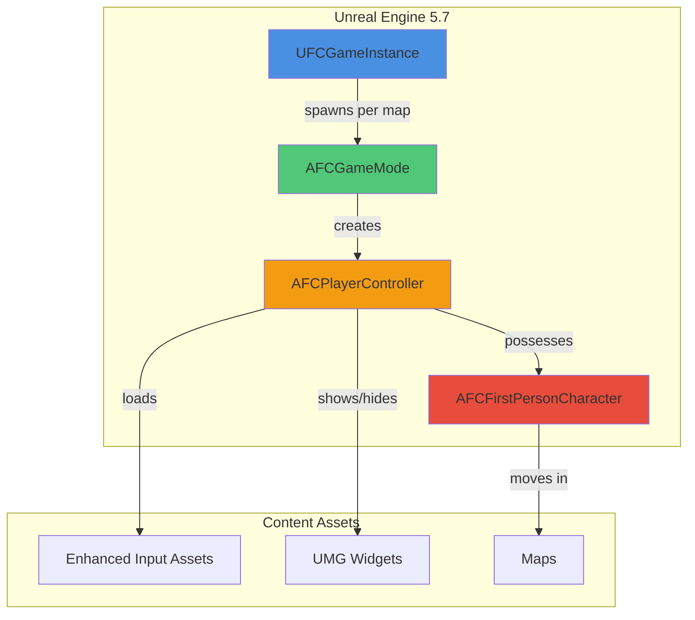
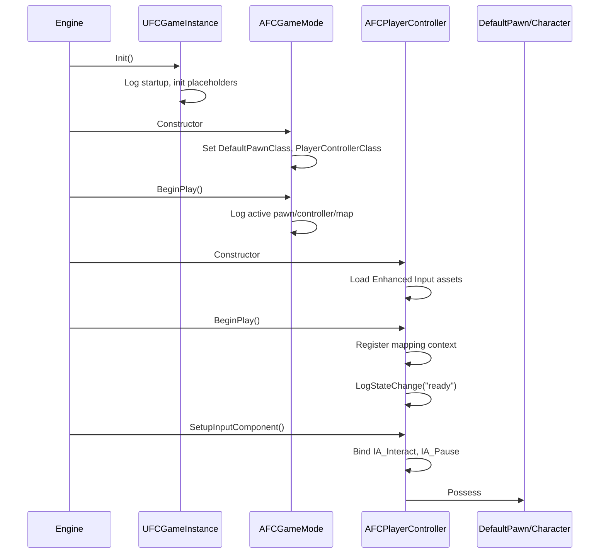
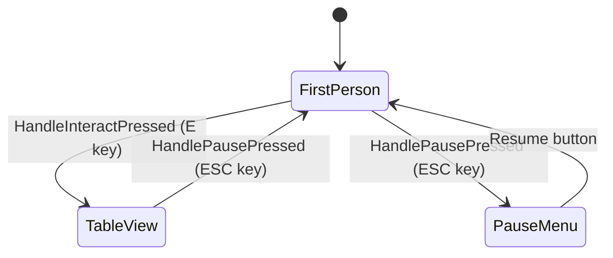
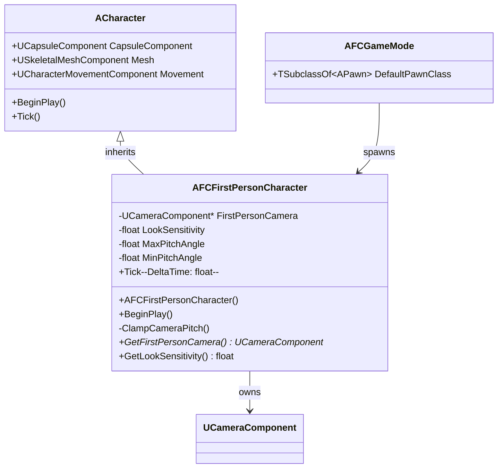
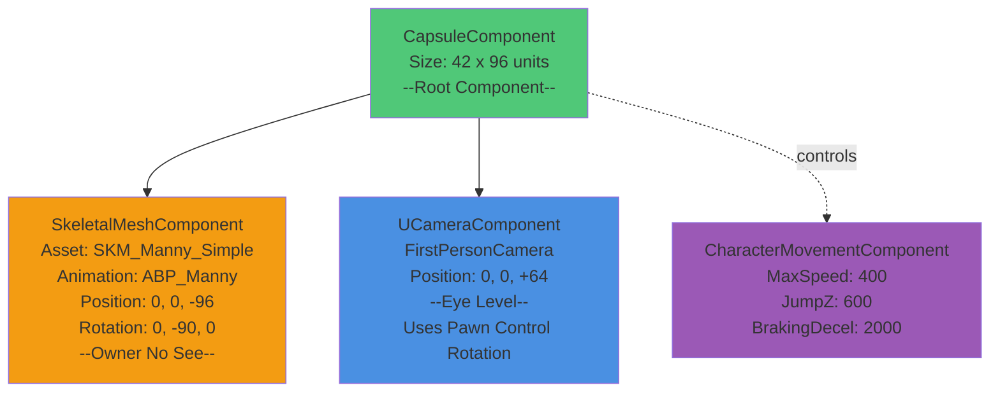
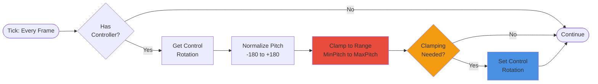
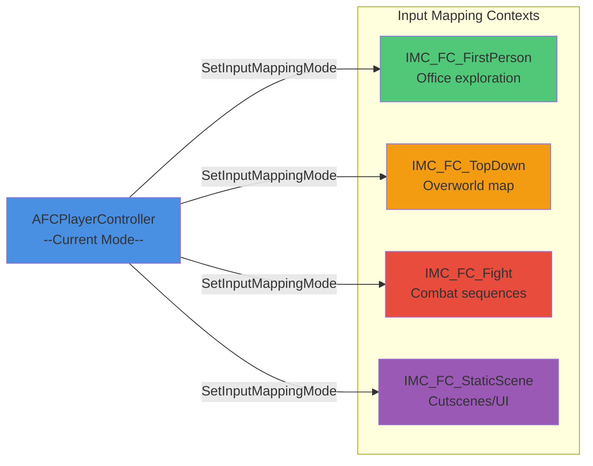

# Fallen Compass – Technical Documentation

> **Living document** tracking the C++ and Blueprint architecture, system interactions, and implementation notes for the entire Fallen Compass project. Updated incrementally as tasks are completed.

---

## Table of Contents

1. [Project Overview & Architecture](#project-overview--architecture)
2. [Core Framework (Task 2)](#core-framework-task-2)
3. [First-Person Character & Input (Task 3)](#first-person-character--input-task-3)
4. [Office Level & Greybox (Task 4)](#office-level--greybox-task-4)
5. [Main Menu System (Task 5)](#main-menu-system-task-5)
6. [Office Flow & Interactions (Task 6)](#office-flow--interactions-task-6)
7. [Logging & Debugging](#logging--debugging)
8. [Build & Configuration](#build--configuration)

---

## Project Overview & Architecture

### High-Level System Diagram



### Naming Conventions

- **File Names**: C++ files use `FC` prefix (e.g., `FCGameMode.h`, `FCFirstPersonCharacter.cpp`)
- **Class Names**: C++ classes use type-specific prefix + `FC` (e.g., `AFCGameMode`, `UFCGameInstance`, `AFCFirstPersonCharacter`)
- **Logs**: All categories prefixed `LogFallenCompass*` (e.g., `LogFallenCompassGameMode`, `LogFallenCompassCharacter`)
- **Assets**: Use descriptive names under `/Game/FC/` hierarchy; Enhanced Input assets prefixed `IA_` / `IMC_`

### Directory Structure

```
FC/
├── Source/FC/Core
│   ├── UFCGameInstance.h/cpp
│   ├── FCGameMode.h/cpp
│   ├── FCPlayerController.h/cpp
│   ├── FCFirstPersonCharacter.h/cpp
│   └── FCCharacter.h/cpp (top-down variant)
├── Content/FC/
│   ├── Input/
│   │   ├── IMC_FC_Default
│   │   ├── IA_Interact
│   │   └── IA_Pause
│   └── (future: UI/, Levels/, Characters/)
└── Config/
    ├── DefaultEngine.ini
    ├── DefaultGame.ini
    └── DefaultInput.ini
```

---

## Core Framework (Task 2)

### Overview

Established the foundational runtime classes that every downstream system depends on:

- `UFCGameInstance` (2.1) – global lifecycle and session state owner
- `AFCGameMode` (2.2) – map-specific authority, pawn/controller registration, logging
- `AFCPlayerController` (2.3) – player input handling, camera state, pause/interact scaffolding

### Class Interaction Flow



### UFCGameInstance (2.1)

- **Files**: `Source/FC/UFCGameInstance.h/.cpp`
- **Inheritance**: `UGameInstance`
- **Registration**: Project Settings → Maps & Modes → Game Instance Class
- **Purpose**: Manages global state across map transitions; houses session flags, expedition metadata, and data asset references.

#### Key Members

```cpp
UPROPERTY(EditDefaultsOnly, Category = "Session")
FString StartupExpeditionName;

UPROPERTY(EditDefaultsOnly, Category = "Session")
int32 StartupAct;

UPROPERTY(EditDefaultsOnly, Category = "Session")
int32 StartupDifficulty;

UPROPERTY(BlueprintReadOnly, Category = "Session")
bool bTutorialCompleted;

DECLARE_MULTICAST_DELEGATE_OneParam(FOnExpeditionAboutToStart, const FString&);
FOnExpeditionAboutToStart OnExpeditionAboutToStart;

DECLARE_MULTICAST_DELEGATE_TwoParams(FOnExpeditionCompleted, bool, int32);
FOnExpeditionCompleted OnExpeditionCompleted;
```

#### Lifecycle Methods

- `Init()`: Logs startup with `LogFallenCompassGameInstance`; calls stub `CacheDefaultLoadouts()`.
- `Shutdown()`: Logs cleanup and future telemetry flush point.
- Placeholders: `BootstrapExpeditionAsync`, `CacheDefaultLoadouts`, `FlushSessionData`.

#### Design Rationale

Keeping systemic state in one place avoids circular dependencies once Tasks 5–6 introduce Main Menu ↔ Office transitions. Future save/load systems will hook directly into the GameInstance delegates.

---

### AFCGameMode (2.2)

- **Files**: `Source/FC/FCGameMode.h/.cpp`
- **Inheritance**: `AGameModeBase`
- **UCLASS**: Concrete (not abstract) so it appears in editor drop-downs.

#### Responsibilities

1. **Pawn Management**: Attempts to load legacy `BP_TopDownCharacter` for PIE continuity; falls back to `ADefaultPawn` if missing.
2. **Controller Assignment**: Always assigns `AFCPlayerController::StaticClass()` (legacy blueprint finder removed to eliminate `LoadPackage` errors).
3. **Logging**: Emits structured startup log listing active pawn, controller, and map name.
4. **Debug HUD**: Temporary on-screen green text to visually confirm the mode during PIE (removed once Task 6 has real UI).

#### Constructor Logic

```cpp
AFCGameMode::AFCGameMode()
{
    // Fallback pawn (will be replaced by AFCFirstPersonCharacter in Task 3.4)
    static ConstructorHelpers::FClassFinder<APawn> DefaultPawnBP(TEXT("/Game/TopDown/Blueprints/BP_TopDownCharacter"));
    if (DefaultPawnBP.Succeeded())
    {
        DefaultPawnClass = DefaultPawnBP.Class;
    }
    else
    {
        UE_LOG(LogFallenCompassGameMode, Warning, TEXT("Missing BP_TopDownCharacter. Falling back to ADefaultPawn."));
        DefaultPawnClass = ADefaultPawn::StaticClass();
    }

    // Always use FC controller
    PlayerControllerClass = AFCPlayerController::StaticClass();
}
```

#### BeginPlay Logging

```cpp
void AFCGameMode::BeginPlay()
{
    Super::BeginPlay();

    const UClass* PawnClass = DefaultPawnClass ? DefaultPawnClass.Get() : GetDefaultPawnClassForController(nullptr);
    const FString PawnName = PawnClass ? PawnClass->GetName() : TEXT("None");
    const FString ControllerName = PlayerControllerClass ? PlayerControllerClass->GetName() : TEXT("None");
    const FString MapName = GetWorld() ? GetWorld()->GetMapName() : TEXT("Unknown");

    UE_LOG(LogFallenCompassGameMode, Log, TEXT("AFCGameMode active | Pawn=%s | Controller=%s | Level=%s"),
        *PawnName, *ControllerName, *MapName);

    // Temporary debug HUD
    if (GEngine)
    {
        const FString DebugLine = FString::Printf(TEXT("AFCGameMode active | Pawn=%s | Controller=%s | Level=%s"),
            *PawnName, *ControllerName, *MapName);
        GEngine->AddOnScreenDebugMessage(-1, 4.f, FColor::Green, DebugLine);
    }
}
```

#### Open Hooks

- Verbose log explains upcoming swap to `AFCFirstPersonCharacter` once Task 3 is complete.
- Constructor comment notes when to remove legacy template assets.

---

### AFCPlayerController (2.3)

- **Files**: `Source/FC/AFCPlayerController.h/.cpp`
- **Inheritance**: `APlayerController`
- **Purpose**: Handles player input, camera state transitions, pause logic, and interaction traces.

#### Camera State Machine



#### Key Members

```cpp
UENUM(BlueprintType)
enum class EFCPlayerCameraMode : uint8
{
    FirstPerson = 0,
    TableView
};

UPROPERTY(VisibleAnywhere, BlueprintReadOnly, Category = "State")
EFCPlayerCameraMode CameraMode;

UPROPERTY(VisibleInstanceOnly, BlueprintReadOnly, Category = "State")
bool bIsPauseMenuDisplayed;

UPROPERTY(EditDefaultsOnly, Category = "Input")
TObjectPtr<UInputMappingContext> DefaultMappingContext;

UPROPERTY(EditDefaultsOnly, Category = "Input")
TObjectPtr<UInputAction> InteractAction;

UPROPERTY(EditDefaultsOnly, Category = "Input")
TObjectPtr<UInputAction> PauseAction;
```

#### Enhanced Input Integration

- **Constructor**: Loads `/Game/FC/Input/IMC_FC_Default`, `IA_Interact`, `IA_Pause` via `ConstructorHelpers::FObjectFinder`.
- **SetupInputComponent**: Registers mapping context with local player subsystem; binds actions via `UEnhancedInputComponent`.
- **Safety**: Logs warnings if any asset or component is missing, ensuring QA sees configuration issues immediately.

#### Input Handlers

```cpp
void AFCPlayerController::HandleInteractPressed()
{
    if (CameraMode == EFCPlayerCameraMode::FirstPerson)
    {
        UE_LOG(LogFallenCompassPlayerController, Log, TEXT("TODO: Trace forward and interact with focused actor."));
        EnterTableViewPlaceholder();
    }
    else
    {
        UE_LOG(LogFallenCompassPlayerController, Log, TEXT("TODO: Route table-view interaction to board UI."));
    }
}

void AFCPlayerController::HandlePausePressed()
{
    if (CameraMode == EFCPlayerCameraMode::TableView)
    {
        UE_LOG(LogFallenCompassPlayerController, Log, TEXT("ESC pressed in table view. Returning to first-person."));
        ExitTableViewPlaceholder();
        return;
    }

    if (bIsPauseMenuDisplayed)
    {
        HidePauseMenuPlaceholder();
    }
    else
    {
        ShowPauseMenuPlaceholder();
    }
}
```

#### Placeholder Methods

- `EnterTableViewPlaceholder()` / `ExitTableViewPlaceholder()`: Log TODOs for camera blend and movement disable/enable (Task 6).
- `ShowPauseMenuPlaceholder()` / `HidePauseMenuPlaceholder()`: Log TODOs for UMG widget instantiation (Task 5).
- `SetFallenCompassCameraMode()`: Internal helper renamed to avoid hiding `APlayerController::SetCameraMode`.

#### Design Notes

- `bShowMouseCursor` forced `false` (FPS focus); trivially swappable once UI needs cursor.
- All state transitions logged via `LogStateChange()` for debugging.

---

## First-Person Character & Input (Task 3)

### Overview

Implemented the first-person character for office exploration with proper camera setup, mesh configuration, pitch clamping, and look sensitivity parameters. Task 3.1 establishes the character foundation; subsequent tasks (3.2-3.5) will wire input mappings and movement.

### 3.1 First-Person Character Class

#### AFCFirstPersonCharacter

- **Files**: `Source/FC/FCFirstPersonCharacter.h/.cpp`
- **Inheritance**: `ACharacter`
- **Purpose**: Player-controlled first-person character for office level exploration with configurable camera behavior and movement constraints.

#### Class Architecture



#### Component Hierarchy



#### Key Members

**Camera Component**

```cpp
UPROPERTY(VisibleAnywhere, BlueprintReadOnly, Category = "Components")
TObjectPtr<UCameraComponent> FirstPersonCamera;
```

- Positioned at +64 units Z (eye level above capsule base)
- `bUsePawnControlRotation = true` - follows controller rotation
- Updated every frame via pitch clamping system

**Camera Configuration**

```cpp
UPROPERTY(EditAnywhere, BlueprintReadWrite, Category = "Camera", meta = (ClampMin = "0.1", ClampMax = "5.0"))
float LookSensitivity = 1.0f;

UPROPERTY(EditDefaultsOnly, BlueprintReadOnly, Category = "Camera")
float MaxPitchAngle = 60.0f;

UPROPERTY(EditDefaultsOnly, BlueprintReadOnly, Category = "Camera")
float MinPitchAngle = -60.0f;
```

- **LookSensitivity**: Multiplier for mouse input (ready for Task 3.3)
- **MaxPitchAngle**: Maximum upward look angle (+60°)
- **MinPitchAngle**: Maximum downward look angle (-60°)

#### Constructor Configuration

**Capsule & Rotation**

```cpp
GetCapsuleComponent()->InitCapsuleSize(42.0f, 96.0f);

bUseControllerRotationPitch = false; // Manual pitch control via ClampCameraPitch
bUseControllerRotationYaw = true;    // Character yaw follows mouse X
bUseControllerRotationRoll = false;
```

**Character Movement**

```cpp
GetCharacterMovement()->bOrientRotationToMovement = false; // FPS standard
GetCharacterMovement()->RotationRate = FRotator(0.0f, 720.0f, 0.0f);
GetCharacterMovement()->JumpZVelocity = 600.0f;
GetCharacterMovement()->AirControl = 0.2f;
GetCharacterMovement()->MaxWalkSpeed = 400.0f;
GetCharacterMovement()->BrakingDecelerationWalking = 2000.0f;
```

**Mesh Setup**

```cpp
// Load SKM_Manny_Simple
static ConstructorHelpers::FObjectFinder<USkeletalMesh> MannyMeshAsset(
    TEXT("/Game/Characters/Mannequins/Meshes/SKM_Manny_Simple"));
MeshComp->SetSkeletalMesh(MannyMeshAsset.Object);

// Load ABP_Unarmed animation blueprint
static ConstructorHelpers::FClassFinder<UAnimInstance> MannyAnimBP(
    TEXT("/Game/Characters/Mannequins/Anims/Unarmed/ABP_Unarmed"));
MeshComp->SetAnimInstanceClass(MannyAnimBP.Class);

// Position and show mesh
MeshComp->SetRelativeLocation(FVector(0.0f, 0.0f, -96.0f)); // Feet at capsule base
MeshComp->SetRelativeRotation(FRotator(0.0f, -90.0f, 0.0f)); // Face forward
MeshComp->SetOwnerNoSee(false); // Show in first-person view (visible when looking down)
```

#### Pitch Clamping System



**Implementation**

```cpp
void AFCFirstPersonCharacter::ClampCameraPitch()
{
    if (Controller)
    {
        FRotator ControlRotation = Controller->GetControlRotation();
        float CurrentPitch = FRotator::NormalizeAxis(ControlRotation.Pitch);
        float ClampedPitch = FMath::Clamp(CurrentPitch, MinPitchAngle, MaxPitchAngle);

        if (!FMath::IsNearlyEqual(CurrentPitch, ClampedPitch, 0.01f))
        {
            ControlRotation.Pitch = ClampedPitch;
            Controller->SetControlRotation(ControlRotation);
        }
    }
}
```

- Called every `Tick()` for continuous enforcement
- Only updates controller rotation when clamping occurs (performance optimization)
- Uses 0.01° threshold to avoid micro-adjustments

#### Lifecycle & Logging

**BeginPlay**

```cpp
void AFCFirstPersonCharacter::BeginPlay()
{
    Super::BeginPlay();

    UE_LOG(LogFallenCompassCharacter, Log,
        TEXT("AFCFirstPersonCharacter spawned | LookSensitivity=%.2f | PitchClamp=[%.1f, %.1f]"),
        LookSensitivity, MinPitchAngle, MaxPitchAngle);
}
```

**Tick**

```cpp
void AFCFirstPersonCharacter::Tick(float DeltaTime)
{
    Super::Tick(DeltaTime);
    ClampCameraPitch(); // Enforce pitch limits every frame
}
```

#### Integration with AFCGameMode

**Updated Constructor**

```cpp
AFCGameMode::AFCGameMode()
{
    // Use AFCFirstPersonCharacter for Office level (Task 3.1)
    DefaultPawnClass = AFCFirstPersonCharacter::StaticClass();
    PlayerControllerClass = AFCPlayerController::StaticClass();

    UE_LOG(LogFallenCompassGameMode, Log,
        TEXT("AFCGameMode configured with AFCFirstPersonCharacter and AFCPlayerController."));
}
```

- Removed legacy template pawn references (`BP_TopDownCharacter`, `ADefaultPawn`)
- Directly assigns `AFCFirstPersonCharacter::StaticClass()`
- Simplified includes and constructor logic

**BeginPlay Logging**

```cpp
UE_LOG(LogFallenCompassGameMode, Verbose,
    TEXT("Task 3.1 complete: AFCFirstPersonCharacter active. Next: Input mappings (3.2-3.3) and Office level (4.x)."));
```

#### Design Rationale

1. **Separate Character Class**: Keep `AFCCharacter` (top-down) for variant game modes; `AFCFirstPersonCharacter` exclusively for office level
2. **Pitch Clamping**: Prevents disorientation from over-rotation (standard FPS UX)
3. **Visible Mesh**: `SetOwnerNoSee(false)` allows seeing the character mesh when looking down, providing visual feedback
4. **Look Sensitivity Parameter**: Ready for Task 3.3 input implementation without refactoring
5. **Standard Movement Values**: 400 units/sec walk speed and 600 units/sec jump are industry-standard FPS defaults

#### Asset Dependencies

- **Mesh**: `/Game/Characters/Mannequins/Meshes/SKM_Manny_Simple`
- **Animation**: `/Game/Characters/Mannequins/Animations/ABP_Manny`
- Both assets ship with UE5 Mannequin content (no external dependencies)

#### Open Hooks for Task 3.2-3.5

- `LookSensitivity` ready for mouse input scaling
- Movement input handlers to be bound in Task 3.3
- Interaction input (`IA_Interact`) already configured in `AFCPlayerController`
- Character spawns correctly; awaiting input mapping completion

---

### 3.2 Configure Input Mappings

#### Overview

Configured Enhanced Input System with multiple mapping contexts for different gameplay modes. Created 2D vector input actions for movement and look, with proper key bindings and modifiers for first-person controls.

#### Multiple Input Mapping Contexts

**Architecture Decision**: Separate mapping contexts for different gameplay modes enable clean context switching without conflicts.



#### EFCInputMappingMode Enum

**Added to `FCPlayerController.h`**:

```cpp
UENUM(BlueprintType)
enum class EFCInputMappingMode : uint8
{
    FirstPerson = 0,
    TopDown,
    Fight,
    StaticScene
};
```

#### Input Mapping Context Properties

**Replaced single `DefaultMappingContext` with four mode-specific contexts**:

```cpp
UPROPERTY(VisibleAnywhere, BlueprintReadOnly, Category = "Input")
EFCInputMappingMode CurrentMappingMode;

UPROPERTY(EditDefaultsOnly, Category = "Input")
TObjectPtr<UInputMappingContext> FirstPersonMappingContext;

UPROPERTY(EditDefaultsOnly, Category = "Input")
TObjectPtr<UInputMappingContext> TopDownMappingContext;

UPROPERTY(EditDefaultsOnly, Category = "Input")
TObjectPtr<UInputMappingContext> FightMappingContext;

UPROPERTY(EditDefaultsOnly, Category = "Input")
TObjectPtr<UInputMappingContext> StaticSceneMappingContext;
```

#### Dynamic Context Switching

**Public method for runtime mode changes**:

```cpp
UFUNCTION(BlueprintCallable, Category = "Input")
void SetInputMappingMode(EFCInputMappingMode NewMode);
```

**Implementation** - clears all mappings and applies new context:

```cpp
void AFCPlayerController::SetInputMappingMode(EFCInputMappingMode NewMode)
{
    // Get subsystem and validate
    UEnhancedInputLocalPlayerSubsystem* Subsystem =
        ULocalPlayer::GetSubsystem<UEnhancedInputLocalPlayerSubsystem>(GetLocalPlayer());

    // Select context based on mode
    UInputMappingContext* ContextToApply = nullptr;
    switch (NewMode)
    {
        case EFCInputMappingMode::FirstPerson: ContextToApply = FirstPersonMappingContext; break;
        case EFCInputMappingMode::TopDown: ContextToApply = TopDownMappingContext; break;
        case EFCInputMappingMode::Fight: ContextToApply = FightMappingContext; break;
        case EFCInputMappingMode::StaticScene: ContextToApply = StaticSceneMappingContext; break;
    }

    // Clear and apply
    Subsystem->ClearAllMappings();
    Subsystem->AddMappingContext(ContextToApply, DefaultMappingPriority);
    CurrentMappingMode = NewMode;
}
```

#### Input Action Assets

**Created in `/Game/FC/Input/`**:

| Asset         | Type              | Purpose                          |
| ------------- | ----------------- | -------------------------------- |
| `IA_Move`     | Axis2D (Vector2D) | WASD movement input              |
| `IA_Look`     | Axis2D (Vector2D) | Mouse look input                 |
| `IA_Interact` | Boolean           | Interaction (E key) - _existing_ |
| `IA_Pause`    | Boolean           | Pause/ESC handling - _existing_  |

#### IMC_FC_FirstPerson Configuration

**Key Bindings & Modifiers**:

**IA_Move** (2D Vector):

- **W** → Forward
  - Modifier: **Swizzle Input Axis Values** (YXZ)
  - Maps to Y-axis positive
- **S** → Backward
  - Modifiers: **Swizzle** (YXZ) + **Negate**
  - Maps to Y-axis negative
- **D** → Right
  - No modifiers (X-axis positive)
- **A** → Left
  - Modifier: **Negate**
  - Maps to X-axis negative

**IA_Look** (2D Vector):

- **Mouse 2D Axis**
  - Modifier: **Negate Y**
  - Inverts Y-axis for standard FPS look (mouse up = look up)

**IA_Interact**:

- **E** key → Trigger interaction

**IA_Pause**:

- **Escape** key → Pause menu / exit table view

#### Constructor Updates

**Loads all four mapping contexts at startup**:

```cpp
AFCPlayerController::AFCPlayerController()
{
    CurrentMappingMode = EFCInputMappingMode::FirstPerson;

    // Load all four mapping contexts with ConstructorHelpers
    static ConstructorHelpers::FObjectFinder<UInputMappingContext> FirstPersonContextFinder(
        TEXT("/Game/FC/Input/IMC_FC_FirstPerson"));
    FirstPersonMappingContext = FirstPersonContextFinder.Object;

    static ConstructorHelpers::FObjectFinder<UInputMappingContext> TopDownContextFinder(
        TEXT("/Game/FC/Input/IMC_FC_TopDown"));
    TopDownMappingContext = TopDownContextFinder.Object;

    // ... Fight and StaticScene contexts ...
}
```

#### SetupInputComponent Updates

**Critical fix**: Added `Super::SetupInputComponent()` call to prevent access violation crash.

```cpp
void AFCPlayerController::SetupInputComponent()
{
    Super::SetupInputComponent(); // MUST be first - initializes InputComponent

    // Apply initial mapping context
    SetInputMappingMode(CurrentMappingMode);

    // Bind shared input actions
    UEnhancedInputComponent* EnhancedInput = Cast<UEnhancedInputComponent>(InputComponent);
    if (EnhancedInput)
    {
        EnhancedInput->BindAction(InteractAction, ETriggerEvent::Started,
            this, &AFCPlayerController::HandleInteractPressed);
        EnhancedInput->BindAction(PauseAction, ETriggerEvent::Started,
            this, &AFCPlayerController::HandlePausePressed);
    }
}
```

#### Future Usage Examples

**Switching contexts at runtime**:

```cpp
// When entering office level
PlayerController->SetInputMappingMode(EFCInputMappingMode::FirstPerson);

// When transitioning to overworld map
PlayerController->SetInputMappingMode(EFCInputMappingMode::TopDown);

// When entering combat
PlayerController->SetInputMappingMode(EFCInputMappingMode::Fight);

// During cutscenes
PlayerController->SetInputMappingMode(EFCInputMappingMode::StaticScene);
```

#### Asset Status

**Mapping Contexts** (all in `/Game/FC/Input/`):

- `IMC_FC_FirstPerson` ✅ Configured with WASD + Mouse
- `IMC_FC_TopDown` ✅ Created (to be configured in future tasks)
- `IMC_FC_Fight` ✅ Created (to be configured in future tasks)
- `IMC_FC_StaticScene` ✅ Created (to be configured in future tasks)

**Input Actions** (all in `/Game/FC/Input/`):

- `IA_Move` ✅ Created (Axis2D)
- `IA_Look` ✅ Created (Axis2D)
- `IA_Interact` ✅ Existing (Boolean)
- `IA_Pause` ✅ Existing (Boolean)

#### Design Rationale

1. **Separate Contexts**: Prevents key binding conflicts between gameplay modes
2. **Shared Actions**: `IA_Move`, `IA_Look` reusable across contexts with different bindings
3. **Runtime Switching**: Clean transitions without rebinding individual actions
4. **Scalability**: Easy to add new contexts (e.g., `IMC_FC_Camp`, `IMC_FC_UI`)
5. **Blueprint Accessible**: `SetInputMappingMode()` callable from BP for level scripts

#### Open Hooks for Task 3.3

- Input actions created and mapped ✅
- Mapping context switching functional ✅
- Awaiting binding to character movement methods
- `LookSensitivity` parameter ready for mouse input scaling

---

### 3.3 Implement Movement & Look

#### Overview

Implemented Enhanced Input bindings for WASD movement and mouse look with configurable sensitivity and pitch clamping. Fixed initial pitch inversion issue by negating the Y-axis input for standard FPS controls.

#### Input Binding Implementation

**SetupPlayerInputComponent Override**

```cpp
void AFCFirstPersonCharacter::SetupPlayerInputComponent(UInputComponent* PlayerInputComponent)
{
    Super::SetupPlayerInputComponent(PlayerInputComponent);

    UEnhancedInputComponent* EnhancedInput = Cast<UEnhancedInputComponent>(PlayerInputComponent);
    if (!EnhancedInput) return;

    // Bind movement action (WASD)
    if (MoveAction)
    {
        EnhancedInput->BindAction(MoveAction, ETriggerEvent::Triggered, this, &AFCFirstPersonCharacter::HandleMove);
    }

    // Bind look action (Mouse)
    if (LookAction)
    {
        EnhancedInput->BindAction(LookAction, ETriggerEvent::Triggered, this, &AFCFirstPersonCharacter::HandleLook);
    }
}
```

- Loads `IA_Move` and `IA_Look` via ConstructorHelpers in constructor
- Binds to `HandleMove` and `HandleLook` methods using `ETriggerEvent::Triggered` for continuous input

#### Movement Handler

**HandleMove Method**

```cpp
void AFCFirstPersonCharacter::HandleMove(const FInputActionValue& Value)
{
    const FVector2D MovementVector = Value.Get<FVector2D>();

    if (Controller)
    {
        const FRotator Rotation = Controller->GetControlRotation();
        const FRotator YawRotation(0, Rotation.Yaw, 0);

        const FVector ForwardDirection = FRotationMatrix(YawRotation).GetUnitAxis(EAxis::X);
        const FVector RightDirection = FRotationMatrix(YawRotation).GetUnitAxis(EAxis::Y);

        AddMovementInput(ForwardDirection, MovementVector.Y); // Y = forward/backward (W/S)
        AddMovementInput(RightDirection, MovementVector.X);   // X = right/left (D/A)
    }
}
```

- Processes 2D vector input from WASD keys
- Calculates forward/right directions relative to controller yaw (character faces movement direction)
- Adds movement input using standard Character movement system

#### Look Handler

**HandleLook Method**

```cpp
void AFCFirstPersonCharacter::HandleLook(const FInputActionValue& Value)
{
    const FVector2D LookAxisVector = Value.Get<FVector2D>();

    if (Controller)
    {
        AddControllerYawInput(LookAxisVector.X * LookSensitivity);   // Mouse X = yaw (turn left/right)
        AddControllerPitchInput(-LookAxisVector.Y * LookSensitivity); // Mouse Y = pitch (look up/down) - inverted
    }
}
```

- Applies `LookSensitivity` multiplier to mouse input
- **Pitch Inversion Fix**: Negated Y-axis (`-LookAxisVector.Y`) to correct inverted look up/down
- Yaw remains standard (positive X turns right)
- Pitch clamping enforced in `Tick()` via `ClampCameraPitch()`

#### Design Rationale

1. **Controller-Relative Movement**: Character moves relative to camera yaw, standard for FPS games
2. **Sensitivity Parameter**: Allows runtime adjustment of mouse sensitivity (0.1x to 5.0x range)
3. **Pitch Inversion**: Fixed by negating Y-input; mouse up now correctly looks up
4. **Continuous Input**: Uses `ETriggerEvent::Triggered` for smooth, frame-rate independent input
5. **Separation of Concerns**: Movement and look handled separately for clarity and modularity

#### Testing & Validation

- **WASD Movement**: Verified forward/backward and strafe left/right
- **Mouse Look**: Confirmed yaw (left/right) and corrected pitch (up/down)
- **Sensitivity**: Tested with different `LookSensitivity` values
- **Pitch Clamping**: Ensured ±60° limits prevent over-rotation
- **Logging**: Added debug logs for input binding and handler execution

#### Integration Notes

- Depends on `IA_Move` and `IA_Look` assets configured in Task 3.2
- `LookSensitivity` exposed as editable property for designers
- Pitch clamping runs every `Tick()` for continuous enforcement
- No conflicts with `AFCPlayerController` input mappings (separate contexts)

---

---

### 3.4 Connect Character to GameMode

**Status**: ✅ **Completed** (integrated with Task 3.1)

See [AFCGameMode Integration](#integration-with-afcgamemode) above.

---

### 3.5 Expose Hooks for Interaction and ESC

#### Overview

Implemented input action bindings for interaction (E key) and pause (ESC) in `AFCPlayerController`. Added forward line trace functionality for interaction detection as a foundation for future interactable objects.

#### Input Action Bindings

**SetupInputComponent Override** (already implemented in Task 2.3, confirmed in Task 3.5)

```cpp
void AFCPlayerController::SetupInputComponent()
{
    Super::SetupInputComponent();

    SetInputMappingMode(CurrentMappingMode);

    UEnhancedInputComponent* EnhancedInput = Cast<UEnhancedInputComponent>(InputComponent);
    if (EnhancedInput)
    {
        EnhancedInput->BindAction(InteractAction, ETriggerEvent::Started,
            this, &AFCPlayerController::HandleInteractPressed);
        EnhancedInput->BindAction(PauseAction, ETriggerEvent::Started,
            this, &AFCPlayerController::HandlePausePressed);
    }
}
```

- Binds `IA_Interact` to `HandleInteractPressed` (E key)
- Binds `IA_Pause` to `HandlePausePressed` (ESC key)
- Uses `ETriggerEvent::Started` for single-press actions

#### Interaction Handler Implementation

**HandleInteractPressed Method**

```cpp
void AFCPlayerController::HandleInteractPressed()
{
    if (CameraMode == EFCPlayerCameraMode::FirstPerson)
    {
        AFCFirstPersonCharacter* Character = Cast<AFCFirstPersonCharacter>(GetPawn());
        if (Character)
        {
            UCameraComponent* Camera = Character->GetFirstPersonCamera();
            if (Camera)
            {
                FVector Start = Camera->GetComponentLocation();
                FVector End = Start + (Camera->GetForwardVector() * 1000.0f);

                FHitResult HitResult;
                FCollisionQueryParams QueryParams;
                QueryParams.AddIgnoredActor(GetPawn());

                if (GetWorld()->LineTraceSingleByChannel(HitResult, Start, End, ECC_Visibility, QueryParams))
                {
                    UE_LOG(LogFallenCompassPlayerController, Log, TEXT("Interact: Hit actor '%s' at distance %.1f units"),
                        *HitResult.GetActor()->GetName(), HitResult.Distance);
                    // TODO: Check if hit actor is interactable and call interaction logic
                }
                else
                {
                    UE_LOG(LogFallenCompassPlayerController, Log, TEXT("Interact: No interactable found"));
                }
            }
        }
    }
    // TableView mode: TODO for Task 6
}
```

- Performs line trace from camera position forward 1000 units
- Ignores player character in trace
- Logs hit actor name and distance for debugging
- On-screen debug messages for visual feedback
- Placeholder for interactable logic (to be implemented in Task 6)

#### Pause Handler

**HandlePausePressed Method** (already implemented)

- Logs pause press with current camera mode
- Handles table view exit vs. pause menu toggle
- On-screen debug messages
- Delegates to placeholder methods for UI (Task 5)

#### Design Rationale

1. **Controller-Level Binding**: Interaction and pause are player actions, not character-specific, so bound in `AFCPlayerController`
2. **Forward Trace**: Basic raycast from camera provides foundation for object interaction without requiring complex systems
3. **Debug Feedback**: Comprehensive logging and on-screen messages aid development and testing
4. **Extensible**: Trace result can be extended to check for interactable components/tags in Task 6
5. **Mode-Aware**: Different behavior for FirstPerson vs. TableView modes

#### Testing & Validation

- **E Key**: Verified line trace detects geometry and logs results
- **ESC Key**: Confirmed pause logging and mode transitions
- **No False Positives**: Player character ignored in traces
- **Performance**: Single trace per press, minimal impact

#### Integration Notes

- Depends on `IA_Interact` and `IA_Pause` assets (Task 3.2)
- Trace distance (1000 units) can be made configurable later
- Future: Add interactable interface/component for objects to implement
- Camera mode switching affects interaction behavior

---

---

## Office Level & Greybox (Task 4)

_Placeholder: to be populated when Task 4 is completed._

---

## Main Menu System (Task 5)

_Placeholder: to be populated when Task 5 is completed._

---

## Office Flow & Interactions (Task 6)

_Placeholder: to be populated when Task 6 is completed._

---

## Logging & Debugging

### Log Categories

All FC-specific categories use the prefix `LogFallenCompass*`:

| Category                           | Verbosity  | Purpose                                                  |
| ---------------------------------- | ---------- | -------------------------------------------------------- |
| `LogFallenCompassGameInstance`     | `Log, All` | Lifecycle events, session state changes                  |
| `LogFallenCompassGameMode`         | `Log, All` | Pawn/controller registration, map startup                |
| `LogFallenCompassPlayerController` | `Log, All` | Input handling, camera transitions, state dumps          |
| `LogFallenCompassCharacter`        | `Log, All` | First-person character spawning, camera config, movement |

### Enabling Categories at Runtime

Use the in-editor console or add to `Config/DefaultEngine.ini`:

```
Log LogFallenCompassGameMode VeryVerbose
Log LogFallenCompassPlayerController VeryVerbose
Log LogFallenCompassGameInstance VeryVerbose
Log LogFallenCompassCharacter VeryVerbose
```

### Common Issues

- **No logs appear**: Ensure latest C++ binaries are loaded (rebuild or Live Coding reload). Check Output Log filters (click funnel icon → Clear Filters).
- **"Failed to find BP_TopDownPlayerController"**: Legacy blueprint reference still in constructor; remove or restore asset.
- **Enhanced Input not working**: Verify assets exist under `/Game/FC/Input/` and `DefaultMappingContext` is registered in `SetupInputComponent`.

---

## Build & Configuration

### Required Assets

Ensure these exist before PIE:

- `/Game/FC/Input/IMC_FC_Default` (Input Mapping Context)
- `/Game/FC/Input/IA_Interact` (Input Action)
- `/Game/FC/Input/IA_Pause` (Input Action)
- `/Game/Characters/Mannequins/Meshes/SKM_Manny_Simple` (Character mesh - UE5 default)
- `/Game/Characters/Mannequins/Animations/ABP_Manny` (Animation blueprint - UE5 default)

### Project Settings

- **Game Instance Class**: `UFCGameInstance`
- **Default GameMode**: `FCGameMode`
- **Enhanced Input Subsystem**: Enabled by default in UE 5.7

### Build Commands

Full rebuild after C++ changes:

```powershell
w:\GameDev\FallenCompass\Engine\Build\BatchFiles\Build.bat FCEditor Win64 Development -project="w:\GameDev\FallenCompass\FC\FC.uproject" -waitmutex
```

Clean build (regenerates `.generated.h` files):

```powershell
w:\GameDev\FallenCompass\Engine\Build\BatchFiles\Build.bat FCEditor Win64 Development -project="w:\GameDev\FallenCompass\FC\FC.uproject" -waitmutex -clean
```

### Editor Configuration

- **Editor Startup Map**: Set in Project Settings → Maps & Modes
- **Game Default Map**: Set in same location
- **PIE Settings**: Use default; enable "Play in Viewport" for quick iteration

---

## Next Steps & Open Work

### Task 2 Follow-Ups

- ✅ Replaced `DefaultPawnClass` fallback with `AFCFirstPersonCharacter` (completed in Task 3.1)
- Implement actual interaction traces and camera blends in placeholder methods (Task 6)
- Add UMG pause menu and table-view UI widgets (Tasks 5 & 6)

### Task 3 Follow-Ups

- ✅ **Task 3.2**: Enhanced Input mappings configured with multiple contexts (completed)
- ✅ **Task 3.3**: Movement & look implemented with sensitivity and pitch clamping (completed)
- ✅ **Task 3.5**: Interaction and ESC hooks exposed with forward trace (completed)

### Codebase Organization

- ✅ **File Reorganization**: Moved core classes (`FCGameMode`, `FCPlayerController`, `FCFirstPersonCharacter`, `UFCGameInstance`) to `Source/FC/Core/` for better project structure

### Future Documentation Sections

- Task 4: Office level greybox, table/door props, camera target transforms
- Task 5: Main menu UMG widget, level transitions, button bindings
- Task 6: Interaction system, table-view camera blending, pause menu flow

---

_Last updated: November 15, 2025 (Tasks 3.1-3.5 complete, files reorganized to FC/Core/)_
