# Fallen Compass – Technical Documentation

> **Living document** tracking the C++ and Blueprint architecture, system interactions, and implementation notes for the entire Fallen Compass project. Updated incrementally as tasks are completed.

---

## Table of Contents
1. [Project Overview & Architecture](#project-overview--architecture)
2. [Core Framework (Task 2)](#core-framework-task-2)
3. [First-Person Character & Input (Task 3)](#first-person-character--input-task-3)
4. [Office Level & Greybox (Task 4)](#office-level--greybox-task-4)
5. [Main Menu System (Task 5)](#main-menu-system-task-5)
6. [Office Flow & Interactions (Task 6)](#office-flow--interactions-task-6)
7. [Logging & Debugging](#logging--debugging)
8. [Build & Configuration](#build--configuration)

---

## Project Overview & Architecture

### High-Level System Diagram

```mermaid
flowchart TB
    subgraph Engine["Unreal Engine 5.7"]
        GI[UFCGameInstance]
        GM[AFCGameMode]
        PC[AFCPlayerController]
        Pawn[AFCFirstPersonCharacter]
    end
    
    subgraph Content["Content Assets"]
        Input[Enhanced Input Assets]
        UI[UMG Widgets]
        Levels[Maps]
    end
    
    GI -->|spawns per map| GM
    GM -->|creates| PC
    PC -->|possesses| Pawn
    PC -->|loads| Input
    PC -->|shows/hides| UI
    Pawn -->|moves in| Levels
    
    style GI fill:#4a90e2
    style GM fill:#50c878
    style PC fill:#f39c12
    style Pawn fill:#e74c3c
```


### Naming Conventions
- **Prefix**: All custom C++ classes use `FC` (e.g., `UFCGameInstance`, `AFCGameMode`).
- **Logs**: All categories prefixed `LogFallenCompass*` (e.g., `LogFallenCompassGameMode`, `LogFallenCompassPlayerController`).
- **Assets**: Use descriptive names under `/Game/FC/` hierarchy; Enhanced Input assets prefixed `IA_` / `IMC_`.

### Directory Structure
```
FC/
├── Source/FC/
│   ├── UFCGameInstance.h/cpp
│   ├── AFCGameMode.h/cpp
│   ├── AFCPlayerController.h/cpp
│   └── (future: AFCFirstPersonCharacter, interaction components)
├── Content/FC/
│   ├── Input/
│   │   ├── IMC_FC_Default
│   │   ├── IA_Interact
│   │   └── IA_Pause
│   └── (future: UI/, Levels/, Characters/)
└── Config/
    ├── DefaultEngine.ini
    ├── DefaultGame.ini
    └── DefaultInput.ini
```

---

## Core Framework (Task 2)

### Overview
Established the foundational runtime classes that every downstream system depends on:
- `UFCGameInstance` (2.1) – global lifecycle and session state owner
- `AFCGameMode` (2.2) – map-specific authority, pawn/controller registration, logging
- `AFCPlayerController` (2.3) – player input handling, camera state, pause/interact scaffolding

### Class Interaction Flow


### UFCGameInstance (2.1)
- **Files**: `Source/FC/UFCGameInstance.h/.cpp`
- **Inheritance**: `UGameInstance`
- **Registration**: Project Settings → Maps & Modes → Game Instance Class
- **Purpose**: Manages global state across map transitions; houses session flags, expedition metadata, and data asset references.

#### Key Members
```cpp
UPROPERTY(EditDefaultsOnly, Category = "Session")
FString StartupExpeditionName;

UPROPERTY(EditDefaultsOnly, Category = "Session")
int32 StartupAct;

UPROPERTY(EditDefaultsOnly, Category = "Session")
int32 StartupDifficulty;

UPROPERTY(BlueprintReadOnly, Category = "Session")
bool bTutorialCompleted;

DECLARE_MULTICAST_DELEGATE_OneParam(FOnExpeditionAboutToStart, const FString&);
FOnExpeditionAboutToStart OnExpeditionAboutToStart;

DECLARE_MULTICAST_DELEGATE_TwoParams(FOnExpeditionCompleted, bool, int32);
FOnExpeditionCompleted OnExpeditionCompleted;
```

#### Lifecycle Methods
- `Init()`: Logs startup with `LogFallenCompassGameInstance`; calls stub `CacheDefaultLoadouts()`.
- `Shutdown()`: Logs cleanup and future telemetry flush point.
- Placeholders: `BootstrapExpeditionAsync`, `CacheDefaultLoadouts`, `FlushSessionData`.

#### Design Rationale
Keeping systemic state in one place avoids circular dependencies once Tasks 5–6 introduce Main Menu ↔ Office transitions. Future save/load systems will hook directly into the GameInstance delegates.

---

### AFCGameMode (2.2)
- **Files**: `Source/FC/FCGameMode.h/.cpp`
- **Inheritance**: `AGameModeBase`
- **UCLASS**: Concrete (not abstract) so it appears in editor drop-downs.

#### Responsibilities
1. **Pawn Management**: Attempts to load legacy `BP_TopDownCharacter` for PIE continuity; falls back to `ADefaultPawn` if missing.
2. **Controller Assignment**: Always assigns `AFCPlayerController::StaticClass()` (legacy blueprint finder removed to eliminate `LoadPackage` errors).
3. **Logging**: Emits structured startup log listing active pawn, controller, and map name.
4. **Debug HUD**: Temporary on-screen green text to visually confirm the mode during PIE (removed once Task 6 has real UI).

#### Constructor Logic
```cpp
AFCGameMode::AFCGameMode()
{
    // Fallback pawn (will be replaced by AFCFirstPersonCharacter in Task 3.4)
    static ConstructorHelpers::FClassFinder<APawn> DefaultPawnBP(TEXT("/Game/TopDown/Blueprints/BP_TopDownCharacter"));
    if (DefaultPawnBP.Succeeded())
    {
        DefaultPawnClass = DefaultPawnBP.Class;
    }
    else
    {
        UE_LOG(LogFallenCompassGameMode, Warning, TEXT("Missing BP_TopDownCharacter. Falling back to ADefaultPawn."));
        DefaultPawnClass = ADefaultPawn::StaticClass();
    }

    // Always use FC controller
    PlayerControllerClass = AFCPlayerController::StaticClass();
}
```

#### BeginPlay Logging
```cpp
void AFCGameMode::BeginPlay()
{
    Super::BeginPlay();

    const UClass* PawnClass = DefaultPawnClass ? DefaultPawnClass.Get() : GetDefaultPawnClassForController(nullptr);
    const FString PawnName = PawnClass ? PawnClass->GetName() : TEXT("None");
    const FString ControllerName = PlayerControllerClass ? PlayerControllerClass->GetName() : TEXT("None");
    const FString MapName = GetWorld() ? GetWorld()->GetMapName() : TEXT("Unknown");

    UE_LOG(LogFallenCompassGameMode, Log, TEXT("AFCGameMode active | Pawn=%s | Controller=%s | Level=%s"),
        *PawnName, *ControllerName, *MapName);

    // Temporary debug HUD
    if (GEngine)
    {
        const FString DebugLine = FString::Printf(TEXT("AFCGameMode active | Pawn=%s | Controller=%s | Level=%s"),
            *PawnName, *ControllerName, *MapName);
        GEngine->AddOnScreenDebugMessage(-1, 4.f, FColor::Green, DebugLine);
    }
}
```

#### Open Hooks
- Verbose log explains upcoming swap to `AFCFirstPersonCharacter` once Task 3 is complete.
- Constructor comment notes when to remove legacy template assets.

---

### AFCPlayerController (2.3)
- **Files**: `Source/FC/AFCPlayerController.h/.cpp`
- **Inheritance**: `APlayerController`
- **Purpose**: Handles player input, camera state transitions, pause logic, and interaction traces.

#### Camera State Machine


#### Key Members
```cpp
UENUM(BlueprintType)
enum class EFCPlayerCameraMode : uint8
{
    FirstPerson = 0,
    TableView
};

UPROPERTY(VisibleAnywhere, BlueprintReadOnly, Category = "State")
EFCPlayerCameraMode CameraMode;

UPROPERTY(VisibleInstanceOnly, BlueprintReadOnly, Category = "State")
bool bIsPauseMenuDisplayed;

UPROPERTY(EditDefaultsOnly, Category = "Input")
TObjectPtr<UInputMappingContext> DefaultMappingContext;

UPROPERTY(EditDefaultsOnly, Category = "Input")
TObjectPtr<UInputAction> InteractAction;

UPROPERTY(EditDefaultsOnly, Category = "Input")
TObjectPtr<UInputAction> PauseAction;
```

#### Enhanced Input Integration
- **Constructor**: Loads `/Game/FC/Input/IMC_FC_Default`, `IA_Interact`, `IA_Pause` via `ConstructorHelpers::FObjectFinder`.
- **SetupInputComponent**: Registers mapping context with local player subsystem; binds actions via `UEnhancedInputComponent`.
- **Safety**: Logs warnings if any asset or component is missing, ensuring QA sees configuration issues immediately.

#### Input Handlers
```cpp
void AFCPlayerController::HandleInteractPressed()
{
    if (CameraMode == EFCPlayerCameraMode::FirstPerson)
    {
        UE_LOG(LogFallenCompassPlayerController, Log, TEXT("TODO: Trace forward and interact with focused actor."));
        EnterTableViewPlaceholder();
    }
    else
    {
        UE_LOG(LogFallenCompassPlayerController, Log, TEXT("TODO: Route table-view interaction to board UI."));
    }
}

void AFCPlayerController::HandlePausePressed()
{
    if (CameraMode == EFCPlayerCameraMode::TableView)
    {
        UE_LOG(LogFallenCompassPlayerController, Log, TEXT("ESC pressed in table view. Returning to first-person."));
        ExitTableViewPlaceholder();
        return;
    }

    if (bIsPauseMenuDisplayed)
    {
        HidePauseMenuPlaceholder();
    }
    else
    {
        ShowPauseMenuPlaceholder();
    }
}
```

#### Placeholder Methods
- `EnterTableViewPlaceholder()` / `ExitTableViewPlaceholder()`: Log TODOs for camera blend and movement disable/enable (Task 6).
- `ShowPauseMenuPlaceholder()` / `HidePauseMenuPlaceholder()`: Log TODOs for UMG widget instantiation (Task 5).
- `SetFallenCompassCameraMode()`: Internal helper renamed to avoid hiding `APlayerController::SetCameraMode`.

#### Design Notes
- `bShowMouseCursor` forced `false` (FPS focus); trivially swappable once UI needs cursor.
- All state transitions logged via `LogStateChange()` for debugging.

---

## First-Person Character & Input (Task 3)
_Placeholder: to be populated when Task 3 is completed._

---

## Office Level & Greybox (Task 4)
_Placeholder: to be populated when Task 4 is completed._

---

## Main Menu System (Task 5)
_Placeholder: to be populated when Task 5 is completed._

---

## Office Flow & Interactions (Task 6)
_Placeholder: to be populated when Task 6 is completed._

---

## Logging & Debugging

### Log Categories
All FC-specific categories use the prefix `LogFallenCompass*`:

| Category | Verbosity | Purpose |
|----------|-----------|---------|
| `LogFallenCompassGameInstance` | `Log, All` | Lifecycle events, session state changes |
| `LogFallenCompassGameMode` | `Log, All` | Pawn/controller registration, map startup |
| `LogFallenCompassPlayerController` | `Log, All` | Input handling, camera transitions, state dumps |

### Enabling Categories at Runtime
Use the in-editor console or add to `Config/DefaultEngine.ini`:
```
Log LogFallenCompassGameMode VeryVerbose
Log LogFallenCompassPlayerController VeryVerbose
Log LogFallenCompassGameInstance VeryVerbose
```

### Common Issues
- **No logs appear**: Ensure latest C++ binaries are loaded (rebuild or Live Coding reload). Check Output Log filters (click funnel icon → Clear Filters).
- **"Failed to find BP_TopDownPlayerController"**: Legacy blueprint reference still in constructor; remove or restore asset.
- **Enhanced Input not working**: Verify assets exist under `/Game/FC/Input/` and `DefaultMappingContext` is registered in `SetupInputComponent`.

---

## Build & Configuration

### Required Assets
Ensure these exist before PIE:
- `/Game/FC/Input/IMC_FC_Default` (Input Mapping Context)
- `/Game/FC/Input/IA_Interact` (Input Action)
- `/Game/FC/Input/IA_Pause` (Input Action)

### Project Settings
- **Game Instance Class**: `UFCGameInstance`
- **Default GameMode**: `FCGameMode`
- **Enhanced Input Subsystem**: Enabled by default in UE 5.7

### Build Commands
Full rebuild after C++ changes:
```powershell
w:\GameDev\FallenCompass\Engine\Build\BatchFiles\Build.bat FCEditor Win64 Development -project="w:\GameDev\FallenCompass\FC\FC.uproject" -waitmutex
```

Clean build (regenerates `.generated.h` files):
```powershell
w:\GameDev\FallenCompass\Engine\Build\BatchFiles\Build.bat FCEditor Win64 Development -project="w:\GameDev\FallenCompass\FC\FC.uproject" -waitmutex -clean
```

### Editor Configuration
- **Editor Startup Map**: Set in Project Settings → Maps & Modes
- **Game Default Map**: Set in same location
- **PIE Settings**: Use default; enable "Play in Viewport" for quick iteration

---

## Next Steps & Open Work

### Task 2 Follow-Ups
- Replace `DefaultPawnClass` fallback with `AFCFirstPersonCharacter` once Task 3 is complete.
- Implement actual interaction traces and camera blends in placeholder methods (Task 6).
- Add UMG pause menu and table-view UI widgets (Tasks 5 & 6).

### Future Documentation Sections
- Task 3: First-person movement, axis mappings, camera component setup
- Task 4: Office level greybox, table/door props, camera target transforms
- Task 5: Main menu UMG widget, level transitions, button bindings
- Task 6: Interaction system, table-view camera blending, pause menu flow

---

_Last updated: November 14, 2025 (Task 2 complete)_
